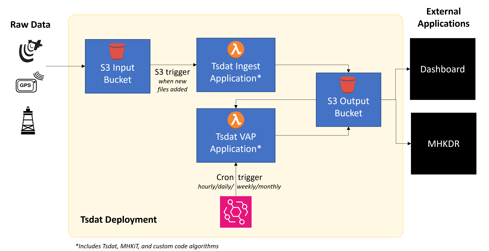
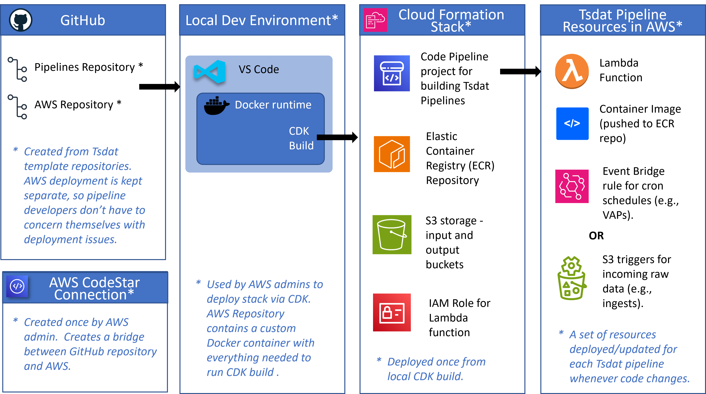
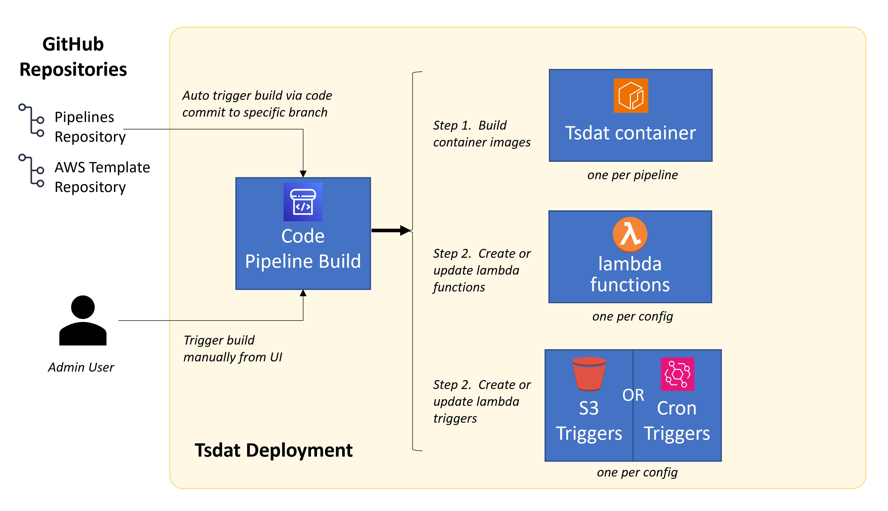

# Deploying to AWS

!!! danger "AWS Admin Privileges Required"

    This deployment can only be run by AWS administrators, so we assume the user has a basic understanding of code
    development, Docker containers, and the AWS cloud.

## Overview

The goal of this guide is to help you create a functioning pipeline in AWS that allows you to process data on-the-fly as
it enters S3 buckets (Ingest applications), or on a regular cron schedule (VAP applications), and store the processed
results in an output S3 bucket in a structured format.

=== "Deployment result"

    Ingest and VAP pipelines can be set up to run on S3 event triggers or on a cron schedule.
    
    

=== "Stack resources"

    The following resources will be used or setup during the AWS deployment. 
    
    

=== "CodeBuild steps"

    The following image shows how code changes are deployed to AWS and the steps that make up the AWS CodeBuild process
    to update or create lambda functions and containers for each pipeline.

    

## Prerequisites

### Create code repos

Make sure that you have two repositories in your GitHub organization/account created from the following templates:

* **<https://github.com/tsdat/pipeline-template>**
* **<https://github.com/tsdat/aws-template>**

If you are using an existing `pipeline-template` repository, make sure that the `requirements.txt` file specifies a
`tsdat` version of at least `tsdat==0.7.1`. The AWS build will not work with earlier versions of `tsdat`.

Clone these repos to the same parent folder on your computer.

???+ warning "Warning: Windows users"

    If you are using WSL on Windows make sure you run the `git clone` command from a WSL terminal.

### Install Docker

We use a Docker container with VSCode to make setting up your development environment a snap.  We assume users have a
basic familiarity with Docker containers. If you are new to Docker, there are many free online tutorials to get you
started.

!!! note

    Docker Desktop can be flaky, especially on Windows, and it requires a license so we recommend not using it. Instead,
    we are providing alternative, non-Docker Desktop installation instructions for each platform. The Docker Desktop
    install is easier and requires fewer steps, so it may be fine for your needs, but keep in mind it may crash if you
    update it (requiring a full uninstall/reinstall, and then you lose all your container environments).

    === "Windows Users"

        * [Install Docker on wsl2](https://github.com/clansing/docs/blob/main/windows-docker-wsl2.md)
        * [Install Docker Desktop](https://docs.docker.com/desktop/install/windows-install/)

    === "Mac Users"

        * [Use Docker/Colima](https://dev.to/elliotalexander/how-to-use-docker-without-docker-desktop-on-macos-217m)
        * [Install Docker Desktop](https://docs.docker.com/desktop/install/mac-install/)

    === "Linux Users"

        * [Install Docker](https://docs.docker.com/engine/install/ubuntu/)
        * [Install Docker Desktop](https://docs.docker.com/desktop/install/linux-install/)

We also recommend [installing VS Code](https://code.visualstudio.com/download) and using the
[ms-vscode-remote.vscode-remote-extensionpack](https://marketplace.visualstudio.com/items?itemName=ms-vscode-remote.vscode-remote-extensionpack)
extension, which includes support for editing code in Docker Containers.

## Development Environment

### Open your `aws-template` repo in VS Code

???+ warning "Warning: Windows users"

    If you are using WSL on Windows then you should open VSCode from within a WSL terminal in order for VSCode so it
    automatically installs the proper WSL interface extension.

For example, if you checked out the aws-template repository to your `$HOME/projects/tsdat` folder, then you would run
this to start VSCode:

```shell
cd $HOME/projects/tsdat
code aws-template
```

### Start your tsdat-cdk Docker container

From your VSCode window, start a terminal (^^Main Menu -> Terminal -> New^^, OR you can press ++ctrl+grave++).

Then from the VSCode terminal, run:

 ```shell
 docker build --platform linux/amd64 . -t tsdat-cdk # (1)!
 docker compose up -d
 ```

1. In our testing we found that just `docker compose up -d` works fine on our team's Windows, Linux, and intel MacOS
systems, but the `--platform` argument was needed for M1/M2 MacBooks. Milage may vary.

### Attach a new VSCode window to the tsdat-cdk container

1. Type the key combination:  ++ctrl+shift+p++ to bring up the VSCode command palette.
1. Then from the input box type: "Dev-Containers:  Attach to Running Container..." and select it
1. Then choose the  tsdat-cdk  container.

This will start up a new VSCode window that is running from inside your tsdat-cdk container.

### Open the provided cdk.code-workspace file

From the VSCode window that is attached to the tsdat-cdk container click ^^Main Menu -> File-> Open Workspace from
File^^. In the file chooser dialog, select `/root/aws-template/.vscode/cdk.code-workspace`

!!! tip

    A box should pop up in the bottom right corner that asks if you want to install the recommended extensions.
    Select "Install".

Once the extensions are installed, your workspace is ready! In the Explorer, you will see two top-level folders and a
directory structure like so:

1. :material-folder: **`aws-template/`**
    * :material-folder: *`.vscode/`*
    * :material-folder: *`.build_utils/`*
    * :material-folder: `...`
    * :material-file: *`pipelines_config.yml`*

2. :material-folder: **`.aws/`**
    * :material-file: *`config`*
    * :material-file: *`credentials`*

## Deploying your AWS Stack

### Edit the pipelines config file

Open the `aws-template/pipelines_config.yml` file and fill out the configuration options, using your own values as
needed.

#### Configure AWS/GitHub Settings

The top part of the `aws-template/pipelines_config.yml` contains settings related to the AWS-GitHub integration, where
data should be pulled from & placed, and which AWS account should be used. This section only needs to be filled out
once.

```yaml title="aws-template/pipelines_config.yml"

github_org: tsdat  # (1)!
pipelines_repo_name: pipeline-template
aws_repo_name: aws-template

account_id: "XXXXXXXXXXX"  # (2)!
region: us-west-2
input_bucket_name: tsdat-input
output_bucket_name: tsdat-output
create_buckets: True

github_codestar_arn: arn:aws:codestar-connections:us-west-2:... # (3)!
```

1. The name of the organization or user that cloned the `aws-template` and `pipeline-template` repos.

2. Your AWS account ID. You can get this from the AWS console: In the navigation bar at the upper right, choose your
    username and then copy the Account ID. It should be a 12-digit number.

3. This is the ARN of the CodeStar connection to GitHub. Check out the [AWS guide for setting up a CodeStar connection](https://docs.aws.amazon.com/dtconsole/latest/userguide/connections-create-github.html#connections-create-github-console),
    then copy the ARN of your CodeStar connection here.

    !!! tip

        Generally it is a best practice to limit access read/write access to your github account, so we recommend just
        allowing CodeStar access to the `pipeline-template` and `aws-template` repositories in your account/org. You can
        always change this later in [GitHub](https://github.com/settings/installations) if you want.

#### Configure Deployed Pipelines

The second half of the `aws-template/pipelines_config.yml` file contains configurations for each deployed pipeline,
including the type of pipeline (i.e., `Ingest` or `VAP`), the trigger (i.e., `S3` or `Cron`). You'll want to keep this
section updated as you develop new pipelines so they can be run & deployed promptly.

```yaml title="aws-template/pipelines_config.yml"
pipelines:
  - name: lidar  # (1)!
    type: Ingest  # (2)!
    trigger: S3  # (3)!
    configs:
      humboldt:
        input_bucket_path: lidar/humboldt/  # (4)!
        config_file_path: pipelines/lidar/config/pipeline_humboldt.yaml # (5)!
      morro: # (6)!
        input_bucket_path: lidar/morro/
        config_file_path: pipelines/lidar/config/pipeline_morro.yaml

  - name: lidar_vap
    type: VAP
    trigger: Cron
    schedule: Hourly  # (7)!
    configs:
      humboldt:
        config_file_path: pipelines/lidar_vap/config/pipeline.yaml
```

1. A useful name to give the pipeline. This will be used as a label in various places in AWS.

2. The type of pipeline, either **`Ingest`** or **`VAP`**.

3. The type of trigger, either **`S3`** to trigger when a file enters the input bucket path, or **`Cron`** to run on a
    regular schedule.

4. The subpath within the input bucket that should be watched. When new files enter this bucket, the pipeline will run
    with those files as input.

5. The path to the pipeline configuration file in the `pipeline-template` repo.

6. You can have multiple configuration files for each pipeline.

    Here we define one for Morro Bay, CA in addition to the ingest for the Humboldt, CA site.

    !!! note

        You can keep adding new sites, or versions of this pipeline to the **`configs`** section. Just make sure that
        the key (e.g., "morro", "humboldt") is unique for each pipeline config you add.

7. If the **`Cron`** trigger is selected, then you must also specify the schedule. The schedule should be one of the
    following values:

    * **Hourly**
    * **Daily**
    * **Weekly**
    * **Monthly**

### Configure your AWS profile

From a terminal inside your VSCode window attached to the docker container run the following line. You may leave this
mostly blank.

```shell
aws configure --profile tsdat
# AWS Access Key ID [None]: 
# AWS Secret Access Key [None]: 
# Default region name [None]: us-west-2
# Default output format [None]: 
```

Your `~/.aws/config` file should now look like this:

```txt title="~/.aws/config"
[profile tsdat]
region = us-west-2
```

You only need to do this step once.

### Edit your aws credentials

!!! warning

    You will need to do this step ^^BEFORE^^ you deploy your stack and any time the credentials expire (usually after
    about 12 hours).

If you entered your access keys in the last step then you are good to go, otherwise open your `~/.aws/credentials` file
and update your credentials. (1)
{ .annotate }

1. You can find your AWS credentials using the following steps:

    1. Go to your AWS login page
    2. Then click ^^PROJECT -> Administrator -> Command line or programmatic access^^  (use whatever project you are
    an admin for)
    3. In the section, "Option 2: Manually add a profile to your AWS credentials file (Short-term credentials)", click
    on the box to copy the text.

Your credentials file should look like this (with real values instead of the `XXXX`):

```txt title="~/.aws/credentials"
[tsdat]
aws_access_key_id=XXXXXXX
aws_secret_access_key=XXXXXX
aws_session_token=XXXXXX
```

### Bootstrap AWS resources

!!! warning

    This should only be run ONCE for your AWS Account/Region. It won't break anything if you run it more than once, but
    it's just not recommended.

    Check your [CloudFormation stacks](https://us-west-2.console.aws.amazon.com/cloudformation/home?region=us-west-2)
    first to see if you need to deploy the bootstrap. If you see a stack named `CDKToolkit` then you can SKIP this step.

```shell
cd aws-template
./bootstrap_cdk.sh
```

Bootstrapping is the process of provisioning resources for the AWS CDK before you can deploy AWS CDK apps into an
AWS environment. An AWS environment is a combination of an AWS account and region.

These resources include an Amazon S3 bucket for storing files and IAM roles that grant permissions needed to perform
deployments.

The required resources are defined in an AWS CloudFormation stack, called the bootstrap stack, which is usually named
CDKToolkit. Like any AWS CloudFormation stack, it appears in the AWS CloudFormation console once it has been deployed.

### Deploy the stack

You can re-run this for each branch you want to deploy (e.g., dev, prod, etc.) and any time you make changes to the
stack (e.g., if you add a new permission to your lambda role).

Most deployments will not need to change anything in the stack, but advanced users are free to customize.

!!! note

    You will need to commit and push all of your changes for this to work correctly.

```shell
cd aws-template
./deploy_stack.sh main  # (1)!
```

1. Here `main` refers to the `main` branch of the `pipeline-template` repo. We recommend deploying the `main` branch
because it is slightly easier to maintain. You could also create a `release` branch and deploy that instead if you
prefer to have a separate branch for production releases.

!!! tip

    The very first time you run `./deploy_stack.sh` for a given branch you will need to manually release a CodePipeline
    change in AWS to get it to build the initial container images and lambda functions.

## Deploying Pipeline Changes

### Adding a new pipeline

The steps to deploy an existing pipeline at a new site, or to deploy an entirely new pipeline are the same:

<div class="annotate" markdown>

1. Commit and push your `pipeline-template` changes (to whichever branch you set up for deployment).

2. Add/update the `aws-template/pipelines_config.yml` file for the new pipeline. (1)

3. Go to the CodePipeline UI in AWS and find the CodePipeline for this project, then click 'release change'.

</div>

1. See [the earlier section on the `pipelines_config.yml` file](./aws_template.md#configure-deployed-pipelines) for more
info on how to update this file.

### Updating an existing pipeline

Changes to the deployed branch(es) in the `pipeline-template` repo will be released automatically via the CodePipeline
build process in AWS, which was set up to watch for branch changes during the `./deploy_stack.sh main` step.

This means that all you have to do to deploy changes to an already-deployed pipeline is just push your changes to the
`main` branch.

!!! success

    You've now deployed a pipeline stack to AWS and you know how to update and add new pipelines on-the-fly!

## Viewing your Resources in AWS

You can use the AWS UI to view the resources that were created during the build.

<div class="grid cards" markdown>

* :material-file-multiple:{ .lg .middle } **Code Pipeline**

    ---

    From here you can check the status of your code build to make sure it is running successfully.

    [:material-link: Link](https://us-west-2.console.aws.amazon.com/codesuite/codepipeline/pipelines/)

* :octicons-container-16:{ .lg .middle } **ECR Container Repository**

    ---

    From here you can check the status of your built images.

    [:material-link: Link](https://us-west-2.console.aws.amazon.com/ecr/repositories?region=us-west-2>)

* :material-bucket-outline:{ .lg .middle } **S3 Buckets**

    ---

    From here you can check the contents of your input and output buckets.

    [:material-link: Link](https://s3.console.aws.amazon.com/s3/buckets?region=us-west-2>)

* :simple-awslambda:{ .lg .middle } **Lambda Functions**

    ---

    You can see the lambda functions that were created for each pipeline here.

    [:material-link: Link](https://us-west-2.console.aws.amazon.com/lambda/home?region=us-west-2#/functions>)

* :material-bridge:{ .lg .middle } **Event Bridge Cron Rules**

    ---

    From here you can check what cron events have been set up for any cron-triggered pipelines.

    [:material-link: Link](https://us-west-2.console.aws.amazon.com/events/home?region=us-west-2#/rules>)

* :octicons-stack-24:{ .lg .middle } **Cloud Formation Stack**

    ---

    You can see the resources that were created via the CDK deploy. You can also delete the stack from here to clean up
    those resources.  Note that any lambda functions and Event Bridge cron rules created via the CodePipeline build are
    NOT part of the stack, so these would have to be removed by hand.

    [:material-link: Link](https://us-west-2.console.aws.amazon.com/cloudformation/home?region=us-west-2#/stacks?filteringText=&filteringStatus=active&viewNested=true>)

</div>

## Removing your AWS Stack

If for some reason you would like to completely remove everything that's been deployed, then follow the steps below for
each branch you deployed.

1. Make sure the input and output S3 buckets are completely empty.
2. Delete the CloudFormation stack. It should be named like `pipeline-template-main-CodePipelineStack`
3. Navigate to the Lambda UI and delete any lambda functions named like `pipeline-template-branch-lambda-*`.
4. Navigate back to the CloudFormation UI and delete the `CDKToolKit` stack.
