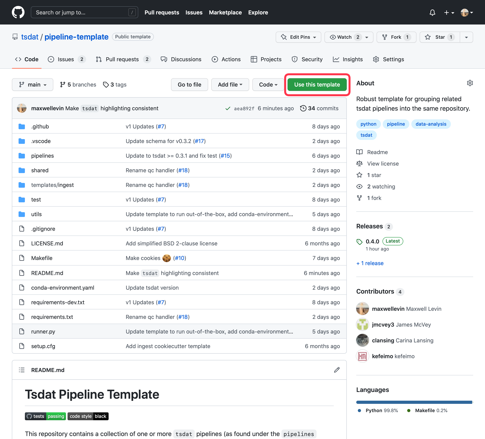

# Getting Started

To get started developing a tsdat pipeline, we suggest following the steps below.

1. Get a template
2. Configure the template
3. Use the template

## Choose a template

The recommended way to set up a tsdat pipeline is to use a GitHub repository template. You can find a list of template
repositories for tsdat [here](https://github.com/tsdat/template-repositories).

The most used and most flexible template is the [Pipeline Template](https://github.com/tsdat/pipeline-template)
repository, so we recommend starting there.

Once you have selected the template to use, select the "Use this template" button to create a new repository at your
specified location with the template contents.

!!! note
    You must have a github account and be signed-in to see this button. You can still click to download the code as a
    zip file and follow the rest of the setup instructions, but you will be lacking certain features (e.g., automated
    testing via github actions)



## Configure the Template

Once you have created a new repository from the template, you can clone your repository to your local desktop and start
developing. By default, the repository template comes pre-configured to run out-of-the-box on an example dataset.

We recommend that reading through the template's README and examining the included example before starting to configure
the template. The template README will include end-to-end instructions on how to customize the template and create your
own pipelines, but for those who learn best doing things hands-on, we recommend starting with the
[pipeline template tutorial](tutorials/data_ingest.md) for a complete walkthrough of setting up and configuring the
pipeline-template repository.

See the [Configuring Tsdat](./config/configuring_tsdat.md) section for more information on tsdat configuration files and
code customizations.

## Using the template

Once tsdat is installed and your template is configured, you can use it to process data on your computer using the
`runner.py` script included in the repository. To see the full list of options offered by this script run:

```bash
python runner.py --help
```

For detailed examples of how to set up and use tsdat see [pipeline customization](./tutorials/pipeline_customization.md)
and our other tutorials.
