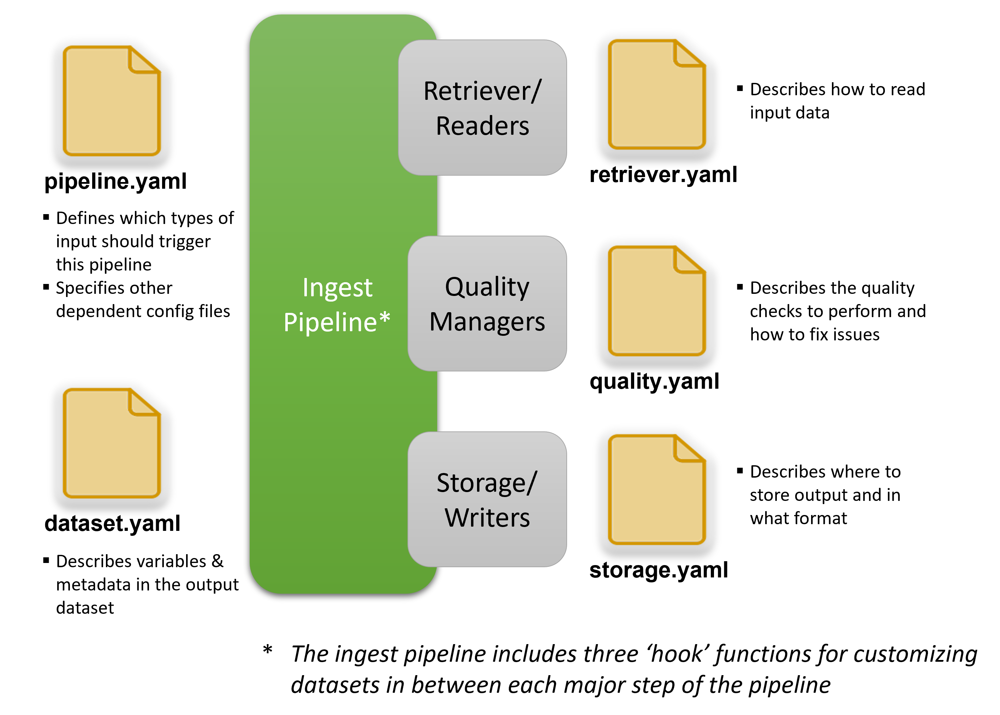

# About

**Tsdat** is an open-source Python framework that makes creating pipelines to process and standardize time-series data
more easy, clear, and quick to stand up so that you can spend less time data-wrangling and more time on data analysis.

Tsdat was originally written for use in the Marine Energy community and was developed with data standards and best
practices borrowed from the [ARM program](https://arm.gov), but the library and framework itself is applicable to any
domain in which large datasets are collected.

## How It Works

A Tsdat pipeline involves the following steps, as shown in in the figure below:

As illustrated in the diagram, one or more raw data files are read into an xarray
[Dataset](http://xarray.pydata.org/en/stable/generated/xarray.Dataset.html#xarray.Dataset), combined into a single
standardized Dataset, run through a set of quality managers for validating and cleaning data, and finally saved to
persistent storage.

Tsdat's pipeline framework is built on top of [xarray](http://xarray.pydata.org/en/stable/) and the
[netCDF](https://www.unidata.ucar.edu/software/netcdf/) file format, which are frequently used in the climate science
community. Xarray can be thought of as a multidimensional extension of pandas, though it is not built on top of pandas.
Xarray Datasets support all of the same basic functionality of dictionaries (e.g., indexing, iterating, etc.), with
additional functionality that is designed to streamline the process of analyzing and working with data. The netCDF
format is particularly powerful because it provides a two-level data structure that stores independent,
multi-dimensional variables by shared dimensions (e.g. latitude, longitude, and time). It is highly recommended to
familiarize oneself with the Xarray library and netCDF before working with Tsdat.

Tsdat is designed so that users can quickly set up their pipeline, but yet completely customize the behavior as needed.
A Tsdat pipeline is comprised of a Pipeline class and several configuration files which control how the pipeline runs
and what the output dataset will look like. The Tsdat pipeline components are shown below:

In addition to controlling the pipeline's behavior via configuration files, further customization for more complicated
or multi-dimensional datasets can be accomplished using user-defined code "hooks" (functions inside the IngestPipeline
class) that are triggered at various points in the pipeline. Plots can be added through a particular "hook" as well.

Tsdat provides an easy-to-use template for jump starting your pipeline. The template contains a custom IngestPipeline
class with empty hook functions and pre-filled out configuration files for defining your pipeline. This template should
support ~90% of cases out of the box. However for special circumstances, users can also override any of the core
functions of the IngestPipeline class to implement special one-off behavior. Consult the
[getting-started](./getting_started.md) section for more information on getting started with a template.

## Motivation

Publicly available datasets are often difficult to use because the information needed to understand the data are
buried away in technical reports and loose documentation that are often difficult to access and are not well-maintained.
Even when you are able to get your hands on both the dataset and the metadata you need to understand the data, it can
still be tricky to write code that reads each data file and handles edge cases. Additionally, as you process more and
more datasets it can become cumbersome to keep track of and maintain all of the code you have written to process each
of these datasets.

The goal of tsdat is to produce high-quality datasets that are much more accessible to data users. Tsdat encourages
following data standards and best practices when building data pipelines so that your data is clean, easy to understand,
 more accessible, and ultimately more valuable to your data users.

## Acknowledgements

Tsdat was developed by Carina Lansing(1), Maxwell Levin(1), and James
McVey(1) with support and management from Chitra Sivaraman(1) and
funding from the United States Water Power Technologies Office within
the Department of Energy's Office of Energy Efficiency and Renewable
Energy.

We would like to thank Rebecca Fao(2), Calum Kenny(2), Raghavendra
Krishnamurthy(1), Yangchao (Nino) Lin(1), Eddie Schuman(1), and Emma
Cotter(1) for their feedback, testing, and support early on during the
development.

(1) Pacific Northwest National Laboratory, (2) National Renewable Energy
Laboratory
