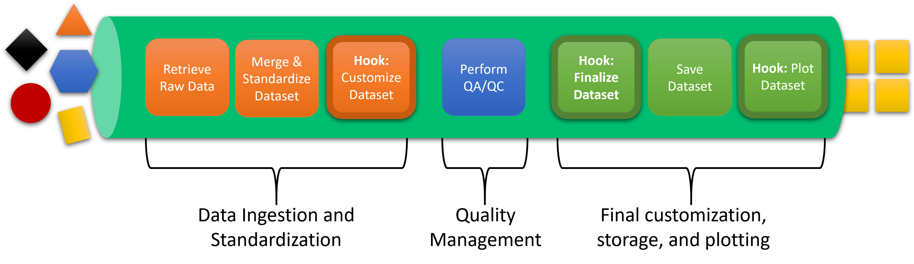
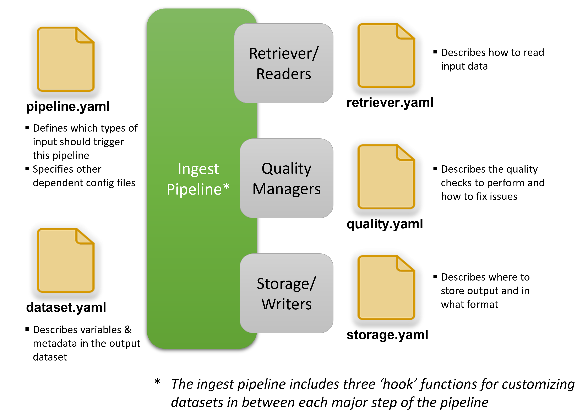

.. _Xarray: http://xarray.pydata.org/en/stable/
.. _netCDF: https://www.unidata.ucar.edu/software/netcdf/
.. _ARM program: https://arm.gov

.. _quick-overview:

About
-----

Tsdat is a data pipeline framework written in Python for standardizing time-series datasets.

It was originally written for use in the Marine Energy community and was developed 
with data standards and best practices borrowed from the `ARM program`_, but the library 
and framework itself is applicable to any domain in which large datasets are collected.

.. figure:: figures/tsdat_pipeline.png
   :alt: Framework for data ingestion and standardization.
   
   Framework for data ingestion and standardization.
   

How It Works
^^^^^^^^^^^^
A Tsdat pipeline involves the following steps, as shown in in the below figure:

   Overview of a Tsdat Data Ingestion Pipeline.

As illustrated in the diagram, one or more raw data files are read into an xarray `Dataset <http://xarray.pydata.org/en/stable/generated/xarray.Dataset.html#xarray.Dataset>`_,
combined into a single standardized Dataset, run through a set of quality managers for validating and cleaning data,
and finally saved to persistent storage.

Tsdat's pipeline framework is built on top of `xarray`_ and the `netCDF`_ file format, which are frequently used in the climate science community.
Xarray can be thought of as a multidimensional extension of pandas, though it is not built on top of pandas. Xarray Datasets
support all of the same basic functionality of dictionaries (e.g., indexing, iterating, etc.), with additional
functionality that is designed to streamline the process of analyzing and working with data. The netCDF format is particularly powerful because it provides
a two-level data structure that stores independent, multi-dimensional variables by shared dimensions (e.g. latitude, longitude, and time).
It is highly recommended to familiarize oneself with the Xarray library and netCDF before working with Tsdat.

Tsdat is designed so that users can quickly set up their pipeline, but yet completely customize the behavior as needed. A Tsdat
pipeline is comprised of a Pipeline class and several configuration files which control how the pipeline runs and what
the output dataset will look like.  The Tsdat pipline components are shown below:

   Tsdat Pipeline Components.

In addition to controlling the pipeline's behavior via configuration files, further customization for more complicated
or multi-dimensional datasets can be accomplished using user-defined code “hooks” (functions inside the IngestPipeline class)
that are triggered at various points in the pipeline. Plots can be added through a particular "hook" as well.

Tsdat provides an easy-to-use template for jump starting your pipeline.  The template contains a custom IngestPipeline class
with empty hook functions and pre-filled out configuration files for defining your pipeline.   This template should support ~90% of cases out of the box.
However for special circumstances, users can also override any of the core functions of the IngestPipeline class to
implement special one-off behavior.  Consult the :ref:`getting-started` section for more information on getting started with a template.

.. _motivation:

Motivation
^^^^^^^^^^

Publically available datasets are often difficult to use because the information 
needed to understand the data are buried away in technical reports and loose
documentation that are often difficult to access and are not well-maintained.
Even when you are able to get your hands on both the dataset and the metadata
you need to understand the data, it can still be tricky to write code that
reads each data file and handles edge cases. Additionally, as you process more
and more datasets it can become cumbersome to keep track of and maintain all of
the code you have written to process each of these datasets.

The goal of tsdat is to produce high-quality datasets that are much more accessible 
to data users. Tsdat encourages following data standards and best practices when 
building data pipelines so that your data is clean, easy to understand, more accessible, 
and ultimately more valuable to your data users.
 