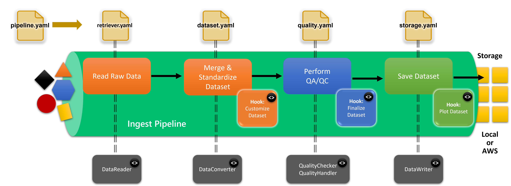

.. _configuring_tsdat:

Configuring Tsdat
=================

Tsdat pipelines can be configured to tailor the specific data and metadata that will 
be contained in the standardized dataset.

The following figure illustrates the different phases of the pipeline along with 
multiple layers of configuration that Tsdat provides.

   
   Tsdat pipelines provide multiple levels of configuration.

Users can customize Tsdat in three ways:

#. **Configuration files** - shown as input to the pipeline on the top
#. **Code hooks** - indicated **inside** the pipeline with code (<>) bubbles.  Code hooks are provided by
   extending the IngestPipeline base class to create custom pipeline behavior.
#. **Helper classes** - indicated **outside** the pipeline with code (<>) bubbles.  Helper classes provide reusable, cross-pipeline functionality such
   as custom file readers or quality control checks.  The specific helper classes that are used
   for a given pipeline are declared in the storage or pipeline config files.

Tsdat pipelines produce standardized datasets that follow the conventions and terminology provided in the `Data Standards Document <https://github.com/ME-Data-Pipeline-Software/data_standards>`_. Please refer to this document for more detailed information about the format of standardized datasets.

.. toctree::
   :maxdepth: 1

   pipeline_config
   retriever_config
   dataset_config
   storage_config
   quality_control
   hook_functions
   transform_config
   pydantic

.. note::
   Configuration files are written in yaml format.  We recommend using an IDE with
   yaml support (such as VSCode) for editing your config files.
   

.. note::
   For more information on classes in Python, see `<https://docs.python.org/3/tutorial/classes.html>`_
   