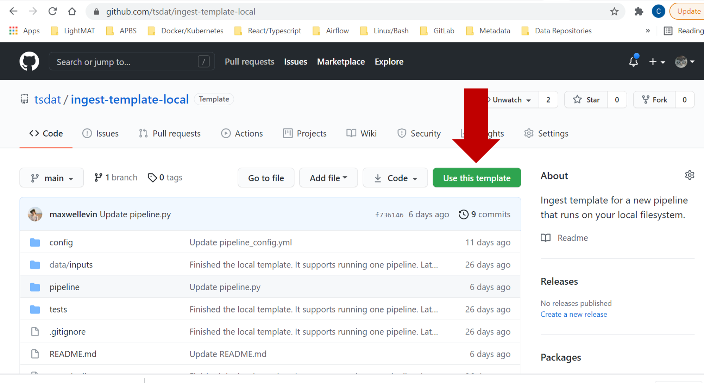

.. getting_started:

.. _examples folder: https://github.com/tsdat/tsdat/tree/master/examples
.. _pipeline template file:  https://github.com/tsdat/tsdat/blob/master/examples/templates/ingest_pipeline_template.yml
.. _Xarray: http://xarray.pydata.org/en/stable/
.. _netCDF: https://www.unidata.ucar.edu/software/netcdf/
.. _act-atmos: https://github.com/ARM-DOE/ACT
.. _anaconda: https://www.anaconda.com
.. _docker: https://www.docker.com

.. _getting-started:

###############
Getting Started
###############

To get started developing a tsdat pipeline, we suggest following the following
steps, which are explained in more detail in the linked sections:

1. :ref:`Install tsdat<Installation>`
2. :ref:`Get a template<template>`
3. :ref:`Configure template<configuring_tsdat>`
4. :ref:`Run pipeline<running-tsdat>`

.. _prerequisites:

Prerequisites
*************
Tsdat requires `Python 3.8+ <https://www.python.org/downloads/>`_

.. _installation:

Installation
************
You can install tsdat simply by running ``pip install tsdat`` in a console 
window.  

.. _template:

Getting a Tsdat Pipeline Template
*********************************
The quickest way to set up a Tsdat pipeline is to use a GitHub repository template.
You can find a list of template repositories for tsdat at `<https://github.com/tsdat/template-repositories>`_.

.. note::
   Currently, there are only two ingest templates available, but more will
   be added over time, including support for VAPs, multi-pipeline templates,
   and specific data models.

#. `Local Ingest Template <https://github.com/tsdat/ingest-template-local>`_

    Use this template to run ingest pipelines on your local computer.

#. `AWS Ingest Template <https://github.com/tsdat/ingest-template-aws>`_

    Use this template to run ingest pipelines on AWS.  (It requires an AWS account.)

Once you have selected the template to use, select the "Use this template" button
to create a new repository at your specified location with the template contents.

Once you have created a new repository from the template, you can clone your 
repository to your local desktop and start developing.  By default, the repository
template will come pre-configured to run out-of-the-box on an example dataset.  

See :ref:`configuring your pipeline<configuring_tsdat>` for more information on 
tsdat-specific configuration file and code customizations.  In addtion, make
sure to read the **README.md** file associated with your template for any
template-specific instructions.

.. _running-tsdat:

Running Your tsdat Pipeline
****************************

Once tsdat is installed and your pipeline template is configured, you can run it on 
your input data using the following code from a terminal window at the top level of your repository::

    python3 run_pipeline.py

By default this will run the pipeline on all files in the **data/inputs** folder and it will run in **'dev'
mode**, with all outputs going to the **storage/root** folder.  To run the pipeline in production mode on
a specific file, use the following syntax::

    python3 run_pipeline.py $PATH_TO_YOUR_FILE --mode prod

For command-line help::

    python3 run_pipeline.py -h 

For detailed examples of how to set up and use tsdat, consult the 
:ref:`examples-and-tutorials` section.
