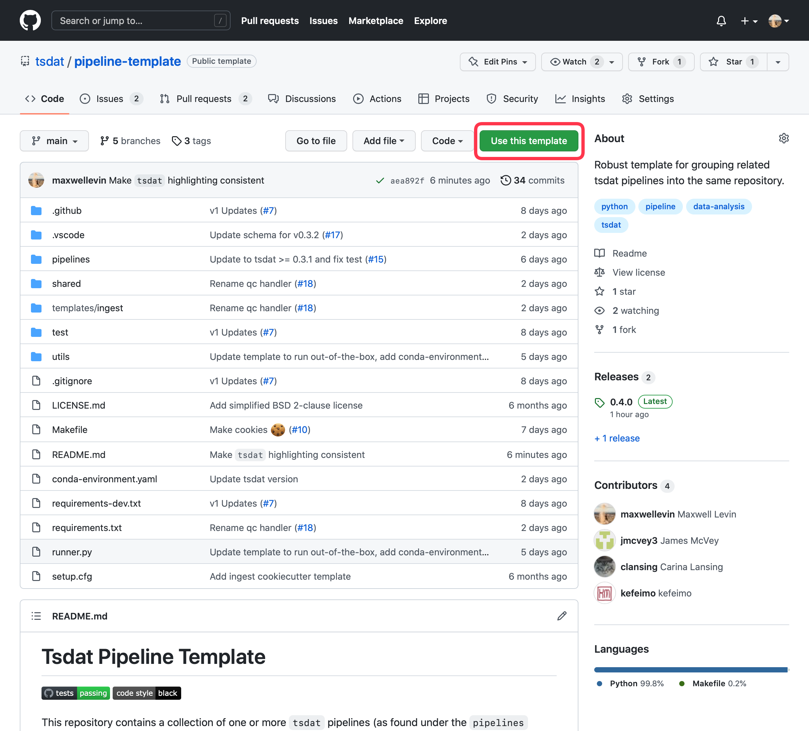

.. getting_started:

.. _Xarray: http://xarray.pydata.org/en/stable/
.. _netCDF: https://www.unidata.ucar.edu/software/netcdf/
.. _act-atmos: https://github.com/ARM-DOE/ACT
.. _anaconda: https://www.anaconda.com
.. _docker: https://www.docker.com

.. _getting-started:

Getting Started
###############

To get started developing a tsdat pipeline, we suggest following the steps below.

1. :ref:`Get a template<template>`
2. :ref:`Configure the template<configuring_template>`
3. :ref:`Use the template<running-tsdat>`

.. _template:

Choose a template
*****************

The recommended way to set up a tsdat pipeline is to use a GitHub repository template.
You can find a list of template repositories for tsdat at `<https://github.com/tsdat/template-repositories>`_.

The most used and most flexible template is the `Pipeline Template <https://github.com/tsdat/pipeline-template>`_
repository, so we recommend starting there.

Once you have selected the template to use, select the "Use this template" button
to create a new repository at your specified location with the template contents.

.. note::
    You must have a github account and be signed-in to see this button. You can still
    click to download the code as a zip file and follow the rest of the setup instructions,
    but you will be lacking certain features (e.g., automated testing via github actions)

.. _configuring_template:

Configure the Template
************************

Once you have created a new repository from the template, you can clone your repository
to your local desktop and start developing. By default, the repository template comes
pre-configured to run out-of-the-box on an example dataset.

We recommend that reading through the template's README and examining the included example
before starting to configure the template. The template README will include end-to-end
instructions on how to customize the template and create your own pipelines, but for those
who learn best doing things hands-on, we recommend starting with the
:ref:`pipeline template tutorial<data_ingest>` for a complete walkthrough of
setting up and configuring the pipeline-template repository.

See the :ref:`Configuring Tsdat<configuring_tsdat>` section for more information on tsdat
configuration files and code customizations.

.. _running-tsdat:

Using the template
******************

Once tsdat is installed and your template is configured, you can use it to process data 
on your computer using the ``runner.py`` script included in the repository. To see the full
list of options offered by this script run:

.. code-block:: bash

    python runner.py --help

For detailed examples of how to set up and use tsdat, consult :ref:`configuring_tsdat`
and :ref:`examples_and_tutorials`.
