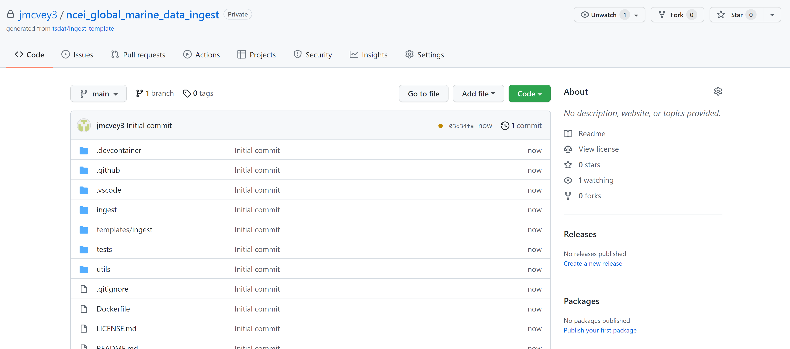
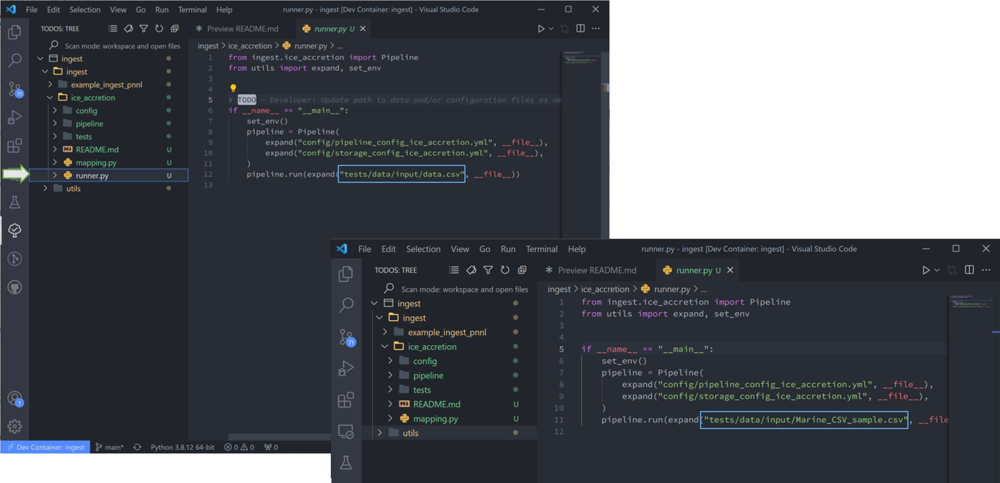
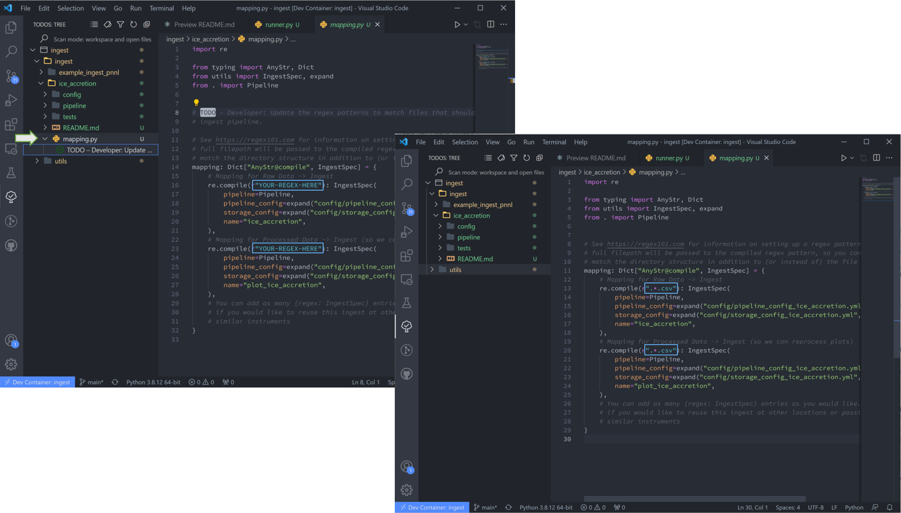
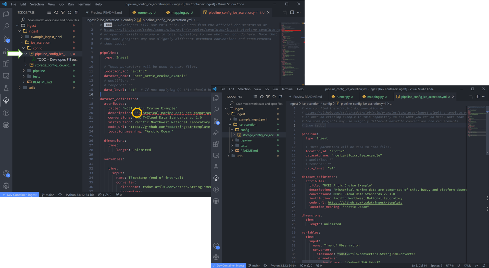
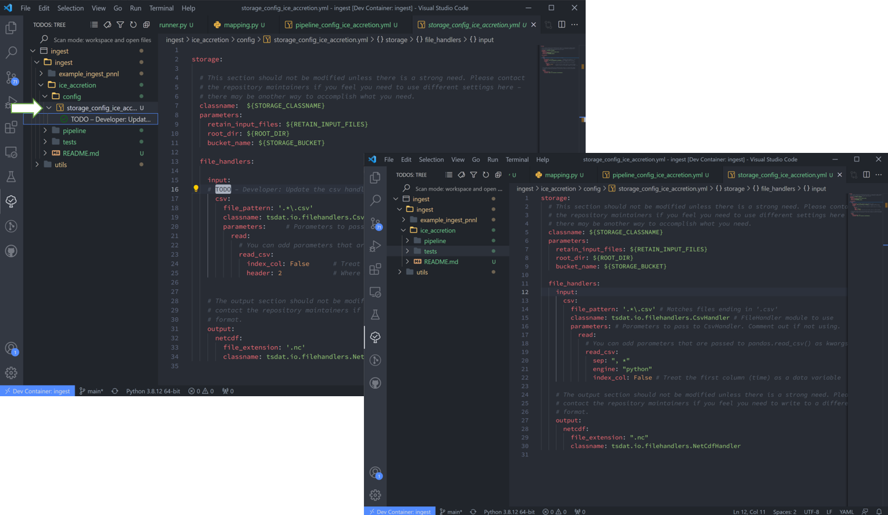
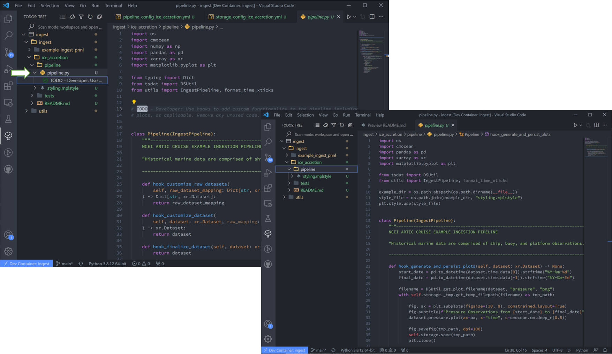
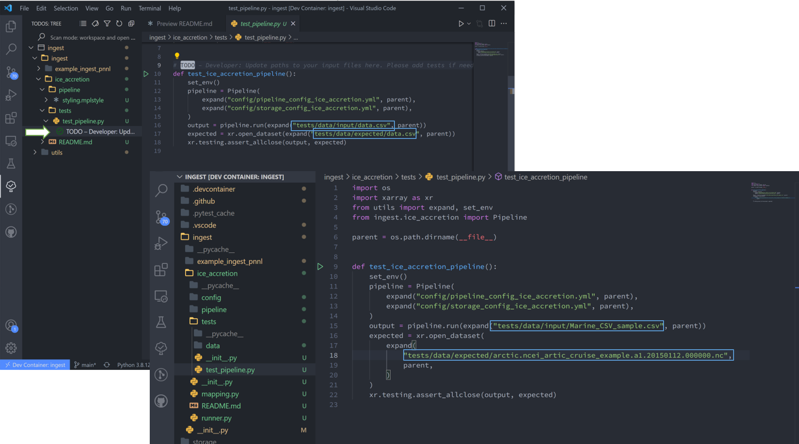

.. _template repository: https://github.blog/2019-06-06-generate-new-repositories-with-repository-templates/
.. _Docker container: https://www.docker.com/
.. _Anaconda environment: https://www.anaconda.com/

.. _data_ingest: 

Pipeline Template Tutorial
---------------------------

In this tutorial we will build a data ingestion pipeline to ingest some global
marine data hosted by the National Oceanic and Atmospheric Administration’s 
(NOAA) National Centers for Environmental Information (NCEI). The data can be 
found at https://www.ncdc.noaa.gov/cdo-web/datasets under the “Global Marine 
Data” section. This is a pretty simple and high-quality dataset, so this data 
ingest will be pretty straight-forward. We will walk through the following 
steps in this tutorial:

#.	Examine and download the data
#.	Set up a GitHub repository in which to build our ingestion pipeline
#.	Modify configuration files and ingestion pipeline for our NCEI dataset
#.	Run the ingest data pipeline on NCEI data

Now that we’ve outlined the goals of this tutorial and the steps that we will 
need to take to ingest this data we can get started with step #1. 

Examining and downloading the data
==================================

Navigate to https://www.ncdc.noaa.gov/cdo-web/datasets and download the 
documentation and a data sample from their global marine data section.

.. figure:: global_marine_data/global_marine_data_webpage.png
   :alt: NOAA / NCEI Webpage for Global Marine Data sample data and documentation.


The documentation describes each variable in the sample dataset and will be 
extremely useful for updating our configuration file with the metadata for this
dataset. The metadata we care most about are the units and user-friendly text 
descriptions of each variable, but we also need to be on the lookout for any 
inconsistencies or potential data problems that could complicate how we process
this dataset. Take, for example, the following descriptions of the various 
temperature measurements that this dataset contains and note that the units are
not necessarily the same between files in this dataset:

.. figure:: global_marine_data/global_marine_data_documentation.png
   :alt: Global Marine Data documentation snippet indicating temperature measurements can be reported in Celcius or Fahrenheit depending on contributor preference.


If we were collecting this data from multiple users, we would need to be aware 
of possible unit differences between files from different users and we would 
likely want to standardize the units so that they were all in Celsius or all in
Fahrenheit (Our preference is to use the metric system wherever possible). If 
we examine this data, it appears that the units are not metric – how 
unfortunate. Luckily, this is something that can easily be fixed by using 
tsdat.

.. figure:: global_marine_data/global_marine_data_csv_snippet.png
    :alt: Snippet from a sample data file.

    Selection from the sample dataset. It appears that units are recorded in the imperial system instead of the metric system – Sea Level Pressure is recorded in Hg instead of hPa (Hectopascal) and Air Temperature is recorded in degF (Fahrenheit) instead of degC (Celsius).


Creating a repository from a template
=====================================

Now that we have the data and metadata that we will need, let’s move on to 
step #2 and set up a GitHub repository for our work. What we are looking to 
do is read in the NCEI “raw” data, apply variable names and metadata, 
apply quality control, and convert it into the netCDF format – an ‘ingest’, 
in other words. To do this, navigate to https://github.com/tsdat/pipeline-template
and click “Use this template” (you must log into github to see this button).

.. figure:: global_marine_data/github1.png
    :alt:


This will open https://github.com/tsdat/pipeline-template/generate (you can
also just open this link directly) which will prompt you to name your 
repository. Go ahead and fill out the information however you would like and 
set the visibility to your preference.

.. figure:: global_marine_data/github2.png
    :alt:
  
    Example shown is titled "ncei-global-marine-data-ingest".


Click “Create repository from template” to create your own repository that you 
can work in for this example.



Go ahead and clone the repository to your local machine and open it up in 
whatever IDE you prefer.

Next install Python 3.8+ if you haven’t already done so and create an 
environment in which to manage your project’s dependencies. You can download 
and install Python here: https://www.python.org. When developing with intent to
deploy to a production system, we recommend managing your environment using a 
`Docker Container`_ or an `Anaconda environment`_. 


.. setting_up_docker:

Setting up a Docker Container and VS Code
=========================================

Because Tsdat support for Windows machines is currently limited (and I have a 
windows machine), I'll show how you to set up tsdat in VSCode using tsdat's Docker
setup. This setup is recommended because it creates a self-contained development
environment and is pretty user-friendly.

Start by installing `Docker <https://www.docker.com/products/docker-desktop>`_ 
and `VSCode <https://code.visualstudio.com/>`_. It's a good idea to familiarize
yourself with the VScode interface, and feel free to go through
Docker's initial tutorial after installation. It goes through basics on setting 
up a Docker "engine" to make sure it's working - you don't need to know how to 
do this (or really anything in Docker) to use Tsdat.

Once you have VS Code and Docker downloaded and installed:

1. Open VSCode -> New Window -> Open Folder -> open cloned template folder ("ncei_global_marine_data_ingest")
	
  .. figure:: global_marine_data/vscode1.png
      :align: center
      :width: 100%
      :alt:

  |

  .. figure:: global_marine_data/vscode2.png
      :align: center
      :width: 100%
      :alt:

  |
	
2. VSCode will prompt you if you want to open in Docker -> Click yes and wait for docker to initiate, which takes a minute or two.
	
  .. figure:: global_marine_data/vscode3.png
      :align: center
      :width: 100%
      :alt:

  |

  .. figure:: global_marine_data/vscode4.png
      :align: center
      :width: 100%
      :alt:

  |
	
3. VSCode will prompt if you want to install dependencies -> Hit install; you can close the new windows it opens
	
  .. figure:: global_marine_data/vscode5.png
      :align: center
      :width: 100%
      :alt:

  |

4. VS Code will then prompt you to restart window after pylance is installed -> Hit yes again and VS Code will reboot
	
  .. figure:: global_marine_data/vscode6.png
      :align: center
      :width: 100%
      :alt:

  |

Congrats! Python environment handling done. Open the "Explorer" tab to see folder contents for the next step:

  .. figure:: global_marine_data/vscode7.png
      :align: center
      :width: 100%
      :alt:

  |

A few quick things on VSCode: in the left-hand toolbar, we will use the "Explorer", "Search", "Testing", and "TODO tree" icons in this tutorial. Also useful to know are the commands "ctrl \`" (toggle the terminal on/off) and "ctrl shift P" (open command search bar).


Run the Basic Template
======================

Navigate to the "runner.py" file and run it. This will run the basic example stored
in the template. Notice the data here is stored in the "tests" folder, but can be
located anywhere that the user desires.

  .. figure:: global_marine_data/vscode8.png
      :align: center
      :width: 100%
      :alt:

  |

After the code runs, there won't be any particular output in the terminal window. Notice that a new ``storage/`` folder is created with the following contents:

  .. figure:: global_marine_data/vscode9.png
      :align: center
      :width: 100%
      :alt:

  |

These files contain the outputs of the ingest pipeline example. Note that there 
are two subdirectories here – one ends in “.00” and the other ends with “.a1”. 
This ending is called the “data level” and indicates the level of processing 
of the data, with “00” representing raw data that has been renamed according 
to the data standards that tsdat was developed under, "a1" refers to data
that has been standardized, but no quality control has been applied, and “b1” 
representing data that has been ingested, standardized, and quality-controlled.

For more information on the standards used to develop tsdat, please consult 
`our data standards <https://github.com/tsdat/data_standards>`_.


Creating a New Ingest
=====================
Now that all the setup work is done, let’s start working on ingesting the NCEI
data.

1. In the Explorer window pane you'll see a list of all folders and files in this ingest -> right click on the top level README.md and select "open preview". The steps in this readme we are more or less following in this tutorial.

2. Scroll down to "Adding a pipeline". We have already done steps 1 and 2.

  .. figure:: global_marine_data/vscode10.png
      :align: center
      :width: 100%
      :alt:

  |

3. Looking at Readme step #3, we'll run a quick test of the pipeline to make sure everything is set up properly. Navigate to "Testing" and run all tests using the "Play" icon by hoving over the "ingest" dropdown. Tsdat will automatically configure these tests, and they all should pass at this point in time.

  .. figure:: global_marine_data/vscode10.png
      :align: center
      :width: 100%
      :alt:

  |

4. Looking at Readme step #4: Navigate back to the "Explorer" pane and hit "ctrl \`" to open the terminal. 
Create a new ingest by running the following code in the terminal:
	
.. code-block::

	cookiecutter templates/ingest -o ingest/
  
	
There will follow a series of prompts that'll be used to auto-fill the new ingest. Fill
these in for the particular dataset of interest. Note: the term "slug" here means directory 
names. For this ingest we will not be using custom QC functions or custom file handlers, 
so select no for those as well. (See :ref:`Custom QC & file handler tutorial <more_code>`
for those)

  .. figure:: global_marine_data/vscode12.png
      :align: center
      :width: 100%
      :alt:

  |

Once you fill that list out and hit the final enter, Tsdat will create a new ingest folder 
named with <ingest_slug>, in this case "ice_accretion":

  .. figure:: global_marine_data/vscode13.png
      :align: center
      :width: 100%
      :alt:

  |

5. Right-click the README.md in our new "ice_accretion" ingest and "open-preview".
We are now looking at step #2: Use the "TODO tree" extension or use the search tool
to find occurances of "# TODO-Developer". (We have in fact followed the instructions 
in this step #1 already, if you were curious.)

  .. figure:: global_marine_data/vscode14.png
      :align: center
      :width: 100%
      :alt:

  |

6. The "TODO tree" lists every literal "TODO" instance in the code, and we are looking
in particular for "TODO - Developer". (The "TODO tree" is in fact the oak tree icon in 
the left-hand window pane).

You'll need to reload VS Code for these to show up in the ingest. Hitting "ctrl shift P"
on the keyboard to open the search bar, and type in and run the command "Reload Window".

  .. figure:: global_marine_data/vscode15.png
      :align: center
      :width: 100%
      :alt:

  |

After doing the window reloads, all the newly created "TODOs" will show up in the new 
ingest folder.

  .. figure:: global_marine_data/vscode16.png
      :align: center
      :width: 100%
      :alt:

  |

Customizing the New Ingest
==========================
Each ingest folder is particular to a specific datafile, so we must customize our ingest
to our particular datafile. The following section describes how to customize a pipeline 
for our historical ship data, following the TODOs list.

7. Let's start with "runner.py". This "TODO" states 'Update path to data and/or 
configuration files as needed.' As you can see, the `cookiecutter` command auto-filled
the configuration filenames, so all we need to do is replace the input data. Once done,
delete the "TODO" and it disappears from the list.

Raw datafiles can be stored anywhere (but here I have moved it to the tests/data/input/ folder),
so long as the `run_pipeline` command is referenced to the correct location. Also be sure 
to delete any other files not to be read through the pipeline from the data folder. Tsdat 
will try to run these and will fail.




8. "mapping.py" is next. This particular file doesn't have a repeatable pattern that
Regex can accomodate, so we'll simply use the file extension regex ".*.csv".




9. Now we will move on the configuration files. These are the most user-involved, and
we'll start with "pipeline_config_ice_accretion.yml". which we’ll need to modify to 
capture the variables and metadata we want to retain in this ingest. My config file is
shown below this next figure.

Note that if VS Code finds errors in a file, it highlights the file track in red.
This particular case is due to double quotation marks, so I'll get rid of the extra set of
those in that line.




This part of the process can take some time, as it involves knowing or learning a lot 
of the context around the dataset and then writing it up succinctly and clearly so 
that your data users can quickly get a good understanding of what this dataset 
is and how to start using it. The pipeline config file is super specific to the
particular dataset you are working on:

.. code-block:: yaml
  :linenos:

  pipeline:
    type: Ingest

    # These parameters will be used to name files.
    location_id: "arctic"
    dataset_name: "ncei_artic_cruise_example"
    # qualifier: ""
    # temporal: ""
    data_level: "a1"

  dataset_definition:
    attributes:
      title: "NCEI Artic Cruise Example"
      description: "Historical marine data are comprised of ship, buoy, and platform observations."
      conventions: MHKiT-Cloud Data Standards v. 1.0
      institution: Pacific Northwest National Laboratory
      code_url: https://github.com/tsdat/pipeline-template
      location_meaning: "Arctic Ocean"

    dimensions:
      time:
        length: unlimited

    variables:
      time:
        input:
          name: Time of Observation
          converter:
            classname: tsdat.utils.converters.StringTimeConverter
            parameters:
              time_format: "%Y-%m-%dT%H:%M:%S"
        dims: [time]
        type: long
        attrs:
          long_name: Time of Observation (UTC)
          standard_name: time
          units: seconds since 1970-01-01T00:00:00

      lat:
        input:
          name: Latitude
        dims: [time]
        type: float
        attrs:
          long_name: Latitude
          units: degrees N

      lon:
        input:
          name: Longitude
        dims: [time]
        type: float
        attrs:
          long_name: Longitude
          units: degrees E

      ice_accretion:
        input:
          name: Ice Accretion On Ship
        dims: [time]
        type: int
        attrs:
          long_name: Ice Accretion On Ship
          comment: "1: Icing from ocean spray,
            2: Icing from fog,
            3: Icing from spray and fog,
            4: Icing from rain,
            5: Icing from spray and rain, "
          _FillValue: -1

      ice_accretion_thickness:
        input:
          name: Thickness of Ice Accretion on Ship
        dims: [time]
        type: float
        attrs:
          long_name: Thickness of Ice Accretion on Ship
          units: "m"

      ice_accretion_rate:
        input:
          name: Ice Accretion On Ship
        dims: [time]
        type: int
        attrs:
          long_name: Ice Accretion On Ship
          comment: "0: Ice not building up,
            1: Ice building up slowly,
            2: Ice building up rapidly,
            3: Ice melting or breaking up slowly,
            4: Ice melting or breaking up rapidly, "
          _FillValue: -1

      pressure:
        input:
          name: Sea Level Pressure
        dims: [time]
        type: float
        attrs:
          long_name: Pressure at Sea Level
          units: hPa

      pressure_tendency_characteristics:
        input:
          name: Characteristics of Pressure Tendency
        dims: [time]
        type: int
        attrs:
          long_name: Characteristics of Pressure Tendency
          comment: "-1=Data is missing, 0=Increasing, then decreasing, 1=Increasing steadily or unsteadily, 2=Increasing steadily or unsteadily, 3=Decreasing or steady then increasing OR increasing then increasing more rapidly, 4=Steady. Pressure same as 3 hrs. ago, 5=Decreasing then increasing OR decreasing then decreasing more slowly, 6=Decreasing, then steady OR decreasing, then decreasing more slowly, 7=Decreasing steadily or unsteadily, 8=Steady or increasing then decreasing OR decreasing then decreasing more rapidly"
          _FillValue: -1

  quality_management:
    manage_missing_coordinates:
      checker:
        classname: tsdat.qc.checkers.CheckMissing
      handlers:
        - classname: tsdat.qc.handlers.FailPipeline
      variables:
        - COORDS

    manage_coordinate_monotonicity:
      checker:
        classname: tsdat.qc.checkers.CheckMonotonic
      handlers:
        - classname: tsdat.qc.handlers.FailPipeline
      variables:
        - COORDS

    manage_missing_data:
      checker:
        classname: tsdat.qc.checkers.CheckMissing
      handlers:
        - classname: tsdat.qc.handlers.RecordQualityResults
          parameters:
            bit: 1
            assessment: Bad
            meaning: "Missing datapoint"
        - classname: tsdat.qc.handlers.RemoveFailedValues
      variables:
        - DATA_VARS


10. The file handler is managed in "storage_config_ice_accretion.yml".
For this particular dataset, we'll use tsdat's built-in filehandler. 


    

If we examine the sample csv closely we can see that a mixture of tabs, commas, and 
spaces are used to separate the columns. While this somewhat works visually, many 
libraries have trouble parsing this. To solve this with tsdat, we can add some parameters 
to the storage configuration file to indicate how those gaps should be handled. Put 
together, the storage config file for the data I want looks like this: 


.. code-block:: yaml
  :linenos:

  storage:
    classname: ${STORAGE_CLASSNAME}
    parameters:
    retain_input_files: ${RETAIN_INPUT_FILES}
    root_dir: ${ROOT_DIR}
    bucket_name: ${STORAGE_BUCKET}

    file_handlers:
    input:
      csv:
      file_pattern: '.*\.csv' # Matches files ending in '.csv'
      classname: tsdat.io.filehandlers.CsvHandler # FileHandler module to use
      parameters: # Parameters to pass to CsvHandler. Comment out if not using.
        read:
          read_csv:
            sep: ", *"
            engine: "python"
            index_col: False

    output:
      netcdf:
      file_extension: ".nc"
      classname: tsdat.io.filehandlers.NetCdfHandler


11. Finally "pipeline.py" is the last "get pipeline to working mode" "TODO" we should
finish setting up here (excluding a custom file handler or QC functions, if needed. Those
will get covered in another tutorial). It contains a series of "hook" functions that can 
be used along the pipeline for further data organization.


   

The most common used is the last one "hook_generate_and_persist_plots", which plot the 
processed data and save them in the output folder. I’ve removed all others to keep this 
simple and created a simple plot for the pressure variable (Unforunately this particular
dataset didn't log ice accretion, so feel free to run more files from the NOAA database 
to see that data):


.. code-block:: python
  :linenos:

  import os
  import cmocean
  import pandas as pd
  import xarray as xr
  import matplotlib.pyplot as plt

  from tsdat import DSUtil
  from utils import IngestPipeline, format_time_xticks

  example_dir = os.path.abspath(os.path.dirname(__file__))
  style_file = os.path.join(example_dir, "styling.mplstyle")
  plt.style.use(style_file)


  class Pipeline(IngestPipeline):
      """--------------------------------------------------------------------------------
      NCEI ARTIC CRUISE EXAMPLE INGESTION PIPELINE
      
      "Historical marine data are comprised of ship, buoy, and platform observations."
      
      --------------------------------------------------------------------------------"""
      def hook_generate_and_persist_plots(self, dataset: xr.Dataset) -> None:
          start_date = pd.to_datetime(dataset.time.data[0]).strftime("%Y-%m-%d")
          final_date = pd.to_datetime(dataset.time.data[-1]).strftime("%Y-%m-%d")

          filename = DSUtil.get_plot_filename(dataset, "pressure", "png")
          with self.storage._tmp.get_temp_filepath(filename) as tmp_path:

            fig, ax = plt.subplots(figsize=(10, 8), constrained_layout=True)
            fig.suptitle(f"Pressure Observations from {start_date} to {final_date}")
            dataset.pressure.plot(ax=ax, x="time", c=cmocean.cm.deep_r(0.5))

            fig.savefig(tmp_path, dpi=100)
            self.storage.save(tmp_path)
            plt.close()

          return


Running the Pipeline
====================

We can now re-run the pipeline using the "runner.py" file as before:

  .. figure:: global_marine_data/vscode22.png
      :align: center
      :width: 100%
      :alt:

  |

Once the pipeline runs, if you look in the "storage" folder, you'll see 
the plot as well as the netCDF file output:

  .. figure:: global_marine_data/vscode23.png
      :align: center
      :width: 100%
      :alt:

  |

Data can be viewed by opening the terminal (``ctrl ```) and running a quick python shell:

.. code-block:: bash

  # cd storage/arctic/arctic.ncei_artic_cruise_example.a1/
  # python
  
In the python shell that opens, we can view the dataset for a quick overview:

.. code-block::

  >>> import xarray as xr
  >>> ds = xr.open_dataset('arctic.ncei_artic_cruise_example.a1.20150112.000000.nc')
  >>> ds
  <xarray.Dataset>
  Dimensions:                               (time: 55)
  Coordinates:
    * time                                  (time) datetime64[ns] 2015-01-12 .....
  Data variables: (12/14)
      lat                                   (time) float64 ...
      lon                                   (time) float64 ...
      ice_accretion                         (time) float64 ...
      ice_accretion_rate                    (time) float64 ...
      pressure                              (time) float64 ...
      pressure_tendency_characteristics     (time) float64 ...
      ...                                    ...
      qc_lon                                (time) int32 ...
      qc_ice_accretion                      (time) int32 ...
      qc_ice_accretion_rate                 (time) int32 ...
      qc_pressure                           (time) int32 ...
      qc_pressure_tendency_characteristics  (time) int32 ...
      qc_ice_accretion_thickness            (time) int32 ...
  Attributes:
      title:             NCEI Artic Cruise Example
      description:       Historical marine data are comprised of ship, buoy, an...
      conventions:       MHKiT-Cloud Data Standards v. 1.0
      institution:       Pacific Northwest National Laboratory
      code_url:          https://github.com/tsdat/pipeline-template
      location_meaning:  Arctic Ocean
      datastream_name:   arctic.ncei_artic_cruise_example.a1
      input_files:       arctic.ncei_artic_cruise_example.00.20150112.000000.ra...
      history:           Ran at 2021-12-30 20:55:23


Pipeline Tests
==============

The final TODOs listed are for adding detail to the pipeline description and for testing. Testing is best completed as a last step, after everything is set up and the pipeline outputs
as expected. If running a large number of datafiles, a good idea is to input one of those datafiles here, along with its expected output, and have a separate data folder to collect input files.



In the above figure I have moved the output netcdf file to the tests/data/expected/ folder
for the test to work.
