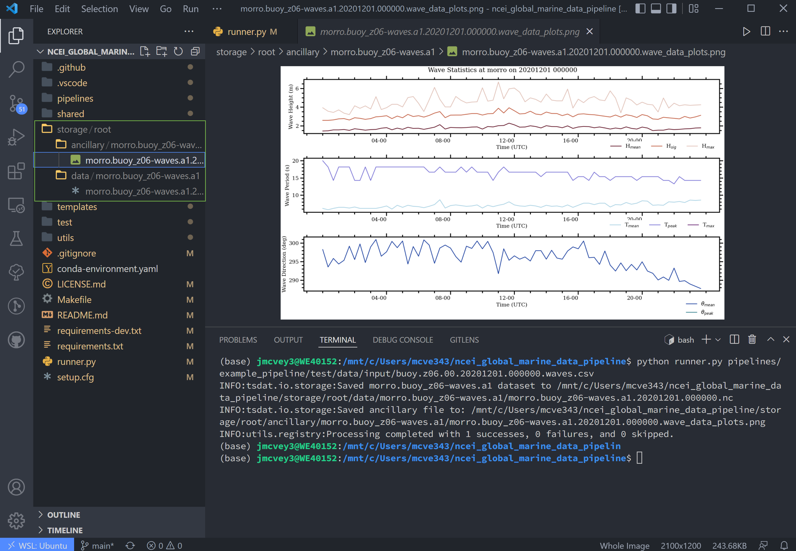
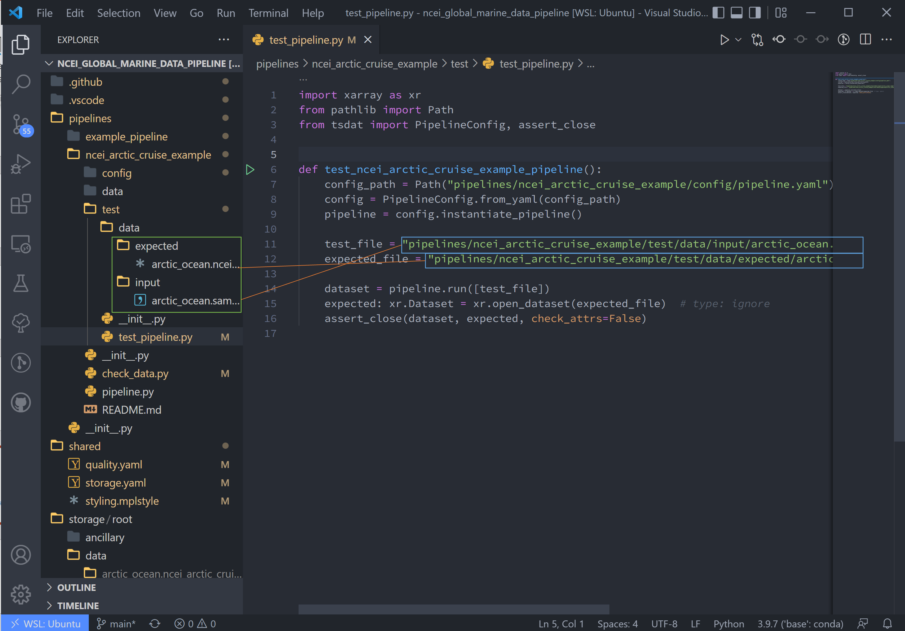

.. _template repository: https://github.blog/2019-06-06-generate-new-repositories-with-repository-templates/
.. _Anaconda: https://docs.anaconda.com/anaconda/install/index.html
.. _Windows Subsystem for Linux: https://docs.microsoft.com/en-us/windows/wsl/about

.. _data_ingest: 

Pipeline Template Tutorial
--------------------------

In this tutorial we will build a data pipeline to ingest global
marine data hosted by the National Oceanic and Atmospheric Administration’s 
(NOAA) National Centers for Environmental Information (NCEI). The data can be 
found at https://www.ncdc.noaa.gov/cdo-web/datasets under the “Global Marine 
Data” section.

We will walk through the following steps in this tutorial:

#.	Examine and download the data
#.	Set up a GitHub repository in which to build our ingestion pipeline
#.	Modify configuration files and ingestion pipeline for our NCEI dataset
#.	Run the ingest data pipeline on NCEI data

Now that we’ve outlined the goals of this tutorial and the steps that we will 
need to take to ingest this data we can get started with step #1. 

Examining and downloading the data
==================================

Navigate to https://www.ncdc.noaa.gov/cdo-web/datasets and download the 
documentation and a data sample from their global marine data section.

.. figure:: global_marine_data/global_marine_data_webpage.png
   :alt: NOAA / NCEI Webpage for Global Marine Data sample data and documentation.

The documentation describes each variable in the sample dataset and will be 
extremely useful for updating our configuration file with the metadata for this
dataset. The metadata we care most about are the units and user-friendly text 
descriptions of each variable, but we also need to be on the lookout for any 
inconsistencies or potential data problems that could complicate how we process
this dataset. Take, for example, the following descriptions of the various 
temperature measurements that this dataset contains and note that the units are
not necessarily the same between files in this dataset:

.. figure:: global_marine_data/global_marine_data_documentation.png
   :alt: Global Marine Data documentation snippet indicating temperature measurements can be reported in Celcius or Fahrenheit depending on contributor preference.

If we were collecting this data from multiple users, we would need to be aware 
of possible unit differences between files from different users and we would 
likely want to standardize the units so that they were all in Celsius or all in
Fahrenheit (Our preference is to use the metric system wherever possible). If 
we examine this data, it appears that the units are not metric – how 
unfortunate. Luckily, this is something that can easily be fixed by using 
tsdat.

.. figure:: global_marine_data/global_marine_data_csv_snippet.png
    :alt: Snippet from a sample data file.

    Selection from the sample dataset. It appears that units are recorded in the imperial system instead of the metric system – Sea Level Pressure is recorded in Hg instead of hPa (Hectopascal) and Air Temperature is recorded in degF (Fahrenheit) instead of degC (Celsius).

Creating a repository from a template
=====================================

Now that we have the data and metadata that we will need, let’s move on to 
step #2 and set up a GitHub repository for our work. What we are looking to 
do is read in the NCEI “raw” data, apply variable names and metadata, 
apply quality control, and convert it into the netCDF format – an ‘ingest
pipeline’, in other words. To do this, navigate to 
https://github.com/tsdat/pipeline-template 
and click “Use this template” (you must log into github to see this button).

.. figure:: global_marine_data/intro1.png
    :alt:

This will open https://github.com/tsdat/pipeline-template/generate (you can
also just open this link directly) which will prompt you to name your 
repository, as well as to make it public or private.

.. figure:: global_marine_data/intro2.png
    :alt:
  
    Example shown is titled "ncei-global-marine-data-ingest".

Click “Create repository from template” to create your own repository that you 
can work in for this example.

Go ahead and clone the repository to your local machine and open it up in 
VS Code.

.. tip::

  You should open the project at the root, which is the Git repo's root directory and
  where the file ``conda-environment.yaml`` is located.

.. note::

  VS Code is not the only IDE that may be used, but we provide additional settings for
  VS Code to make it easier to set up.

Set up Python
=============

Let's set up a python environment that we can develop code in. We will use `Anaconda`_
to create an isolated virtual area that we can install packages to.

.. note::
  
  When developing with intent to deploy to a production system on Windows, we recommend
  using `Windows Subsystem for Linux`_ (WSL) in addition to conda to manage your
  environment. See the :ref:`setting_up_wsl` tutorial for more information.

Once you have anaconda (and optionally WSL) installed, you can run the following command
in the terminal from the project root (e.g., where ``conda-environment.yaml`` is at) to create
and activate the development environment:

.. code-block:: bash

  conda env create --file=conda-environment.yaml
  conda activate tsdat-pipelines

.. tip::
  You can find more details about using conda from `Getting started with conda <https://docs.conda.io/projects/conda/en/latest/user-guide/getting-started.html>`_.

.. note::

    Environments other than conda may be used as long as your python version is >=3.8 and
    you are able to install dependencies from the ``requirements-dev.txt`` file.

Configure Python interpreter in VS Code
=======================================

Tell VS Code to use your new conda environment:

#.  Bring up the command pane in VS Code (shortcut "F1" or "Ctrl+Shift+P")
#.  Type "Python: Select Interpreter" and select it.
#.  Select the newly-created "tsdat-pipelines" conda environment from the drop-down list.
    Note you may need to refresh the list (cycle icon in the top right) to see it.
#.  Bring up the command pane and type "Developer: Reload Window" to reload VS Code and ensure the settings changes propagate correctly.

.. tip::

  A typical path to the Python interpreter in conda is "~/anaconda3/envs/<env-name>/bin/python/".
  You can find more details about using Python in VS Code from `Using Python Environments in Visual Studio Code <https://code.visualstudio.com/docs/python/environments>`_
  and `Get Started Tutorial for Python in Visual Studio Code <https://code.visualstudio.com/docs/python/python-tutorial>`_.

Run the Basic Template
======================

If using VSCode, open the "Explorer" tab to see folder contents 
for the next step:

.. figure:: global_marine_data/intro3.png
    :align: center
    :width: 100%
    :alt:

A few quick things on VSCode: in the left-hand toolbar, we will use the "Explorer", "Search", "Testing", and "TODO tree" icons in this tutorial. Also useful to know are the commands "ctrl \`" (toggle the terminal on/off) and "ctrl shift P" (open command search bar).

Navigate to the ``runner.py`` file and run

.. code-block:: bash

    python runner.py  pipelines/example_pipeline/test/data/input/buoy.z06.00.20201201.000000.waves.csv
    
This will run the example pipeline provided in the ``pipelines/`` folder in the template. 
All pipelines that we create are stored in the ``pipelines/`` folder and are run using 
``python runner.py <path_to_data>``. 

Addition options for the runner can be queried by running:

.. code-block:: bash
  
  python runner.py --help.

.. figure:: global_marine_data/intro4.png
    :align: center
    :width: 100%
    :alt:

After the code runs, notice that a new ``storage/`` folder is created with the following contents:

These files contain the outputs of the example pipeline. Note that there 
are two subdirectories here – "data" and "ancillary". "Data" contains the 
output data in either netcdf or csv format (specified by the user), and 
"ancillary" holds optional plots that a user can create. 

Note, the data directory name contains a “.a1” key.
This ending is called the “data level” and indicates the level of processing 
of the data. “00” represents raw data that has been renamed according 
to the data standards that tsdat was developed under, "a1" refers to data
that has been standardized and some quality control, and “b1” 
represents data that has been ingested, standardized, quality-controlled,
and contains added value from further analysis if applicable.

For more information on the standards used to develop tsdat, please consult 
`our data standards <https://github.com/tsdat/data_standards>`_.

Creating a New Ingest
=====================
Now let’s start working on ingesting the NCEI data.

In the Explorer window pane you'll see a list of all folders and files in this ingest -> right click on the top level README.md and select "open preview". The steps in this readme we are more or less following in this tutorial.

.. figure:: global_marine_data/intro6.png
    :align: center
    :width: 100%
    :alt:

|

Before starting, we'll run a quick test of the pipeline to make sure everything is set up properly.
Navigate to "Testing" and run all tests using the "Play" icon by hovering over the "ingest" dropdown.
Tsdat will automatically configure these tests, and they all should pass at this point in time,
as indicated by green checkmarks.
(You can find more details about testing from `Python testing in Visual Studio Code <https://code.visualstudio.com/docs/python/testing>`_.)

.. figure:: global_marine_data/intro7.png
    :align: center
    :width: 100%
    :alt:

|

Navigate back to the "Explorer" pane and hit "ctrl \`" to open the terminal.
Create a new ingest by running a python template creator called "cookiecutter" 
in the terminal using:
	
.. code-block::

    make cookies

There will follow a series of prompts that'll be used to auto-fill the new ingest. Fill
these in for the particular dataset of interest. For this ingest we will not be using 
custom QC functions, readers/writers, or converters, so select no for those as well. 

.. code-block:: bash

  ingest_name [Name of the Ingest]: ncei_arctic_cruise_example
  ingest_location [Location]: arctic_ocean
  ingest_description [Brief description of the ingest]: Historical marine data that are comprised of ship, buoy and platform observations.                           
  Select use_custom_data_reader [1]: 1
  Select use_custom_data_converter [1]: 1
  Select use_custom_qc [1]: 1
  module [ncei_arctic_cruise_example]: ncei_arctic_cruise_example
  classname [NceiArcticCruiseExample]: NceiArcticCruiseExample
  location_id [arctic_ocean]: arctic_ocean

|

Once you fill that list out and hit the final enter, Tsdat will create a new ingest folder 
named with the "module" name (ncei_arctic_cruise_example):

.. figure:: global_marine_data/intro9.png
    :align: center
    :width: 100%
    :alt:

|

5. Right-click the README.md in our new "ncei_arctic_cruise_example" ingest and 
"open-preview". Scroll down to "Customizing your pipeline" (we have already
accomplished the previous steps, but these are good to check).

|

6. We are now looking at step #1: Use the "TODO tree" extension or use the search tool
to find occurrences of "# Developer". (The "TODO tree" is the oak tree icon in 
the left-hand window pane).

You may need to reload VS Code for these to show up in the ingest. Hitting "ctrl shift P"
on the keyboard to open the search bar, and type in and run the command "Reload Window".

.. figure:: global_marine_data/intro11.png
    :align: center
    :width: 100%
    :alt:

|

After doing the window reloads, all the newly created "TODOs" will show up in the new 
ingest folder. The rest of the tutorial consists of running through this list of "TODOs".

.. figure:: global_marine_data/intro12.png
    :align: center
    :width: 100%
    :alt:

|

Customizing the New Ingest
==========================

7. Navigate to your Explorer pane and open ``pipelines/*/config/pipeline.yaml``. 

This file lists the configuration files for the pipeline in the order that the
pipeline is initiating them.

The first line, "classname", refers to the the pipeline class path. This points to
the class in your "pipeline/pipeline.py" file, which contains the hook functions.
The only hook we're using in this tutorial is that to create plots, which we'll update
after setting up the input data and configuration files. It isn't necessary to edit
this path name.

.. code-block:: yaml

  classname: pipelines.ncei_arctic_cruise_example.pipeline.NceiArcticCruiseExample

.. figure:: global_marine_data/intro13.png
    :alt:

8. The second line, "triggers", is the expected file pattern, or a "regex" 
pattern, of the input data, shown below. A regex pattern is a set of symbols 
and ascii characters that matches to a file name or path. A full set of these 
symbols can be found 
`here <https://www.shortcutfoo.com/app/dojos/regex/cheatsheet>`_.

.. code-block:: yaml

  triggers:
  - .*arctic_ocean.*\.csv

The file pattern that will trigger a pipeline to run is automatically set to  ``.*<location_name>.*\.csv``. it can be adjusted as the user or raw data requires.
This pipeline's auto trigger can be broken down into 5 parts:

  - .*
  - arctic_ocean
  - .*
  - \\
  - .csv

  #. The first symbol, `.*`, means "match any and all characters". 
  #. The next part, `arctic_ocean`, literally means search for the ascii characters that make up "arctic_ocean". 
  #. Next we have the `.*` again. 
  #. Fourth is `\\`, which is the "break" character, meaning "break" the `.*`, i.e. tell it to stop matching characters. 
  #. Finally is `.csv`, which like "arctic_ocean", matches the ascii ".csv".

.. figure:: global_marine_data/intro13.5.png
    :alt:

9. To match the raw data to the trigger, we will rename the sample datafile to "arctic_ocean.sample_data.csv" and move it to a new folder called "data" within 
our pipeline (ncei_arctic_cruise_example) directory.

How does "arctic_ocean.sample_data.csv" match with ``.*arctic_ocean.*\.csv``? 
Good question! :

 - ".*" matches to the preceding filepath of the file (./pipelines/ncei_arctic_cruise_example/data/) that is assumed to exist
 - "arctic_ocean" matches itself
 - ".*" matches `.sample_data` (".sample_data" does not need to begin with . to match)
 - "\\" breaks the above ".*" on matching `.csv`
 - ".csv" matches itself

.. figure:: global_marine_data/intro14.png
    :alt:

10. The third line, "retriever", is the first of two required user-customized 
configuration files, which we'll need to modify to capture the variables and 
metadata we want to retain in this ingest.

Start by opening retriever.yaml in the ``pipelines/*/config`` folder.

.. figure:: global_marine_data/intro15.png
    :alt:

In the retriever file, we can specify several tasks to be run that apply to the
input file and raw data:

    - Specify the file reader
    - Rename data variables
    - Apply conversions (timestamp format, unit conversion, basic calculations, etc)
    - Map particular data variables by input file regex pattern

The retriever is split into 4 blocks:

  #. "classname": default retriever code used by tsdat, not necessary to edit
  #. "readers": specifies details for the input file reader
  #. "coords": short for coordinates, the number of which defines the number of dimensions of the dataset (i.e. data with a single coordinate are 1-dimensional)
  #. "data_vars": short for data variables, these are scalar or vector data

For this pipeline, replace the text in the "retriever.yaml" file with the following:

.. code-block:: yaml
  :linenos:
  
  classname: tsdat.io.retrievers.DefaultRetriever
  readers:                                    # Block header
    .*:                                       # Secondary regex pattern to match files
      classname: tsdat.io.readers.CSVReader   # Name of file reader
      parameters:                             # File reader input arguments
        read_csv_kwargs:                      # keyword args for CSVReader (pandas.read_csv)
          sep: ", *"                          # csv "separator" or delimiter
          engine: "python"                    # csv read engine
          index_col: False                    # create index column from first column in csv

  coords:
    time:
      .*:
        name: Time of Observation
        data_converters:
          - classname: tsdat.io.converters.StringToDatetime
            format: "%Y-%m-%dT%H:%M:%S"
            timezone: UTC

  data_vars:
    latitude:
      .*:
        name: Latitude

    longitude:
      .*:
        name: Longitude

    pressure:
      .*:
        name: Sea Level Pressure
        data_converters:
          - classname: tsdat.io.converters.UnitsConverter
            input_units: hPa

    temperature:
      .*:
        name: Air Temperature
        data_converters:
          - classname: tsdat.io.converters.UnitsConverter
            input_units: degF

    dew_point:
      .*:
        name: Dew Point Temperature
        data_converters:
          - classname: tsdat.io.converters.UnitsConverter
            input_units: degF

    wave_period:
      .*:
        name: Wave Period

    wave_height:
      .*:
        name: Wave Height
        data_converters:
          - classname: tsdat.io.converters.UnitsConverter
            input_units: ft

    swell_direction:
      .*:
        name: Swell Direction

    swell_period:
      .*:
        name: Swell Period

    swell_height:
      .*:
        name: Swell Height
        data_converters:
          - classname: tsdat.io.converters.UnitsConverter
            input_units: ft

    wind_direction:
      .*:
        name: Wind Direction

    wind_speed:
      .*:
        name: Wind Speed
        data_converters:
          - classname: tsdat.io.converters.UnitsConverter
            input_units: dm/s
    
I'll break down the variable structure with the following code-block:

.. code-block:: yaml
  :linenos:

  temperature:
    .*:
      name: Air Temperature
      data_converters:
        - classname: tsdat.io.converters.UnitsConverter
          input_units: degF

Matching the line numbers of the above code-block:
   
  #. Desired name of the variable in the output data - user editable
  #. Secondary regex pattern (matching input key/file) to input name & converter(s) to run
  #. Name of the variable in the input data - should directly match raw input data
  #. Converter keyword - add if a converter is desired
  #. Classname of data converter to run, in this case unit conversion. See :ref:`the customization tutorial <pipeline_customization>` for a how-to on applying custom data conversions.
  #. Data converter input for this variable, parameter and value pair

10. Moving on now to the fourth line in pipeline.yaml, "dataset", refers to the 
dataset.yaml file. This file is where user-specified datatype and metadata are 
added to the raw dataset.

This part of the process can take some time, as it involves knowing or learning a lot 
of the context around the dataset and then writing it up succinctly and clearly so 
that your data users can quickly get a good understanding of what this dataset 
is and how to start using it. 

Replace the text in the "dataset.yaml" file with the following code-block.

 - Note that the units block is particularly important (you will get an error message if a variable doesn't have units)
 - Variable names must match between retriever.yaml and dataset.yaml. 
 - Variables not desired from retriever.yaml can be left out of dataset.yaml.
 - Notice the quality control (QC) attributes,, "_FillValue", "fail_range", and "warn_range". These are both the input and keys to tell tsdat to run a particular QC function

.. code-block:: yaml
  :linenos:

  attrs:
    title: NCEI Arctic Cruise Example
    description: Historical marine data that are comprised of ship, buoy and platform observations.
    location_id: arctic_ocean
    dataset_name: ncei_arctic_cruise_example
    data_level: a1
    # qualifier: 
    # temporal: 
    # institution: 

  coords:
    time:
      dims: [time]
      dtype: datetime64[s]
      attrs:
        units: Seconds since 1970-01-01 00:00:00
        
  data_vars:
    latitude:                 # Name of variable in retriever.yaml
      dims: [time]            # Variable dimension(s), separated by ","
      dtype: float            # Datatype
      attrs:
        long_name: Latitude   # Name used in plotting
        units: degN           # Units, necessary for unit conversion
        comment: ""           # Add a comment or description if necessary
        _FillValue: -999      # Bad data marker in raw dataset, otherwise -9999
        valid_max: 90         # Expected failure range for "CheckValidMax" QC test
        valid_min: -90        # Expected failure range for "CheckValidMin" QC test

    longitude:
      dims: [time]
      dtype: float
      attrs:
        long_name: Longitude
        units: degE
        comment: ""
        valid_max: 180
        valid_min: -180
        
    pressure:
      dims: [time]
      dtype: float
      attrs:
        long_name: Pressure at Sea Level
        units: dbar
        comment: ""
        
    temperature:
      dims: [time]
      dtype: float
      attrs:
        long_name: Air Temperature
        units: degC
        comment: ""
        
    dew_point:
      dims: [time]
      dtype: float
      attrs:
        long_name: Dew Point
        units: degC
        comment: ""
        
    wave_period:
      dims: [time]
      dtype: float
      attrs:
        long_name: Wave Period
        units: s
        comment: Assumed to refer to average wave period
        valid_max: 30 # Expected max for "CheckValidMax"/Min" QC tests
        
    wave_height:
      dims: [time]
      dtype: float
      attrs:
        long_name: Wave Height
        units: m
        comment: Assumed to refer to average wave height
        
    swell_direction:
      dims: [time]
      dtype: float
      attrs:
        long_name: Swell Direction
        units: deg from N
        comment: Assumed to refer to peak wave direction
        valid_max: 360
        
    swell_period:
      dims: [time]
      dtype: float
      attrs:
        long_name: Swell Period
        units: s
        comment: Assumed to refer to peak wave period
        valid_max: 30
        
    swell_height:
      dims: [time]
      dtype: float
      attrs:
        long_name: Swell Height
        units: m
        comment: Assumed to refer to significant wave height
        
    wind_direction:
      dims: [time]
      dtype: float
      attrs:
        long_name: Wind Direction
        units: deg from N
        comment: ""
        valid_max: 360
        
    wind_speed:
      dims: [time]
      dtype: float
      attrs:
        long_name: Wind Speed
        units: m/s
        comment: ""

11. Finally we get to the last two lines in pipeline.yaml are "quality" and "storage". 
In this tutorial, these files are located in the "shared" folder in the top-level 
directory. If custom QC is selected, these will also be located in the "config" folder.

The quality.yaml file defines the QC functions that we will run on this code, and the storage.yaml file defines the path to the output file writer.

.. figure:: global_marine_data/intro17.png
    :alt:

The quality.yaml file contains a number of built-in tsdat quality control functions,
which we will use as is for this ingest. 

Quality control in tsdat is broken up into two types of functions: 'checkers' and 
'handlers'. Checkers are functions that perform a quality control test (e.g. check 
missing, check range (max/min), etc). Handlers are functions that do something with 
this data. 

See the API documentation for more built-in QC tests, and the
:ref:`customization tutorial <pipeline_customization>` for more details on how QC 
works in tsdat and how to create your own.

    
File output is handled by storage.yaml, and built-in output writers are to NETCDF4
file format or CSV.

.. figure:: global_marine_data/intro19.png
    :alt:
 
I won't do this here, but CSV output can be added by replacing the "handler" block in 
storage.yaml with

.. code-block:: yaml
  
    handler:
      classname: tsdat.io.handlers.CSVHandler

12. Finally "pipeline.py" is the last get-pipeline-to-working mode TODO we should
finish setting up here. As mentioned previously, it contains a series of hook 
functions that can be used along the pipeline for further data organization.

.. figure:: global_marine_data/intro20.png
    :alt:

We shall set up "hook_plot_dataset", which plots the processed data and save the 
figures in the storage/ancillary folder. To keep things simple,
only the pressure data is plotted here, but feel free to edit this code as 
desired:

.. code-block:: python
  :linenos:

  import xarray as xr
  import cmocean
  import matplotlib.pyplot as plt

  from tsdat import IngestPipeline, get_start_date_and_time_str

  class NceiArcticCruiseExample(IngestPipeline):
      """---------------------------------------------------------------------------------
        NCEI ARCTIC CRUISE EXAMPLE INGESTION PIPELINE
        
        Historical marine data that are comprised of ship, buoy, and platform 
        observations.
      ---------------------------------------------------------------------------------"""

      def hook_customize_dataset(self, dataset: xr.Dataset) -> xr.Dataset:
          # (Optional) Use this hook to modify the dataset before qc is applied
          return dataset

      def hook_finalize_dataset(self, dataset: xr.Dataset) -> xr.Dataset:
          # (Optional) Use this hook to modify the dataset after qc is applied
          # but before it gets saved to the storage area
          return dataset

      def hook_plot_dataset(self, dataset: xr.Dataset):
          location = self.dataset_config.attrs.location_id

          date, time = get_start_date_and_time_str(dataset)

          plt.style.use("default")  # clear any styles that were set before
          plt.style.use("shared/styling.mplstyle")

          with self.storage.uploadable_dir() as tmp_dir:

            fig, ax = plt.subplots()
            dataset["temperature"].plot(ax=ax, x="time", c=cmocean.cm.deep_r(0.5))
            fig.suptitle(f"Temperature measured at {location} on {date} {time}")

            plot_file = self.storage.get_ancillary_filepath(
                title="temperature",
                extension="png",
                root_dir=tmp_dir,
                dataset=dataset,
            )
            fig.savefig(plot_file)
            plt.close(fig)

            # Create plot display using act
            variable = "wave_height"
            display = act.plotting.TimeSeriesDisplay(
                dataset, figsize=(15, 10), subplot_shape=(2,)
            )
            display.plot(variable, subplot_index=(0,), label="Wave Height")  # data in top plot
            display.qc_flag_block_plot(variable, subplot_index=(1,)) # qc in bottom plot

            plot_file = self.storage.get_ancillary_filepath(
                title=variable,
                extension="png",
                root_dir=tmp_dir,
                dataset=dataset,
            )
            display.fig.savefig(plot_file)
            plt.close(display.fig)

Running the Pipeline
====================

We can now re-run the pipeline using the "runner.py" file as before with::

    python runner.py pipelines/ncei_arctic_cruise_example/data/arctic_ocean.sample_data.csv

Which will run with the same output as before:

  .. figure:: global_marine_data/intro21.png
      :align: center
      :width: 100%
      :alt:

Once the pipeline runs, if you look in the "storage" folder, you'll see 
the plot as well as the netCDF file output (or csv if you changed the output writer earlier):

  .. figure:: global_marine_data/intro22.png
      :align: center
      :width: 100%
      :alt:

Viewing the Data
================
NetCDF files can be opened using the provided `file_viewer.ipynb` jupyter notebook.
This file can be opened in VSCode or through `Jupyter's website <https://jupyter.org/try>`_.

.. figure:: global_marine_data/intro24.png
    :align: center
    :width: 100%
    :alt:

Change the first code block to point to our netcdf data:

.. code-block:: python

  import xarray as xr

  ds = xr.open_dataset(
      "../../storage/root/data/arctic_ocean.ncei_arctic_cruise_example.a1/arctic_ocean.ncei_arctic_cruise_example.a1.20150112.000000.nc"
  )
  
And hit `shift enter` to run this code block. Run the next code block to see an interactive
data block.

.. code-block:: python

  ds

Use the drop-down arrows on the left and the text file and database icons on the right
to explore the data.

There are two sets of variables here. The first are the original variables saved with
their data (adjusted by data converters and/or QC function if applicable) 
and associated metadata.

The second set are the QC variables. Tsdat adds these variables if the
``RecordQualityResults`` handler is called in the quality configuration file.
A few attributes, specified for this handler in the quality config file, are shared 
across all QC variables: `flag_masks`, `flag_meanings`, and `flag_assessments`. 

In this case, there are three `flag masks`: 1, 2, and 4. We can see in the data, flags 
1 and 4 were tripped on this variable. Every point listed as 1 corresponds to the 
first entry in `flag_meanings`: "Value is equal to _FillValue or NaN", a.k.a. it is 
a missing datapoint. Likewise for flag 4: a few datapoints are above the valid maximum
specified.

Note: if multiple QC flags are tripped, these flags will be added together. For instance,
if a QC variable has a value of 5, this means that the QC tests corresponding to flag 1 
and flag 4 were both tripped.

.. figure:: global_marine_data/intro26.png
    :align: center
    :width: 100%
    :alt:

The final two code blocks are shorthand for plotting variables in the dataset.

.. code-block:: python

    ds.temperature.plot()
    ds.qc_temperature.plot()

.. figure:: global_marine_data/intro27.png
    :align: center
    :width: 100%
    :alt:

Pipeline Tests
==============

Testing is best completed as a last step, after everything is set up and the pipeline 
outputs as expected. If running a large number of data files, a good idea is to input 
one of those data files here, along with its expected output, and have a separate data 
folder to collect input files.

Move the input and output files to the ``test/data/input/`` and ``test/data/expected/`` folders,
respectively, and update the file paths.

    
    
Next Steps
==========

Tsdat is highly configurable because of the range and variability of input data and 
output requirements. The following tutorial, the 
:ref:`customization tutorial <pipeline_customization>`, goes over the steps needed 
to create custom file readers, data converters, and custom quality control. In the 
developers experience, many types of input data (aka file extensions) require a 
custom file reader, which also offers the freedom for easy pre-processing and 
organization of raw data. 
