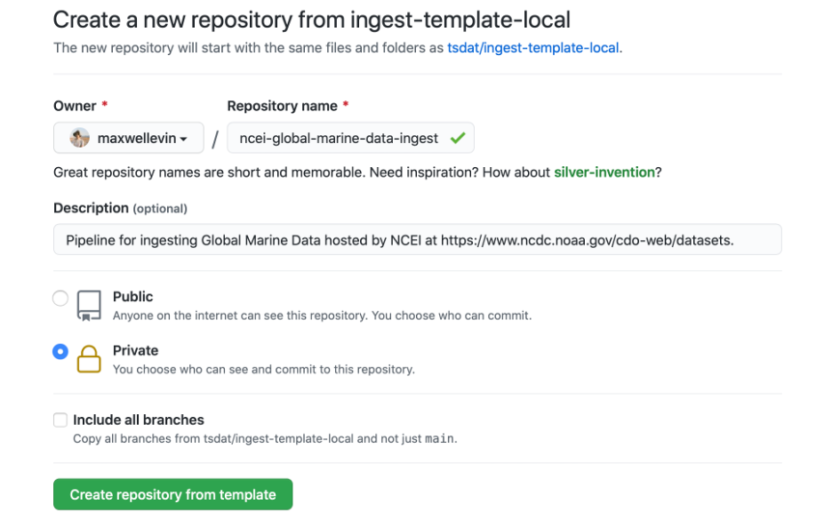
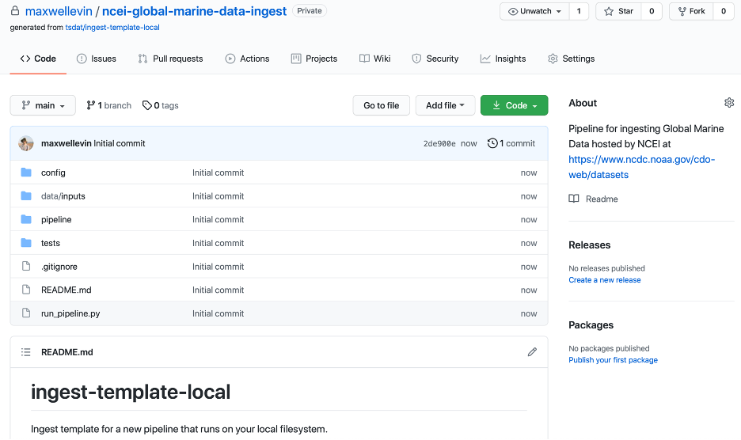
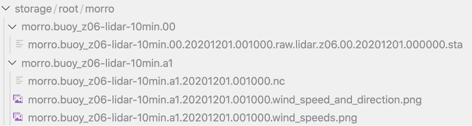
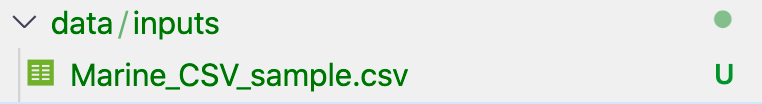
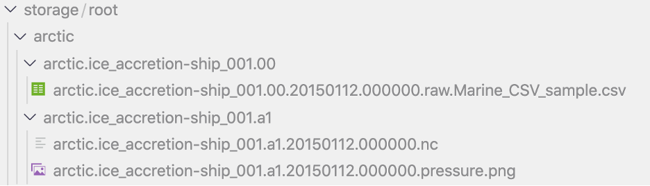
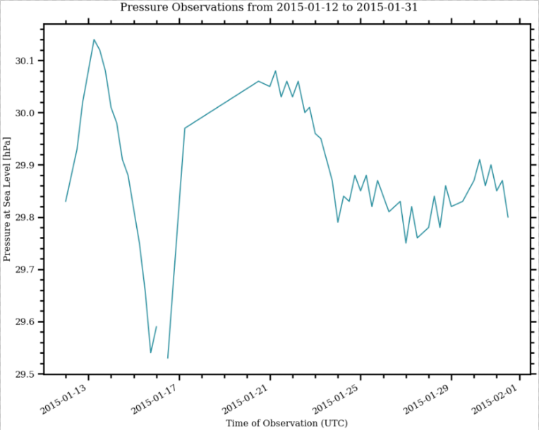

.. local_data_ingest: 

.. _template repository: https://github.blog/2019-06-06-generate-new-repositories-with-repository-templates/
.. _Docker container: https://www.docker.com/
.. _Anaconda environment: https://www.anaconda.com/

.. _local_data_ingest:

Local Data Ingest
-----------------

In this tutorial we will build a data ingestion pipeline to ingest some global
marine data hosted by the National Oceanic and Atmospheric Administration’s 
(NOAA) National Centers for Environmental Information (NCEI). The data can be 
found at https://www.ncdc.noaa.gov/cdo-web/datasets under the “Global Marine 
Data” section. This is a pretty simple and high-quality dataset, so this data 
ingest will be pretty straight-forward. We will walk through the following 
steps in this tutorial:

#.	Examine and download the data
#.	Set up a GitHub repository in which to build our ingestion pipeline
#.	Modify configuration files and ingestion pipeline for our NCEI dataset
#.	Run the ingest data pipeline on NCEI data

Now that we’ve outlined the goals of this tutorial and the steps that we will 
need to take to ingest this data we can get started with step #1. 

Examining and downloading the data
==================================

Navigate to https://www.ncdc.noaa.gov/cdo-web/datasets and download the 
documentation and a data sample from their global marine data section.

.. figure:: global_marine_data/global_marine_data_webpage.png
    :alt: NOAA / NCEI Webpage for Global Marine Data sample data and 
        documentation.

The documentation describes each variable in the sample dataset and will be 
extremely useful for updating our configuration file with the metadata for this
dataset. The metadata we care most about are the units and user-friendly text 
descriptions of each variable, but we also need to be on the lookout for any 
inconsistencies or potential data problems that could complicate how we process
this dataset. Take, for example, the following descriptions of the various 
temperature measurements that this dataset contains and note that the units are
not necessarily the same between files in this dataset:

.. figure:: global_marine_data/global_marine_data_documentation.png
    :alt: Global Marine Data documentation snippet indicating temperature 
        measurements can be reported in Celcius or Fahrenheit depending on 
        contributor preference.

If we were collecting this data from multiple users, we would need to be aware 
of possible unit differences between files from different users and we would 
likely want to standardize the units so that they were all in Celsius or all in
Fahrenheit (Our preference is to use the metric system wherever possible). If 
we examine this data, it appears that the units are not metric – how 
unfortunate. Luckily, this is something that can easily be fixed by using 
tsdat.

.. figure:: global_marine_data/global_marine_data_csv_snippet.png
    :alt: Snippet from a sample data file.

    Selection from the sample dataset. It appears that units are recorded in
    the imperial system instead of the metric system – Sea Level Pressure is 
    recorded in Hg instead of hPa (Hectopascal) and Air Temperature is recorded
    in degF (Fahrenheit) instead of degC (Celsius).

Creating a repository from a template
=====================================

Now that we have the data and metadata that we will need for this example, 
let’s move on to step #2 and set up a GitHub repository for our work. For this
example, I will be using a `template repository`_ to speed things up, as this 
is one of the easiest ways to get started quickly. In this example I will be 
using `tsdat/ingest-template-local <https://github.com/tsdat/ingest-template-
local>`_ as the basis for this example because what we are looking to do is 
read in the NCEI “raw” data and apply a set of corrections and changes to the 
dataset to bring it into the netCDF format – an ‘ingest’, in other words. To do
this, navigate to https://github.com/tsdat/ingest-template-local and click “Use
this template”.

.. figure:: global_marine_data/ingest_template_local_repo.png
    :alt: Screenshot of the tsdat/ingest-template-local repository on github.

This will open https://github.com/tsdat/ingest-template-local/generate (you can
also just open this link directly) which will prompt you to name your 
repository. Go ahead and fill out the information however you would like and 
set the visibility to your preference. Once you are happy with it, click the 
green button at the bottom to create a repository from the template.

        github. Example shown is titled "ncei-global-marine-data-ingest".

Click “Create repository from template” to create your own repository that you 
can work in for this example.

        from the tsdat/ingest-template-local template repository on github.

Go ahead and clone the repository to your local machine and open it up in 
whatever IDE you prefer.

Next install Python 3.7+ if you haven’t already done so and create an 
environment in which to manage your project’s dependencies. You can download 
and install Python here: https://www.python.org. When developing with intent to
deploy to a production system, we recommend managing your environment using a 
`Docker Container`_ or an `Anaconda environment`_. For this tutorial, however, 
I will just be using Python’s built-in venv tool to manage python dependencies:

.. code-block:: bash

    python3 -m venv ncei_env/
    source ncei_env/bin/activate
    pip install tsdat

This will install tsdat into our `ncei_env` virtual environment. 

We now have everything we need to run the example ingest. Go ahead and do that:

.. code-block:: bash

    python3 run_pipeline.py

Notice that a new ``storage/`` folder is created with the following contents:

        example that came packaged with the template repository.

These files contain the outputs of the ingest pipeline example that came with 
the ingest template we used. Note that there are two subdirectories here – one 
ends in “.00” and the other ends with “.a1”. This ending is called the “data 
level” and indicates the level of processing of the data, with “00” 
representing raw data that has been renamed according to the data standards 
that tsdat was developed under, and “a1” representing data that has been 
ingested, standardized, and optionally quality-controlled. For more information
on the standards used to develop tsdat, please consult https://github.com/ME-
Data-Pipeline-Software/data_standards.

Customizing the template repository
===================================

Now that all the setup work is done, let’s start working on ingesting the NCEI
data. First, we’ll need to copy the sample data file into our data/inputs 
directory and pull up the documentation for us to reference:

        has been replaced with the sample Global Marine Data csv file.

We’ll then want to start modifying the configuration files to work with our 
example. For one, the storage config files can change to use the ``tsdat.io.
filehandlers.CsvHandler`` instead of the custom FileHandler used in the example
by default. Additionally, if we examine the sample csv closely we can see that 
a mixture of tabs, commas, and spaces are used to separate the columns. While 
this somewhat works visually, many libraries have trouble parsing this. To 
solve this with tsdat, we can add some parameters to the storage configuration 
file to indicate how those gaps should be handled. Put together, the final 
storage config file looks like this: 

.. code-block:: yaml
    :linenos:

    storage:
        classname:  tsdat.io.FilesystemStorage
        parameters:
            retain_input_files: True
            root_dir: ${CONFIG_DIR}/../storage/root

        file_handlers:
            input:
            csv:
                file_pattern: '.*\.csv'
                classname: pipeline.filehandlers.CsvHandler
                parameters:
                    read:
                        sep: " *, *"
                        engine: "python"
                        index_col: False

            output:
            netcdf:
                file_extension: '.nc'
                classname: tsdat.io.filehandlers.NetCdfHandler

We’ll then need to modify the pipeline configuration file to capture the 
variables and metadata we want to retain in this ingest. This part of the 
process can take some time, as it involves knowing or learning a lot of the 
context around the dataset and then writing it up succinctly and clearly so 
that your data users can quickly get a good understanding of what this dataset 
is and how to start using it. This part of the process is super specific to the
particular dataset you are working on, so I will show only a snippet of the 
changes I have made here:

.. code-block:: yaml
    :linenos:

    pipeline:
        type: Ingest
        location_id: arctic
        dataset_name: ice_accretion
        qualifier: ship_001
        data_level: a1

    dataset_definition:
        attributes:
            title: "Marine Meteorolical Measurements (Example Ingest)"
            description: "Historical marine data are comprised of ship, buoy, and platform observations."
            conventions: "ME Data Pipeline Standards: Version 1.0"
            institution: "National Oceanic and Atmospheric Administration"
            code_url: "https://github.com/maxwellevin/ncei-global-marine-data-ingest"

        dimensions:
            time:
                length: unlimited

        variables:
            time:
                input:
                    name: Time of Observation
                    converter:
                    classname: tsdat.utils.converters.StringTimeConverter
                    parameters:
                        time_format: "%Y-%m-%dT%H:%M:%S"
                dims: [time]
                type: long
                attrs:
                    long_name: Time of Observation (UTC)
                    standard_name: time
                    units: seconds since 1970-01-01T00:00:00

            ice_accretion_source:
                input:
                    name: Ice Accretion On Ship
                dims: [time]
                type: int
                attrs:
                    long_name: Ice Accretion Source
                    comment: "1=Icing from ocean spray, 2=Icing from fog, 3=Icing from spray and fog, 4=Icing 
                    from rain, 5=Icing from spray and rain"
            
            ice_accretion_thickness:
                input:
                    name: Thickness of Ice Accretion On Ship
                dims: [time]
                type: int
                attrs:
                    long_name: Ice Accretion Thickness
                    units: cm

            pressure:
                input:
                    name: Sea Level Pressure
                dims: [time]
                type: float
                attrs:
                    long_name: Pressure at Sea Level
                    units: hPa

Finally, we will work on updating the customized pipeline that was written for 
the example ingest in the original template. I’ve removed several of the user 
hooks to keep this simple and also reworked the plotting hook so that it plots
just the variables listed in the snippet above:

.. code-block:: python
    :linenos:

    import os
    import cmocean
    import matplotlib.pyplot as plt
    import pandas as pd
    import xarray as xr
    from tsdat.pipeline import IngestPipeline
    from tsdat.utils import DSUtil

    example_dir = os.path.abspath(os.path.dirname(__file__))
    style_file = os.path.join(example_dir, "styling.mplstyle")
    plt.style.use(style_file)

    class Pipeline(IngestPipeline):

        def hook_generate_and_persist_plots(self, dataset: xr.Dataset) -> None:
            start_date = pd.to_datetime(dataset.time.data[0]).strftime('%Y-%m-%d')
            final_date = pd.to_datetime(dataset.time.data[-1]).strftime('%Y-%m-%d')

            filename = DSUtil.get_plot_filename(dataset, "pressure", "png")
            with self.storage._tmp.get_temp_filepath(filename) as tmp_path:

                fig, ax = plt.subplots(figsize=(10, 8), constrained_layout=True)
                fig.suptitle(f"Pressure Observations from {start_date} to {final_date}")
                dataset.pressure.plot(ax=ax, x="time", c=cmocean.cm.deep_r(0.5))

                fig.savefig(tmp_path, dpi=100)
                self.storage.save(tmp_path)
                plt.close()

            return

Running the pipeline
====================

We can now re-run the pipeline using the same command as before

.. code-block:: bash

    python3 run_pipeline.py

and it will produce the following results:

        ingest has been run with the updated configurations and code.

        the ingest pipeline.
