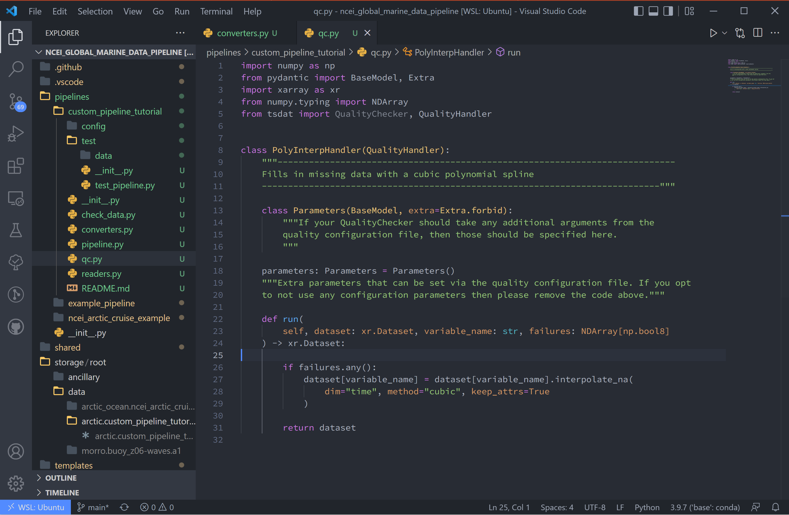

.. _template repository: https://github.blog/2019-06-06-generate-new-repositories-with-repository-templates/
.. _pipeline_customization:

Pipeline Customization
-----------------------------------

This tutorial goes over how to add custom file readers, quality control, and 
data converter code to tsdat for the `pipeline-template`. This tutorial builds
off of :ref:`first tutorial <data_ingest>` and utilizes the same example data.

1. After downloading a <template repository>_, create a new pipeline with:

.. code-block::

  make cookies
  
Or

.. code-block::

	cookiecutter templates/ingest -o ingest/
  
And select yes (2) to the "Select use_custom_<option>".

.. figure:: custom/custom1.png
    :align: center
    :width: 100%
    :alt:

|

Notice this adds a readers.py, qc.py, and converters.py to the new pipeline 
directory, as well as a qc.yaml file to the config folder.

.. figure:: custom/custom2.png
    :align: center
    :width: 100%
    :alt:

|
  
2. Go ahead and copy the retriever.yaml, dataset.yaml, and pipeline.py files from the 
NOAA NCEI example data tutorial.

Adding a Custom File Reader
===========================
Tsdat has two native filehandlers: ``CSVReader`` and ``NetCDFReader``. While useful
for a number of input files, it is not uncommon for raw datafiles to be saved
in some custom format or structure. Tsdat has the flexibility to incorporate
user-built code to read and pre-process raw data.

It is recommended to test your code before inputting to tsdat's framework, and 
the readers.py file can contain as many ``<custom_name>Reader``s as the user requires.
The read function should return an xarray Dataset.

3. Since we're using the same NOAA NCEI data as before, as an example, we'll recreate
tsdat's csv reader from the user's standpoint. When you open readers.py, you'll 
see the reader is built from a class with the name ``CustomDataReader``, and consists
of a `Parameters` class and a "read" function. The `Parameters` class is built
to organize additional parameters not specified in the retriever.yaml file, and 
the "read" function contains the actual file reader code.

.. code-block:: python

  from typing import Any, Dict, Union
  from pydantic import BaseModel, Extra
  import pandas as pd
  import xarray as xr
  from tsdat import DataReader

  class NCEIReader(DataReader):
      """---------------------------------------------------------------------------------
      Custom DataReader that can be used to read data from a specific format.

      Built-in implementations of data readers can be found in the
      [tsdat.io.readers](https://tsdat.readthedocs.io/en/latest/autoapi/tsdat/io/readers)
      module.
      ---------------------------------------------------------------------------------"""

      class Parameters(BaseModel, extra=Extra.forbid):
          """If your CustomDataReader should take any additional arguments from the
          retriever configuration file, then those should be specified here."""

          read_csv_kwargs: Dict[str, Any] = {}
          from_dataframe_kwargs: Dict[str, Any] = {}

      parameters: Parameters = Parameters()
      """Extra parameters that can be set via the retrieval configuration file. If you opt
      to not use any configuration parameters then please remove the code above."""

      def read(self, input_key: str) -> Union[xr.Dataset, Dict[str, xr.Dataset]]:
          # Read csv file with pandas
          df = pd.read_csv(input_key, **self.parameters.read_csv_kwargs)

          # Return an xarray dataset
          return xr.Dataset.from_dataframe(df, **self.parameters.from_dataframe_kwargs)

In the above codeblock, the `Parameters` class initiates the parameter dictionaries
expected from the retriever.yaml file. These dictionaries are
then called for the respective pandas and xarray functions in the "read" function.

Replace the code in reader.py with the above code block.

|

We also need to tell tsdat now to use our csv file reader. Opening the 
retriever.yaml file, replace the reader block with (remember to replace 
<pipeline_name> with your own pipeline's name):

.. code-block::

  readers:
    .*:
      classname: pipelines.<pipeline_name>.readers.NCEIReader
      parameters:
        read_csv_kwargs:
          sep: ", *"
          engine: "python"
          index_col: False
        
Notice we are not using the "from_dataframe_kwargs".

.. figure:: custom/custom4.png
    :align: center
    :width: 100%
    :alt:

|

Adding Custom Data Converter Functions
======================================
Tsdat has two native data converters, a ``UnitsConverter`` and a ``StringToDatetime``
converter. These provide the useful functions of converting units and utilizing
the datetime package's ability to read time formats, given the correct timestring.

The custom data converter is an option to add pre-processing to the input dataset
if it wasn't done in a custom file reader, or a custom file reader isn't necessary.

Converters operate on a variable-by-variable basis, so keep this in mind when adding
one.

4. In the NCEI NOAA documentation, the units for windspeed state that the data was
saved as 1/10th of a knot or m/s, depending on the configuration. Because the rest
of the file is saved in imperial units, it's assumed the data is saved as 1/10th
knots. This isn't a standard unit, so we shall add a data converter to tackle this
input in the codeblock below.

.. code-block:: python

  import xarray as xr
  from typing import Any, Optional
  from pydantic import BaseModel, Extra
  from tsdat.io.base import DataConverter
  from tsdat.utils import assign_data
  from tsdat.config.dataset import DatasetConfig

  class Kt10Converter(DataConverter):
      """---------------------------------------------------------------------------------
      Converts NCEI windspeed data format from 0.1 knots to m/s
      Expects "kt/10" as input and "m/s" as output units
      ---------------------------------------------------------------------------------"""

      class Parameters(BaseModel, extra=Extra.forbid):
          """If your CustomConverter should take any additional arguments from the
          retriever configuration file, then those should be specified here.
          """

          units: Optional[str] = None

      parameters: Parameters = Parameters()
      """Extra parameters that can be set via the retrieval configuration file. If you opt
      to not use any configuration parameters then please remove the code above."""

      def convert(
          self,
          dataset: xr.Dataset,
          dataset_config: DatasetConfig,
          variable_name: str,
          **kwargs: Any,
      ) -> xr.Dataset:

          input_units = self.parameters.units
          output_units = dataset_config[variable_name].attrs.units

          if "kt/10" in input_units and "m/s" in output_units:
              pass
          else:
              return dataset

          data = dataset[variable_name].data / 10 * 0.514444

          dataset = assign_data(dataset, data, variable_name)
          dataset[variable_name].attrs["units"] = output_units

          return dataset

.. figure:: custom/custom5.png
    :align: center
    :width: 100%
    :alt:

|

Once adding a converter class to the converters.py file, update the appropriate
variables in the retriever.yaml file. In this case we'll add this to the "wind_speed"
variable.

.. code-block:: yaml

  wind_speed:
    .*:
      name: Wind Speed
      data_converters:
        - classname: pipelines.<pipeline_name>.converters.Kt10Converter
          parameters:
            units: kt/10

.. figure:: custom/custom6.png
    :align: center
    :width: 100%
    :alt:

|

Adding Custom Quality Control Funtions
======================================
Tsdat has a number of native quality control functions that users could find useful. 
(See :ref:`quality control API <quality_control>` for all of them). These built-in 
functions can then be input into the pipeline config or shared folder 
quality.yaml, and many are already incorporated in the <pipeline_template>.

It is important to note that QC functions are applied one variable at a time.

For example:

.. code-block:: yaml

  quality_management:
   
    manage_min: # tsdat's built-in handle min
      checker:
        classname: tsdat.qc.checkers.CheckValidMin
      handlers:
        - classname: tsdat.qc.handlers.RemoveFailedValues
        - classname: tsdat.qc.handlers.RecordQualityResults
          parameters:
            bit: 2
            assessment: Bad
            meaning: "Value is less than expected range"
      apply_to:
        - DATA_VARS
      exclude: [foo, bar]

In the above block of code, a ``CheckValidMin`` check is run all variables except
variables named "foo" and "bar". This QC check requires the "valid_range" attribute
on all variables running through it in the dataset.yaml file.

The two built-in handlers specified here remove failues (``RemoveFailedValues``) that 
failed the QC check by replacing them with the attribute ``_FillValue``, for example:

.. code-block:: yaml

  distance:
    dims: [time]
    dtype: float
    attrs:
      units: "m"
      valid_range: [-3, 3] # attribute for the "CheckValidMin" and "CheckValidMax" functions
      _FillValue: 999

The second handler here is ``RecordQualityResults``, which requires parameters in the
quality.yaml block itself: "bit", "assessment", and "meaning". This function creates an additional variable that is called "qc_<variable_name>", where variable elements that 
fail a test are given the bit value. If no test fails, "qc_<variable_name>" will contain 
all zeroes.

5. Custom QC code in tsdat follows the same structure, with a `checker` and `handler`
class. Like readers, you can add as many of each as one would like. QualityCheckers 
should return a boolean numpy array (True/False), where `True` refers to flagged data,
for each variable in the raw dataset. QualityHandlers take this boolean array and apply 
some function to the data variable it was created from.

As a simple example for this tutorial, we'll add a QC handler that interpolates 
missing data with a cubic polynomial:

.. code-block:: python

  import numpy as np
  from pydantic import BaseModel, Extra
  import xarray as xr
  from numpy.typing import NDArray
  from tsdat import QualityChecker, QualityHandler

  class PolyInterpHandler(QualityHandler):
      """----------------------------------------------------------------------------
      Fills in missing data with a cubic polynomial spline
      ----------------------------------------------------------------------------"""

      class Parameters(BaseModel, extra=Extra.forbid):
          """If your QualityChecker should take any additional arguments from the
          quality configuration file, then those should be specified here.
          """

      parameters: Parameters = Parameters()
      """Extra parameters that can be set via the quality configuration file. If you opt
      to not use any configuration parameters then please remove the code above."""

      def run(
          self, dataset: xr.Dataset, variable_name: str, failures: NDArray[np.bool8]
      ) -> xr.Dataset:

          if failures.any():
              dataset[variable_name] = dataset[variable_name].interpolate_na(
                  dim="time", method="cubic", keep_attrs=True
              )

          return dataset

|

And then we update the quality.yaml file and replace the custom input with our most 
recent code. We'll continue to use ``CheckMissing`` and ``RecordQualityResults`` here.
Note, you will need to remove the `Remove missing datapoints` (any block with
``RemoveFailedValues``) QC block for interpolation to function. 

.. code-block:: yaml

  managers:

    - name: Cubic spline interpolation
      checker:
        classname: tsdat.qc.checkers.CheckMissing
      handlers:
        - classname: pipelines.<pipeline_name>.qc.PolyInterpHandler
        - classname: tsdat.qc.handlers.RecordQualityResults
          parameters:
            bit: 10
            assessment: bad
            meaning: "Data replaced with cubic polynomial"
      apply_to:
        - DATA_VARS

.. figure:: custom/custom8.png
    :align: center
    :width: 100%
    :alt:

|

Run the Pipeline
================
There are a couple more things.

Need to copy data
Rename data
rename pipeline.yaml regex
Run pipeline string

Notes on Errors
===============

Errors commonly ensue from data file located in incorrect directories, incorrect 
classname paths, and syntax errors. If you get an error, most of the time there is an error,
missing or incorrect input in the .yaml files. 

Common Errors:

  1. KeyError ['time'] -- Time is typically the first variable tsdat looks
  for, so if it can't load your dataset or if the time coordinate is not input 
  correctly, this error will pop up. The failure load a dataset typically results 
  from incorrect file extensions, regex patterns, or file path location.
  
  2. Can't find module "pipeline" -- There are many modules and classes named 
  "pipeline" in tsdat. This error typically refers to a classname specified in the  
  config file, i.e. ``pipelines.<ingest_name>.qc.CustomQualityChecker`` or
  ``pipelines.<ingest_name>.readers.CustomQualityHandler``. Make sure this classname 
  path is correct.
  
  3. ``Check_<function>`` fails -- Ensure all the variables listed under a quality 
  managment group can be run through the function. For example, if I try to run the  
  test ``CheckMonotonic`` on all "COORDS", and one of my coordinate variables is a
  string array (e.g 'direction': ['x','y','z'], this function will fail. Fix this by
  replacing "COORDS" with only numeric coordinates (e.g. 'time').
