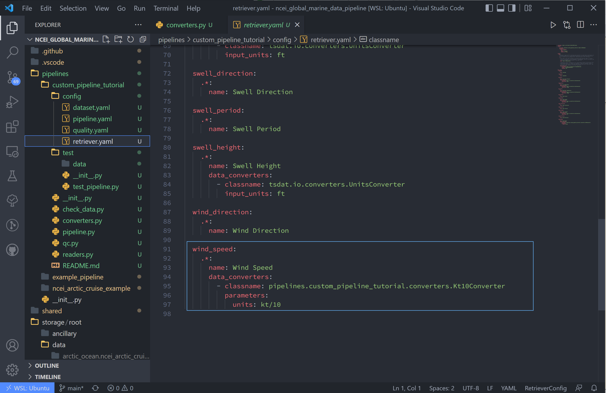

.. _template repository: https://github.blog/2019-06-06-generate-new-repositories-with-repository-templates/
.. _pipeline_customization:

Pipeline Customization
-----------------------------------

This tutorial goes over how to add custom file readers, quality control, and 
data converter code to tsdat for the `pipeline-template`. This tutorial builds
off of :ref:`first tutorial <data_ingest>` and utilizes the same example data.

1. We'll dive straight into it by creating a new pipeline:

.. code-block:: bash

  make cookies
  
Or

.. code-block:: bash

	cookiecutter templates/ingest -o ingest/
  
And select yes (2) to the "Select use_custom_<option>" prompts.

.. figure:: custom/custom1.png
    :align: center
    :width: 100%
    :alt:


Notice this adds a readers.py, qc.py, and converters.py to the new pipeline 
directory, as well as a qc.yaml file to the config folder.


|

Fill out the Configuration Files
================================
  
2. Go ahead and copy the retriever.yaml, dataset.yaml, and pipeline.py files from the 
NOAA NCEI example data tutorial if you using that data. If you are building a custom 
pipeline, go ahead and fill out these files now.


Adding a Custom File Reader
===========================
Tsdat has two native file readers: ``CSVReader`` and ``NetCDFReader``. While useful
for a number of input files, it is not uncommon for raw data files to be saved
in some custom format or structure. Tsdat has the flexibility to incorporate
user-built code to read and pre-process raw data.

It is recommended to test your code before inputting to tsdat's framework by first 
writing and testing a reader on your input data in your preferred IDE. This read 
function should return an xarray Dataset.

3. Since we're using the same NOAA NCEI data as before, this tutorial with recreate
tsdat's csv reader from the user's standpoint:

.. code-block:: python

  from typing import Any, Dict, Union
  from pydantic import BaseModel, Extra
  import pandas as pd
  import xarray as xr
  from tsdat import DataReader


  class NCEIReader(DataReader):
      """---------------------------------------------------------------------------------
      Custom DataReader that can be used to read data from a specific format.

      Built-in implementations of data readers can be found in the
      [tsdat.io.readers](https://tsdat.readthedocs.io/en/latest/autoapi/tsdat/io/readers)
      module.
      ---------------------------------------------------------------------------------"""

      class Parameters(BaseModel, extra=Extra.forbid):
          """If your CustomDataReader should take any additional arguments from the
          retriever configuration file, then those should be specified here."""

          read_csv_kwargs: Dict[str, Any] = {}
          from_dataframe_kwargs: Dict[str, Any] = {}

      parameters: Parameters = Parameters()
      """Extra parameters that can be set via the retrieval configuration file. If you opt
      to not use any configuration parameters then please remove the code above."""

      def read(self, input_key: str) -> Union[xr.Dataset, Dict[str, xr.Dataset]]:
          # Read csv file with pandas
          df = pd.read_csv(input_key, **self.parameters.read_csv_kwargs)

          # Return an xarray dataset
          return xr.Dataset.from_dataframe(df, **self.parameters.from_dataframe_kwargs)


As you can see in the above code, our reader is contained by the class 
`NCEIReader`. The `Parameters` class initiates the parameters expected from 
the retriever.yaml file, which are then fed to the "read" function, which 
contains the reader's source code.

Note, after running the reader, the pipeline runs the dataset through the retriever.
If variable names are changed in the reader source code, this change should be 
reflected in the vairables' input names in retriever.yaml.


.. figure:: custom/custom3.png
    :align: center
    :width: 100%
    :alt:

|


4. We now need to tell tsdat now to use our csv file reader. Open the 
retriever.yaml file and replace the reader block with (remember to replace 
<pipeline_name> with your own pipeline's name):

.. code-block:: yaml

  readers:
    .*:
      classname: pipelines.<pipeline_name>.readers.NCEIReader
      parameters:
        read_csv_kwargs:
          sep: ", *"
          engine: "python"
          index_col: False
        
Notice we are not using the "from_dataframe_kwargs", but if we were, 
"from_dataframe_kwargs" would be listed at the same indent level as 
"read_csv_kwargs".


|


Adding Custom Data Converter Functions
======================================
Tsdat has two native data converters, a ``UnitsConverter`` and a ``StringToDatetime``
converter. These provide the useful functions of converting units and utilizing
the datetime package's ability to read time formats, given the correct timestring.

The custom data converter is an option to add pre-processing to specific variables 
in the input dataset, while a custom file reader gives more flexibility to cover 
all at once. Converters operate on a variable-by-variable basis, so keep this in 
mind when adding one.

5. As stated in the NCEI NOAA documentation, the units for windspeed are recorded 
as either 1/10th of a knot or m/s, depending on the configuration. Because the rest
of the file is saved in imperial units, I'm assuming the data is actually saved as 
1/10th knots. This isn't a standard unit, so we shall add a data converter to tackle 
this input in the codeblock below.

.. code-block:: python

  import xarray as xr
  from typing import Any, Optional
  from pydantic import BaseModel, Extra
  from tsdat.io.base import DataConverter
  from tsdat.utils import assign_data
  from tsdat.config.dataset import DatasetConfig


  class Kt10Converter(DataConverter):
      """---------------------------------------------------------------------------------
      Converts NCEI windspeed data format from 0.1 knots to m/s
      Expects "kt/10" as input and "m/s" as output units
      ---------------------------------------------------------------------------------"""

      class Parameters(BaseModel, extra=Extra.forbid):
          """If your CustomConverter should take any additional arguments from the
          retriever configuration file, then those should be specified here.
          """

          units: Optional[str] = None

      parameters: Parameters = Parameters()
      """Extra parameters that can be set via the retrieval configuration file. If you opt
      to not use any configuration parameters then please remove the code above."""

      def convert(
          self,
          dataset: xr.Dataset,
          dataset_config: DatasetConfig,
          variable_name: str,
          **kwargs: Any,
      ) -> xr.Dataset:

          input_units = self.parameters.units
          output_units = dataset_config[variable_name].attrs.units

          if "kt/10" in input_units and "m/s" in output_units:
              pass
          else:
              return dataset

          data = dataset[variable_name].data / 10 * 0.514444

          dataset = assign_data(dataset, data, variable_name)
          dataset[variable_name].attrs["units"] = output_units

          return dataset


.. figure:: custom/custom5.png
    :align: center
    :width: 100%
    :alt:

|

6. Now we configure the "wind_speed" variable to use this converter in the 
retriever.yaml file:

.. code-block:: yaml

  wind_speed:
    .*:
      name: Wind Speed
      data_converters:
        - classname: pipelines.<pipeline_name>.converters.Kt10Converter
          parameters:
            units: kt/10




|


Adding Custom Quality Control Funtions
======================================

First, a quick overview of how tsdat handles quality control (QC):

Tsdat has a number of native quality control functions that users could find useful. 
(See :ref:`quality control API <quality_control>` for all of them). These built-in 
functions can then be input into the pipeline config or shared folder 
quality.yaml, and many are already incorporated in the <pipeline_template>.

It is important to note that QC functions are applied one variable at a time.

For example:

.. code-block:: yaml

  quality_management:
   
    -name: Remove datapoints below minimum valid threshold
      checker:
        classname: tsdat.qc.checkers.CheckValidMin
      handlers:
        - classname: tsdat.qc.handlers.RemoveFailedValues
        - classname: tsdat.qc.handlers.RecordQualityResults
          parameters:
            bit: 2
            assessment: Bad
            meaning: "Value is less than expected range"
      apply_to:
        - DATA_VARS
      exclude: [foo, bar]

In the above block of code, a ``CheckValidMin`` check is run all variables except
variables named "foo" and "bar". This QC check requires the "valid_min" attribute
on all variables running through it in the dataset.yaml file.

The two built-in handlers specified here remove failues (``RemoveFailedValues``) that 
failed the QC check by replacing them with the attribute ``_FillValue``.

The second handler used is ``RecordQualityResults``, which requires parameters in the
quality.yaml block itself: `bit`, `assessment`, and `meaning`. This adds 
"qc_<variable_name>" to the output data, where variable elements that fail a test 
are assigned the value 2^{bit-1}. If all tests pass, 0 is assigned.

A variable is set to run through a quality management block by adding the required 
attributes. To run a variable "distance" through the QC block shown above, add 
the required "valid_range" and "_FillValue" attributes like the following:

.. code-block:: yaml

  distance:
    dims: [time]
    dtype: float
    attrs:
      units: "m"
      valid_min: -3 # attribute for the "CheckValidMin" function
      _FillValue: -999      # the "bad data" value


Now back to the tutorial steps:

Custom QC code in tsdat allows a user to create both `checkers` and `handlers`. 
Like readers, you can add as many of each as one would like. `Checkers`
should return a boolean numpy array (True/False), where `True` refers to flagged data,
for each variable in the raw dataset. `Handlers` take this boolean array and apply 
some function to the data variable it was created from.

7. For this tutorial, we'll add a QC handler that interpolates missing data with a 
cubic polynomial using one of xarray's functions:

.. code-block:: python

  import numpy as np
  from pydantic import BaseModel, Extra
  import xarray as xr
  from numpy.typing import NDArray
  from tsdat import QualityChecker, QualityHandler


  class PolyInterpHandler(QualityHandler):
      """----------------------------------------------------------------------------
      Fills in missing data with a cubic polynomial spline
      ----------------------------------------------------------------------------"""

      class Parameters(BaseModel, extra=Extra.forbid):
          """If your QualityChecker should take any additional arguments from the
          quality configuration file, then those should be specified here.
          """

      parameters: Parameters = Parameters()
      """Extra parameters can be set via the quality configuration file. If you opt
      to not use any configuration parameters then please remove the code above."""

      def run(
          self, dataset: xr.Dataset, variable_name: str, failures: NDArray[np.bool_]
      ) -> xr.Dataset:

          if failures.any():
              # Make sure failed datapoints have been removed
              dataset[variable_name] = dataset[variable_name].where(~failures)
              
              # Interpolate with cubic polynomial
              dataset[variable_name] = dataset[variable_name].interpolate_na(
                  dim="time", method="cubic", keep_attrs=True
              )

          return dataset

You'll see that the "run" function here is given three inputs:

  #. dataset - currently processed dataset
  #. variable_name - current variable undergoing QC
  #. failures - the true/false array, where true refers to values that failed the QC check
  
In this case, the `checker` is ``CheckMissing``, which flags datapoints already missing 
from the dataset. If the `checker` returned a "failures" array had datapoints flagged 
that weren't missing, I would want to make sure to remove those datapoints before passing 
to `xarray.dataset[variable_name].interpolate_na`.

.. figure:: custom/custom7.png
    :align: center
    :width: 100%
    :alt:

|


8. We then update the quality.yaml file and replace the custom input with our most 
recent code. We'll continue to use ``CheckMissing`` and ``RecordQualityResults`` here.

Note, you will need to remove the `Remove missing datapoints` QC block
(the first block with ``RemoveFailedValues``) for interpolation to function. If 
running multiple QC tests, you will want to make sure they aren't overwriting each 
other.

.. code-block:: yaml

  managers:

    - name: Cubic spline interpolation
      checker:
        classname: tsdat.qc.checkers.CheckMissing
      handlers:
        - classname: pipelines.<pipeline_name>.qc.PolyInterpHandler
        - classname: tsdat.qc.handlers.RecordQualityResults
          parameters:
            bit: 10
            assessment: bad
            meaning: "Data replaced with cubic polynomial"
      apply_to:
        - DATA_VARS

.. figure:: custom/custom8.png
    :align: center
    :width: 100%
    :alt:

|


Run the Pipeline
================
9. There are a couple more things. First we need to update the pipeline regex
pattern in the pipeline.yaml file to run files in this particular pipeline, and
we'll do this by changing the triggers block:

.. code-block:: yaml

  triggers:
  - .*custom.*\.csv


.. figure:: custom/custom9.png
    :align: center
    :width: 100%
    :alt:

|


10. Next, we want to copy the data to this pipeline and rename it to match the
regex pattern. The data here is stored in the test/data/input/ folder, but
can be anywhere, and I have named this data `custom.sample_data.csv`.

.. figure:: custom/custom10.png
    :align: center
    :width: 100%
    :alt:

|


11. Finally we can run this pipeline. Open a terminal (``ctrl ```) and run

.. code-block:: bash

  python runner.py pipelines/<pipeline_name>/test/data/input/custom.sample_data.csv


|

Notes on Errors
===============

Errors commonly ensue from data file located in incorrect directories, incorrect 
classname paths, and syntax errors. If you get an error, most of the time there is an error,
missing or incorrect input in the .yaml files. 

Common Errors:

  1. KeyError ['time'] -- Time is typically the first variable tsdat looks
  for, so if it can't load your dataset or if the time coordinate is not input 
  correctly, this error will pop up. The failure load a dataset typically results 
  from incorrect file extensions, regex patterns, or file path location.
  
  2. Can't find module "pipeline" -- There are many modules and classes named 
  "pipeline" in tsdat. This error typically refers to a classname specified in the  
  config file, i.e. ``pipelines.<pipeline_name>.qc.<custom_qc>`` or
  ``pipelines.<pipeline_name>.readers.<custom_reader>``. Make sure this classname 
  path is correct.
  
  3. ``Check_<function>`` fails -- Ensure all the variables listed under a quality 
  managment group can be run through the function. For example, if I try to run the  
  test ``CheckMonotonic`` on all "COORDS", and one of my coordinate variables is a
  string array (e.g 'direction': ['x','y','z'], this function will fail. Fix this by
  replacing "COORDS" with only numeric coordinates (e.g. 'time').
  
  4. If a QC handler doesn't appear to be running on a variable, 1.) make sure it's not 
  being overridden by another in the same pipeline, 2.) make sure your custom QC 
  tests are running on a single variable at a time and not affecting the entire 
  dataset.
  
  5. Pipeline is "skipped". Make sure your regex pattern in pipeline.yaml matches your
  filename. There are regex file match checkers online for a sanity check.
  
