# Ingest Pipeline Tutorial

In this tutorial we will build a data pipeline to ingest global marine data hosted by the National Oceanic and
Atmospheric Administration's (NOAA) National Centers for Environmental Information (NCEI). The data can be found at
[https://www.ncdc.noaa.gov/cdo-web/datasets](https://www.ncdc.noaa.gov/cdo-web/datasets) under the "Global Marine Data"
section.

We will walk through the following steps in this tutorial:

1. Examine and download the data
2. Set up a GitHub repository in which to build our ingestion pipeline
3. Modify configuration files and ingestion pipeline for our NCEI dataset
4. Run the ingest data pipeline on NCEI data

Now that we've outlined the goals of this tutorial and the steps that we will need to take to ingest this data we can
get started.

## Examining and downloading the data

Navigate to the [data](https://www.ncdc.noaa.gov/cdo-web/datasets) and download both the documentation and a data sample
from the "Global Marine Data" section.

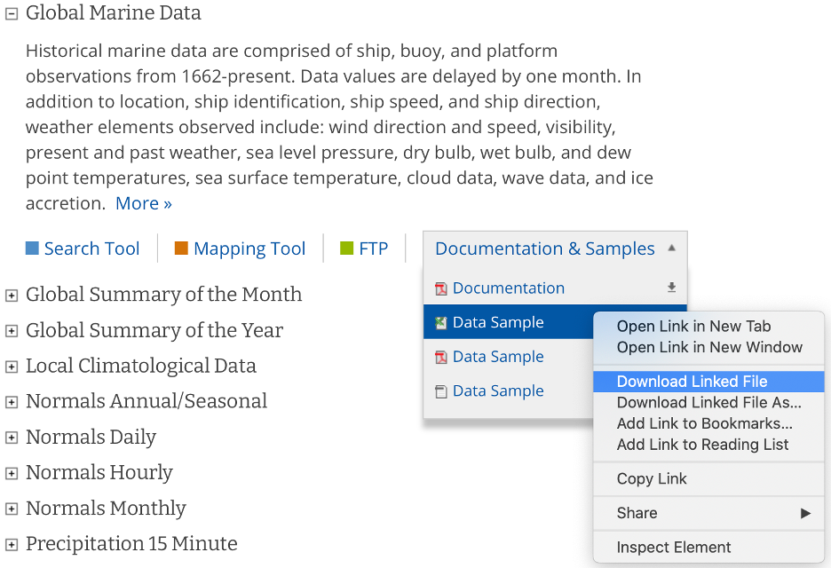

The documentation describes each variable in the sample dataset and will be extremely useful for updating our
configuration file with the metadata for this dataset. The metadata we care most about are the units and user-friendly
text descriptions of each variable, but we also need to be on the lookout for any inconsistencies or potential data
problems that could complicate how we process this dataset. Take, for example, the following descriptions of the various
temperature measurements that this dataset contains and note that the units are not necessarily the same between files
 this dataset:

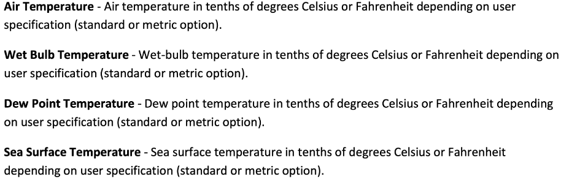

If we were collecting this data from multiple users, we would need to be aware of possible unit differences between
files from different users and we would likely want to standardize the units so that they were all
in Celsius or all in Fahrenheit (Our preference is to use the metric system wherever possible). If we examine this data,
it appears that the units are not metric -- how unfortunate. Luckily, this is something that can easily be fixed using
tsdat.

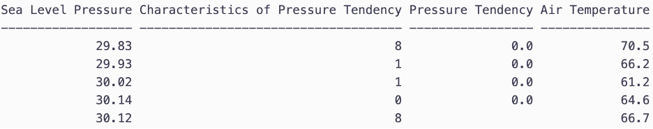

<!-- It appears that units are recorded in the imperial system instead of the metric system -- Sea Level Pressure is
recorded in Hg instead of hPa (Hectopascal) and Air Temperature is recorded in degF (Fahrenheit) instead of degC
(Celsius). -->

## Creating a repository from a template

Now that we have the data and metadata that we will need, let's move on to step #2 and set up a GitHub repository for
our work. What we are looking to do is read in the NCEI "raw" data, apply variable names and metadata, apply quality
control, and convert it into the netCDF format – an 'ingest pipeline', in other words. To do this, navigate to
[github.com/tsdat/pipeline-template](https://github.com/tsdat/pipeline-template) and click "Use this template". Note you
must be logged into github to see this button.

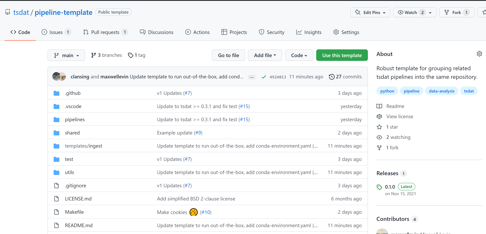

This will open [github.com/tsdat/pipeline-template/generate](https://github.com/tsdat/pipeline-template/generate) (you
can also just open this link directly) which will prompt you to name your repository, as well as to make it public or
private.

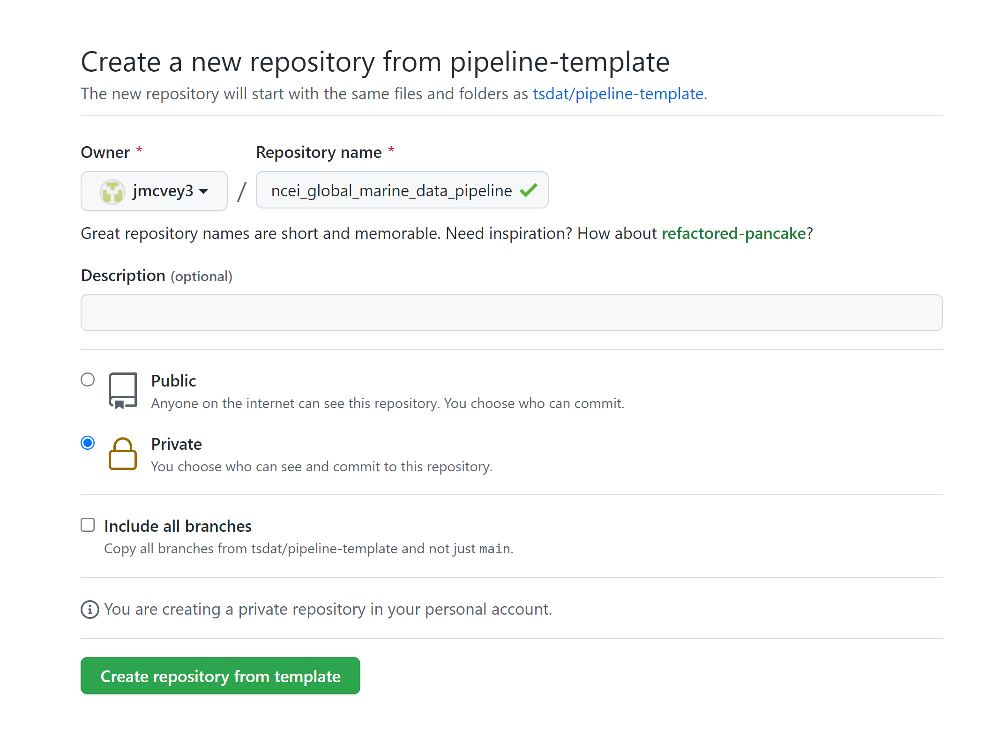

Click "Create repository from template" to create your own repository that you can work in for this example.

Go ahead and clone the repository to your local machine and open it up in VS Code.

!!! tip

    You should open the project at the root, which is the git repo's root directory and where the file
    `conda-environment.yaml` is located.

!!! note

    VS Code is not the only IDE that may be used, but we provide additional settings for VS Code to make it easier to
    set up.

## Set up Python

Let's set up a python environment that we can develop code in. We will
use [Anaconda](https://docs.anaconda.com/anaconda/install/index.html) to
create an isolated virtual area that we can install packages to.

!!! tip

    When developing with intent to deploy to a production system on Windows, we recommend using
    [Windows Subsystem for Linux](https://docs.microsoft.com/en-us/windows/wsl/about) (WSL) in addition to conda to
    manage your environment. See the [Setting Up Wsl](./setup_wsl.md) tutorial for more information.

Once you have anaconda (and optionally WSL) installed, you can run the following command in the terminal from the
project root (e.g., where `environment.yaml` is at) to create and activate the development environment:

```bash
conda env create
conda activate tsdat-pipelines
```

!!! tip

    You can find more details about using conda from
    [Getting started with conda](https://docs.conda.io/projects/conda/en/latest/user-guide/getting-started.html).

!!! note

    Environments other than conda may be used as long as your python version is >=3.10 and you are able to install
    dependencies from the `pyproject.toml` file.

## Configure Python interpreter in VS Code

Tell VS Code to use your new conda environment:

1. Bring up the command pane in VS Code (shortcut ++f1++ or ++ctrl+shift+p++)
2. Type `Python: Select Interpreter` and hit enter.
3. Select the newly-created `tsdat-pipelines` conda environment from the drop-down list. Note you may need to refresh
    the list (cycle icon in the top right) to see it.
4. Bring up the command pane and type `Developer: Reload Window` to reload VS Code and ensure the settings changes
    propagate correctly.

!!! tip

    A typical path to the Python interpreter in conda is `~/anaconda3/envs/<env-name>/bin/python/`. You can find more
    details about using Python in VS Code from
    [Using Python Environments in Visual Studio Code](https://code.visualstudio.com/docs/python/environments) and
    [Get Started Tutorial for Python in Visual Studio Code](https://code.visualstudio.com/docs/python/python-tutorial).

## Run the Basic Template

If using VSCode, open the `Explorer` tab to see folder contents for the next step:

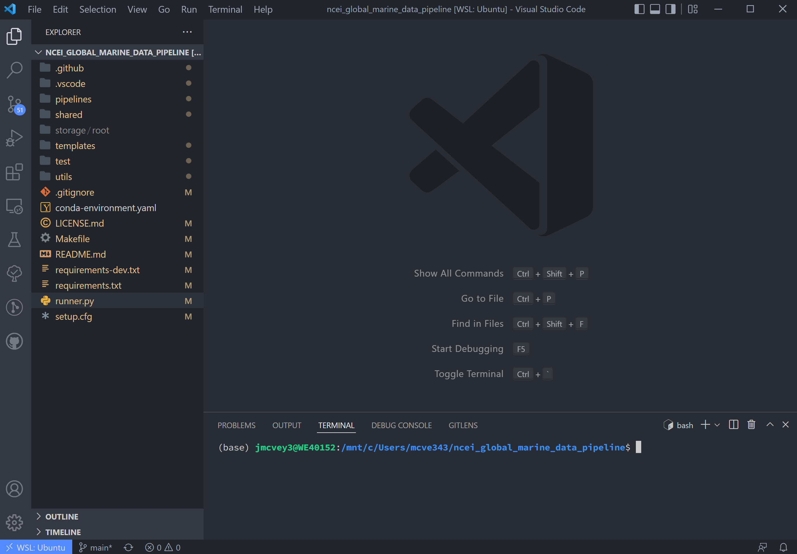

A few quick things on VSCode: in the left-hand toolbar, we will use the `Explorer`, `Search`, `Testing`, and `TODO tree`
icons in this tutorial. Also useful to know are the commands ++ctrl+grave++ (toggle the terminal on/off) and
++ctrl+shift+p++ (open command search bar).

Navigate to the `runner.py` file and run

```bash
python runner.py ingest pipelines/example_pipeline/test/data/input/buoy.z06.00.20201201.000000.waves.csv
```

This will run the example pipeline provided in the `pipelines/` folder in the template. All pipelines that we create are
stored in the `pipelines/` folder and are run using

```bash
python runner.py ingest <path_to_data>
```

Additional options for the runner can be queried by running:

```bash
python runner.py ingest --help
```

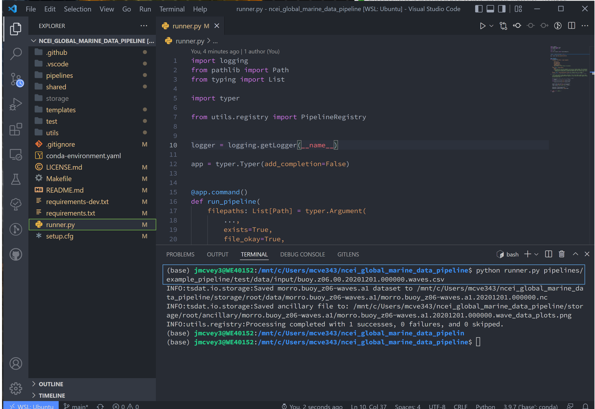

After the code runs, notice that a new `storage/` folder is created with the following contents:

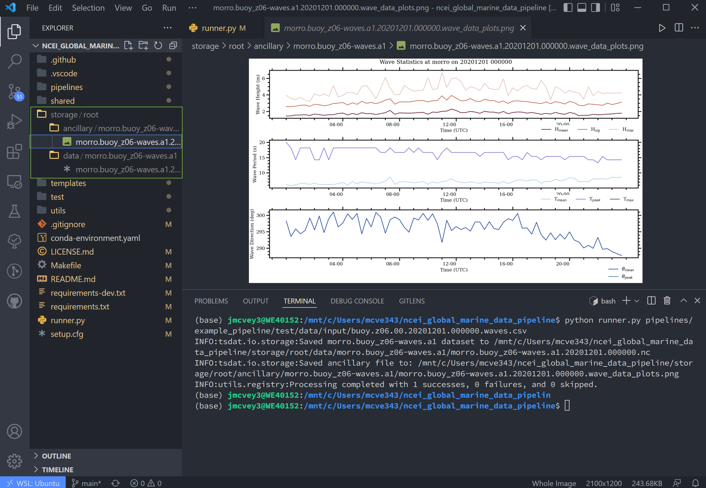

These files contain the outputs of the example pipeline. Note that there are two subdirectories here:

* `data` contains the output data in either netcdf or csv format (specified by the user)
* `ancillary` holds optional plots that a user can create

Note, the data directory name contains a `.a1` key. This ending is called the `data level` and indicates the level of
processing of the data:

* `00` represents raw data that has been renamed according to the data standards that tsdat was developed under
* `a1` refers to data that has been standardized and some quality control
* `b1` represents data that has been ingested, standardized, quality-controlled, and contains added value from further
    analysis if applicable.

For more information on the standards used to develop tsdat, please consult
[our data standards](https://github.com/tsdat/data_standards).

## Creating a New Ingest

Now let's start working on ingesting the NCEI data.

In the Explorer window pane you'll see a list of all folders and files in this ingest -> right click on the top level
`README.md` and select `open preview`. The steps in this readme we are more or less following in this tutorial.

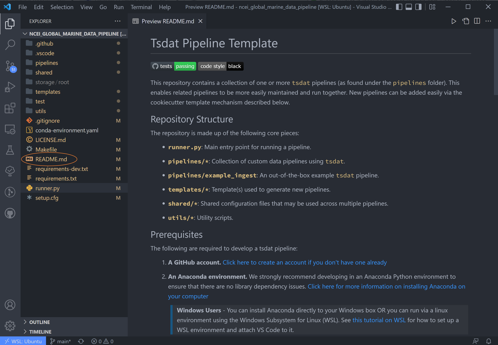

Before starting, we'll run a quick test of the pipeline to make sure everything is set up properly. Navigate to
`testing` and run all tests using the `Play` icon by hovering over the `ingest` dropdown. Tsdat will automatically
configure these tests, and they all should pass at this point in time, as indicated by green checkmarks. (You can find
more details about testing in the [VS Code documentation](https://code.visualstudio.com/docs/python/testing).)

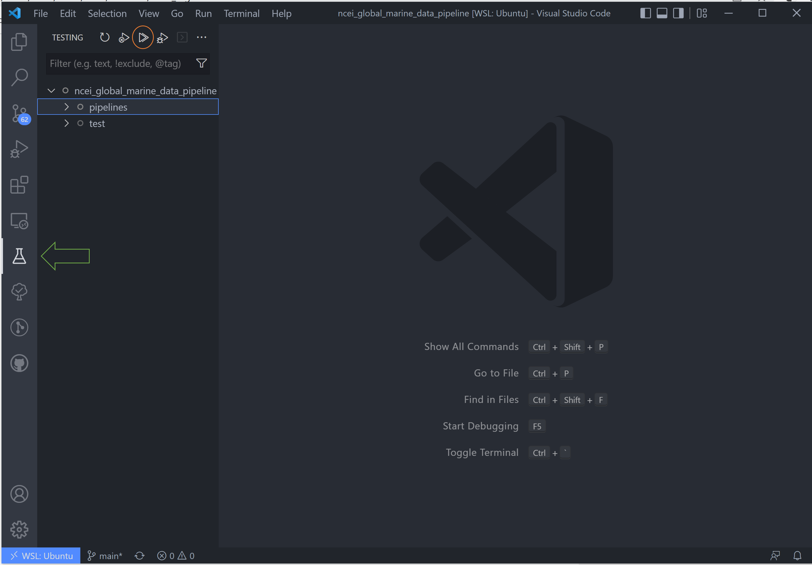

Navigate back to the `Explorer` pane and hit ++ctrl+grave++ to open the terminal. Create a new ingest by running a
python template creator called `cookiecutter` in the terminal using:

```bash
make cookies
```

There will follow a series of prompts that'll be used to auto-fill the new ingest. Fill these in for the particular
dataset of interest. For this ingest we will not be using custom QC functions, readers/writers, or converters.

```txt
Please choose a type of pipeline to create [ingest/vap] (ingest): 
ingest
What title do you want to give this ingest?: 
ncei_arctic_cruise_example
What label should be used for the location of the ingest? (E.g., PNNL, San Francisco, etc.): 
arctic_ocean
Briefly describe the ingest: 
Historical marine data that are comprised of ship, buoy and platform observations.
Data standards to use with the ingest dataset ['basic','ACDD','IOOS']: 
basic
Do you want to use a custom DataReader? [y/N]: 
n
Do you want to use a custom DataConverter? [y/N]: 
n
Do you want to use a custom QualityChecker or QualityHandler? [y/N]: 
n
'ncei_arctic_cruise_example' will be the module name (the folder created under 'pipelines/') Is this OK?  [Y/n]: 
y
'NceiArcticCruiseExample' will be the name of your IngestPipeline class (the python class containing your custom python code hooks). Is this OK?  [Y/n]: 
y
'arctic_ocean' will be the short label used to represent the location where the data are collected. Is this OK?  [Y/n]: 
y
```

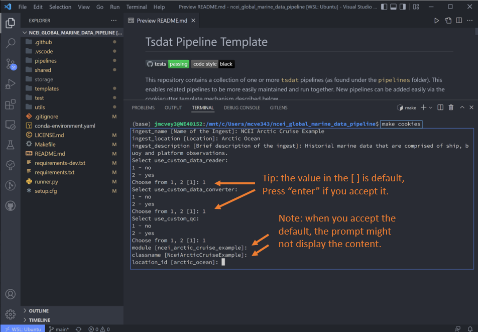

Once you fill that list out and hit the final enter, Tsdat will create anew ingest folder named with the `module` name
(ncei_arctic_cruise_example):

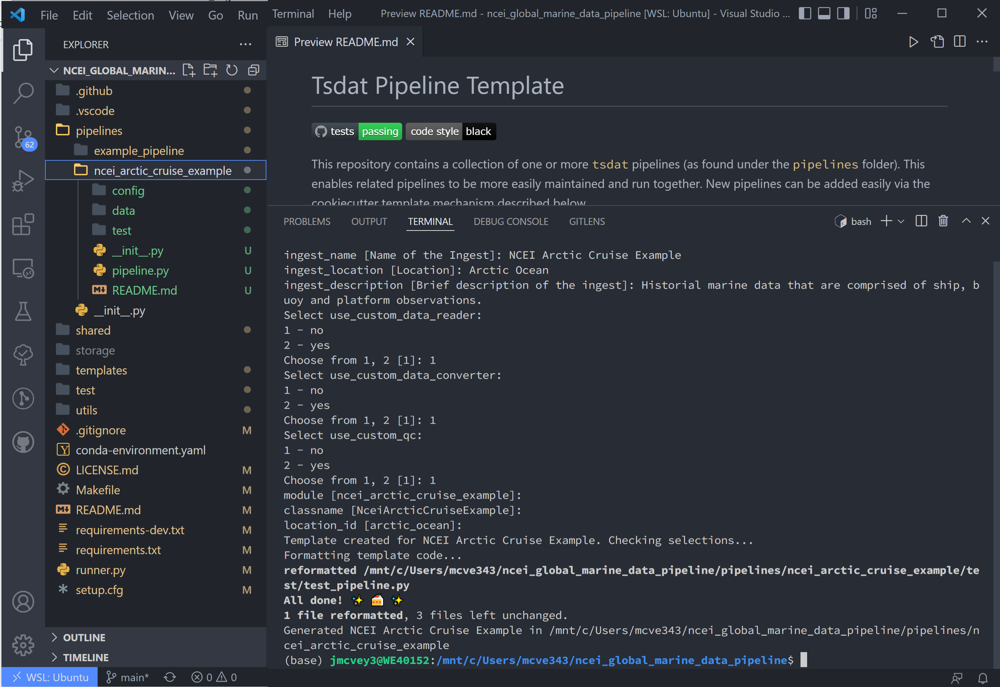

Right-click the README.md in our new `ncei_arctic_cruise_example` ingest and `open-preview`. Scroll down to
`Customizing your pipeline` (we have already accomplished the previous steps, but these are good to check).

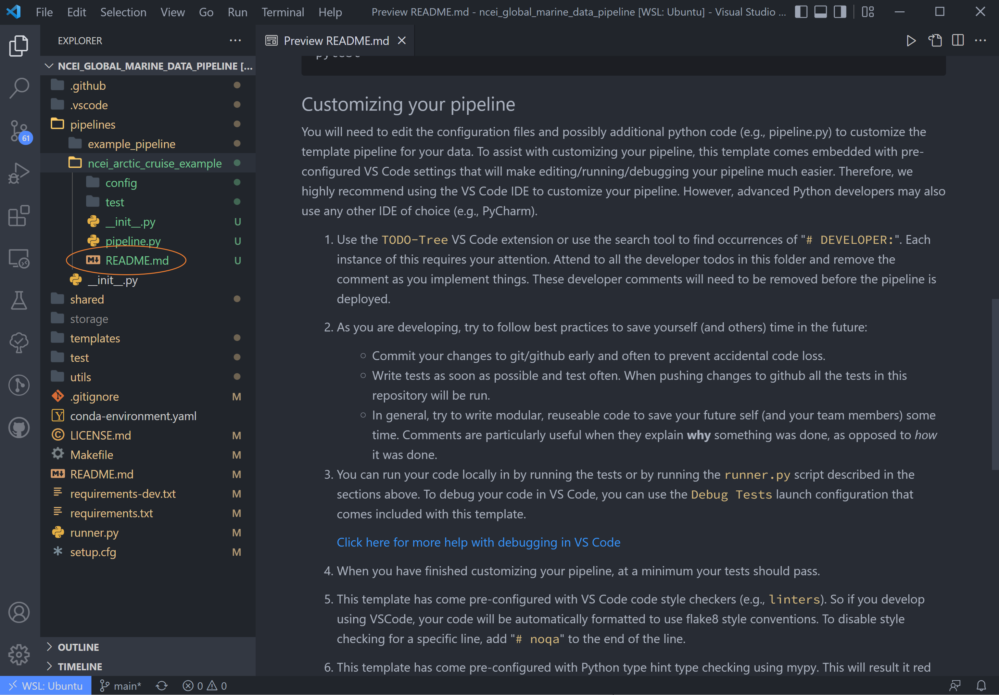

We are now looking at step #1: Use the `TODO tree` extension or use the search tool to find occurrences of
`# DEVELOPER`. (The `TODO tree` is the oak tree icon in the left-hand window panel).

You may need to reload VS Code for these to show up in the ingest. Hit `++ctrl+shift+p++` on the keyboard to open the
search bar, and type in and run the command `Reload Window`.

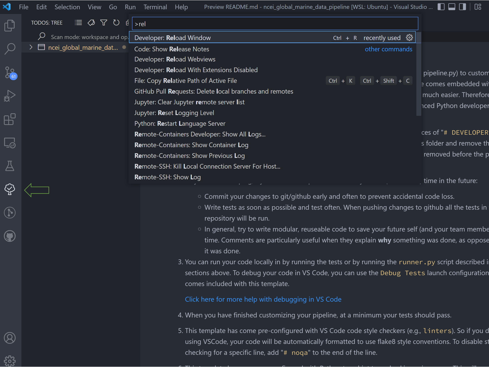

After doing the window reloads, all the newly created `TODOs` will show up in the new ingest folder. The rest of the
tutorial consists of running through this list of `TODOs`.

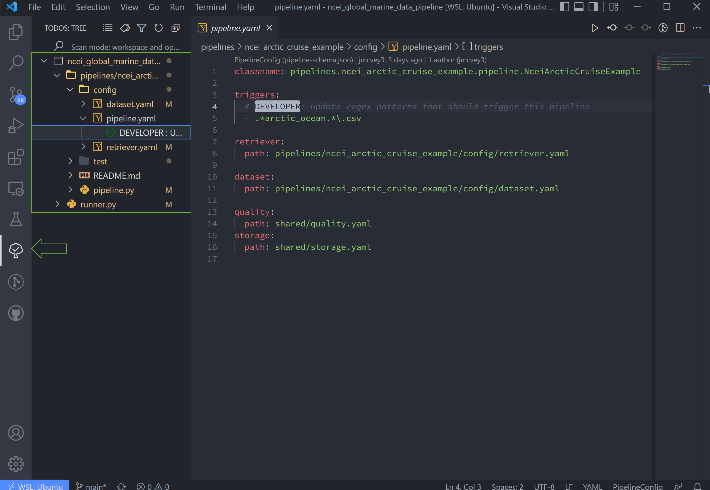

## Customizing the New Ingest

Navigate to your Explorer pane and open `pipelines/*/config/pipeline.yaml`.

This file lists the configuration files for the pipeline in the order that the pipeline is initiating them.

The first line, `classname`, refers to the the pipeline class path. This points to the class in your
`pipeline/pipeline.py` file, which contains the hook functions. The only hook we're using in this tutorial is that to
create plots, which we'll update after setting up the input data and configuration files. It isn't necessary to edit
this path name.

```yaml
classname: pipelines.ncei_arctic_cruise_example.pipeline.NceiArcticCruiseExample
```

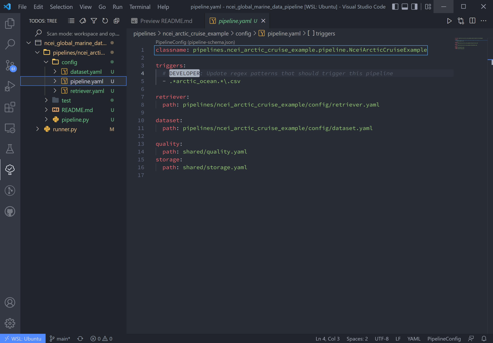

The second line, `triggers`, is the expected file pattern, or a `regex` pattern, of the input data, shown below. A regex
pattern is a set of symbols and ascii characters that matches to a file name or path. A full set of these symbols can be
found [here](https://www.shortcutfoo.com/app/dojos/regex/cheatsheet).

```yaml
triggers:
- .*arctic_ocean.*\.csv
```

The file pattern that will trigger a pipeline to run is automatically set to `.*<location_name>.*\.csv`. it can be
adjusted as the user or raw data requires. This pipeline's auto trigger can be broken down into 5 parts:

* `.*`: match any and all characters possible
* `arctic_ocean` match "arctic_ocean" exactly
* `.*`: match any and all characters possible
* `\.`: match a literal "."
* `csv`: match "csv" exactly

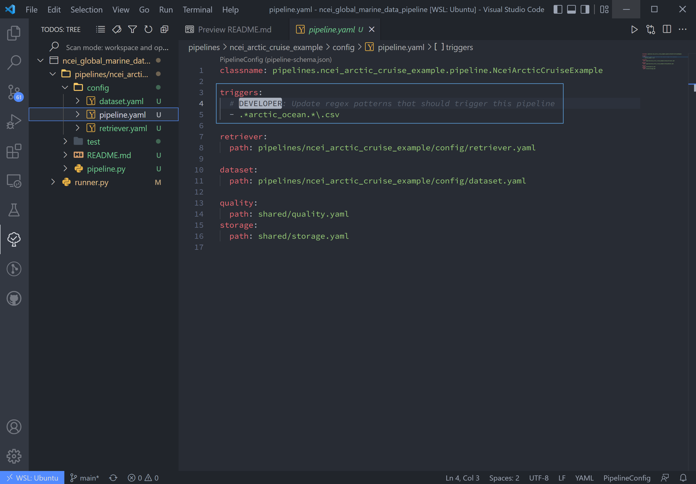

To match the raw data to the trigger, we will rename the sample data file to `arctic_ocean.sample_data.csv` and move it
to a new folder called `data` within our pipeline (ncei_arctic_cruise_example) directory.

How does `arctic_ocean.sample_data.csv` match with `.*arctic_ocean.*\.csv`? Good question! :

* `.*` matches the directory path of the file (`./pipelines/ncei_arctic_cruise_example/data/`)
* `arctic_ocean` matches itself
* `.*` matches `.sample_data`
* `\.` matches a literal `.`
* `csv` matches itself

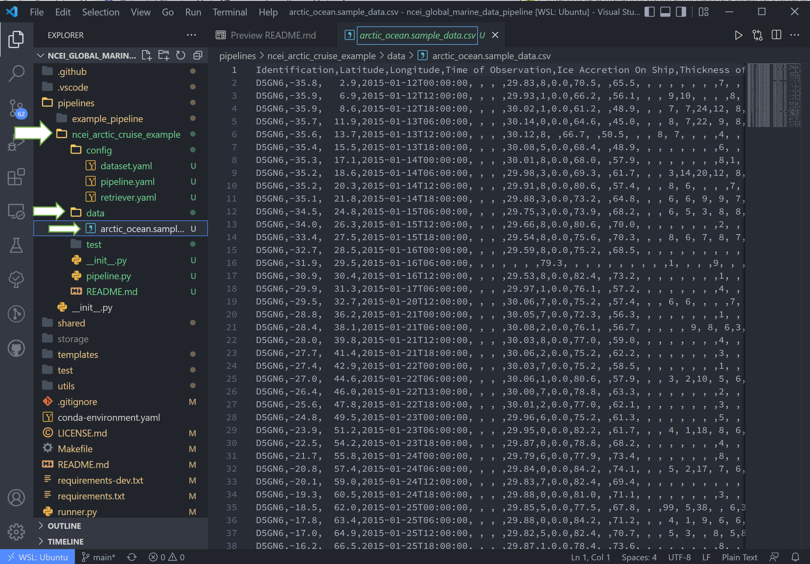

The third line, `retriever`, is the first of two required user-customized configuration files, which we'll need to
modify to capture the variables and metadata we want to retain in this ingest.

Start by opening retriever.yaml in the `pipelines/*/config` folder.

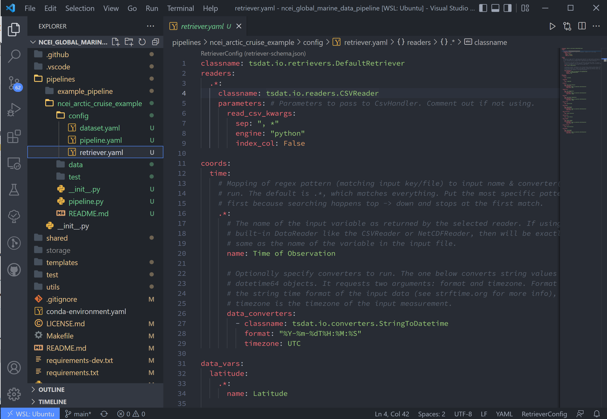

In the retriever file, we can specify several tasks to be run that apply to the input file and raw data:

* Specify the file reader
* Rename data variables
* Apply conversions (timestamp format, unit conversion, basic calculations, etc)
* Map particular data variables by input file regex pattern

The retriever is split into 4 blocks:

1. `classname`: default retriever code used by tsdat, not necessary to edit
2. `readers`: specifies details for the input file reader
3. `coords`: short for coordinates, the number of which defines the number of dimensions of the dataset (i.e. data with
    a single coordinate are 1-dimensional)
4. `data_vars`: short for data variables, these are scalar or vector data

For this pipeline, replace the text in the `retriever.yaml` file with the following:

```yaml title="pipelines/ncei_arctic_cruise_example/config/retriever.yaml"
classname: tsdat.io.retrievers.DefaultRetriever
readers:                                    # Block header
  .*:                                       # Secondary regex pattern to match files
    classname: tsdat.io.readers.CSVReader   # Name of file reader
    parameters:                             # File reader input arguments
      read_csv_kwargs:                      # keyword args for CSVReader (pandas.read_csv)
        sep: ", *"                          # csv "separator" or delimiter
        engine: "python"                    # csv read engine
        index_col: False                    # create index column from first column in csv

coords:
  time:
    name: Time of Observation
    data_converters:
      - classname: tsdat.io.converters.StringToDatetime
        format: "%Y-%m-%dT%H:%M:%S"
        timezone: UTC                       # Update input timezone if necessary

data_vars:
  latitude:
    name: Latitude

  longitude:
    name: Longitude

  pressure:
    name: Sea Level Pressure
    data_converters:
      - classname: tsdat.io.converters.UnitsConverter
        input_units: hPa

  temperature:
    name: Air Temperature
    data_converters:
      - classname: tsdat.io.converters.UnitsConverter
        input_units: degF

  dew_point:
    name: Dew Point Temperature
    data_converters:
      - classname: tsdat.io.converters.UnitsConverter
        input_units: degF

  wave_period:
    name: Wave Period

  wave_height:
    name: Wave Height
    data_converters:
      - classname: tsdat.io.converters.UnitsConverter
        input_units: ft

  swell_direction:
    name: Swell Direction

  swell_period:
    name: Swell Period

  swell_height:
    name: Swell Height
    data_converters:
      - classname: tsdat.io.converters.UnitsConverter
        input_units: ft

  wind_direction:
    name: Wind Direction

  wind_speed:
    name: Wind Speed
    data_converters:
      - classname: tsdat.io.converters.UnitsConverter
        input_units: dm/s
```

I'll break down the variable structure with the following code-block:

```yaml linenums="1"
temperature:
  name: Air Temperature
  data_converters:
    - classname: tsdat.io.converters.UnitsConverter
      input_units: degF
```

Matching the line numbers of the above code-block:

* `line 1` Desired name of the variable in the output data - user editable
* `line 2` Name of the variable in the input data - should directly match raw input data. Can also be a list of possible 
names found in the raw data.
* `line 3` Converter keyword - add if a converter is desired
* `line 4` Classname of data converter to run, in this case unit conversion. See the
    [customization tutorial](./pipeline_customization.md) for a how-to on applying custom data conversions.
* `line 5` Data converter input for this variable, parameter and value pair

Moving on now to the fourth line in `pipeline.yaml`, `dataset`, refers to the `dataset.yaml` file. This file is where
user-specified datatype and metadata are added to the raw dataset.

This part of the process can take some time, as it involves knowing or learning a lot of the context around the dataset
and then writing it up succinctly and clearly so that your data users can quickly get a good understanding of what this
dataset is and how to start using it.

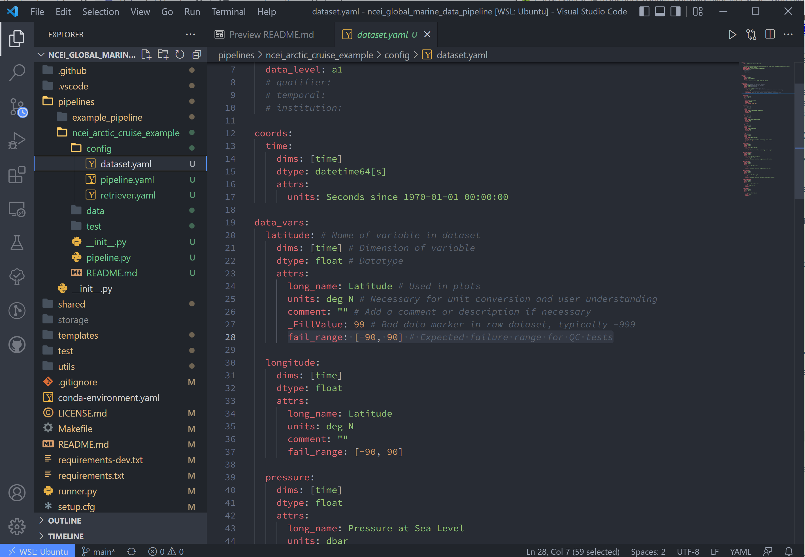

Replace the text in the `dataset.yaml` file with the following code-block.

!!! note

    * Note that the units block is particularly important (you will get an error message if a variable doesn't have
        units)
    * Variable names must match between `retriever.yaml` and `dataset.yaml`.
    * Variables not desired from `retriever.yaml` can be left out of `dataset.yaml`.
    * Notice the quality control (QC) attributes, `_FillValue`, `valid_min`, and `valid_max`. These attributes are
        used by tsdat in quality checks.

```yaml title="pipelines/ncei_arctic_cruise_example/config/dataset.yaml"
attrs:
  title: NCEI Arctic Cruise Example
  description: Historical marine data that are comprised of ship, buoy and platform observations.
  location_id: arctic_ocean
  dataset_name: ncei_arctic_cruise_example
  data_level: a1
  # qualifier: 
  # temporal: 
  # institution: 

coords:
  time:
    dims: [time]
    dtype: datetime64[s]
    attrs:
      long_name: Time
      standard_name: time
      units: Seconds since 1970-01-01 00:00:00 UTC
      timezone: UTC

data_vars:
  latitude:                   # Name of variable in retriever.yaml
    dims: [time]              # Variable dimension(s), separated by ","
    dtype: float              # Datatype
    attrs:
      long_name: Latitude     # Name used in plotting
      standard_name: latitude # Name specified in CF Conventions Table
      units: degN             # Units, necessary for unit conversion
      comment: ""             # Add a comment or description if necessary
      _FillValue: -999        # Bad data marker in raw dataset, otherwise -9999
      valid_max: 90           # Expected failure range for "CheckValidMax" QC test
      valid_min: -90          # Expected failure range for "CheckValidMin" QC test

  longitude:
    dims: [time]
    dtype: float
    attrs:
      long_name: Longitude
      standard_name: longitude
      units: degE
      comment: ""
      valid_max: 180
      valid_min: -180

  pressure:
    dims: [time]
    dtype: float
    attrs:
      long_name: Pressure at Sea Level
      standard_name: air_pressure_at_mean_sea_level
      units: dbar
      comment: ""
      valid_min: 0

  temperature:
    dims: [time]
    dtype: float
    attrs:
      long_name: Air Temperature
      standard_name: air_temperature
      units: degC
      comment: ""

  dew_point:
    dims: [time]
    dtype: float
    attrs:
      long_name: Dew Point
      standard_name: dew_point_temperature
      units: degC
      comment: ""
      valid_min: 0

  wave_height:
    dims: [time]
    dtype: float
    attrs:
      long_name: Wave Height
      standard_name: sea_surface_wave_mean_height
      units: m
      comment: Assumed to refer to average wave height
      valid_min: 0

  wave_period:
    dims: [time]
    dtype: float
    attrs:
      long_name: Wave Period
      standard_name: standard_name: sea_surface_wave_mean_period_from_variance_spectral_density_first_frequency_moment
      units: s
      comment: Assumed to refer to average wave period
      valid_min: 0
      valid_max: 30

  swell_height:
    dims: [time]
    dtype: float
    attrs:
      long_name: Swell Height
      standard_name: sea_surface_wave_significant_height
      units: m
      comment: Assumed to refer to significant wave height
      valid_min: 0

  swell_period:
    dims: [time]
    dtype: float
    attrs:
      long_name: Swell Period
      standard_name: sea_surface_wave_period_at_variance_spectral_density_maximum
      units: s
      comment: Assumed to refer to peak wave period
      valid_min: 0
      valid_max: 30

  swell_direction:
    dims: [time]
    dtype: float
    attrs:
      long_name: Swell Direction
      standard_name: sea_surface_primary_swell_wave_from_direction
      units: deg from N
      comment: Assumed to refer to peak wave direction
      valid_min: 0
      valid_max: 360

  wind_direction:
    dims: [time]
    dtype: float
    attrs:
      long_name: Wind Direction
      standard_name: wind_from_direction
      units: deg from N
      comment: ""
      valid_min: 0
      valid_max: 360

  wind_speed:
    dims: [time]
    dtype: float
    attrs:
      long_name: Wind Speed
      standard_name: wind_speed
      units: m/s
      comment: ""
      valid_min: 0
```

The last two lines in `pipeline.yaml` are `quality` and `storage`. In this tutorial, these files are
located in the `shared` folder in the top-level directory. If custom QC is selected, these will also be located in the
`config` folder.

The `quality.yaml` file defines the QC functions that we will run on this code, and the `storage.yaml` file defines the
path to the output file writer.

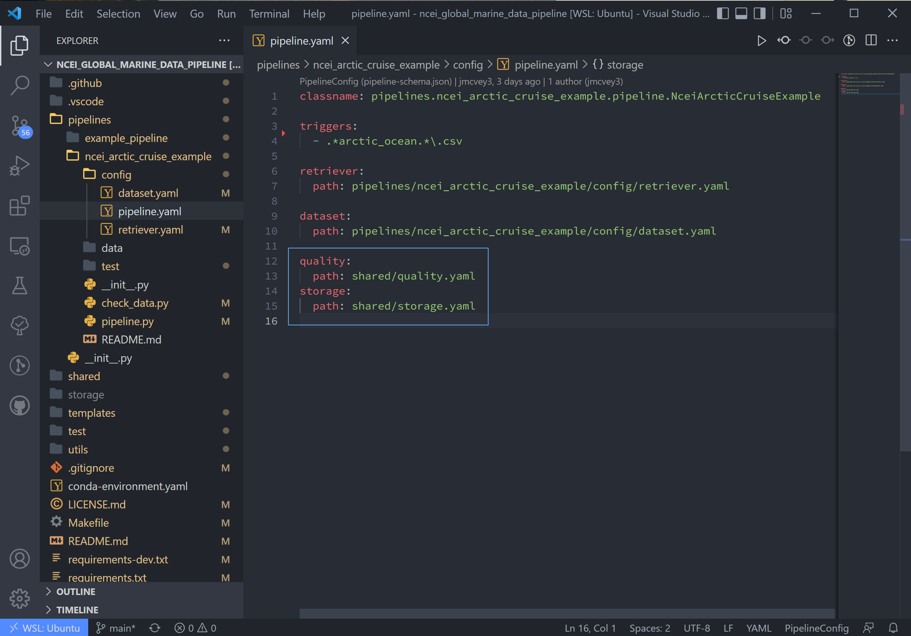

The `quality.yaml` file contains a number of built-in tsdat quality control functions, which we will use as is for this
ingest.

Quality control in tsdat is broken up into two types of functions: 'checkers' and 'handlers'. Checkers are functions
that perform a quality control test (e.g. check missing, check range (max/min), etc). Handlers are functions that do
something with this data.

See the API documentation for more built-in QC tests, and the [customization tutorial](./pipeline_customization.md) for
more details on how QC works in tsdat and how to create your own.

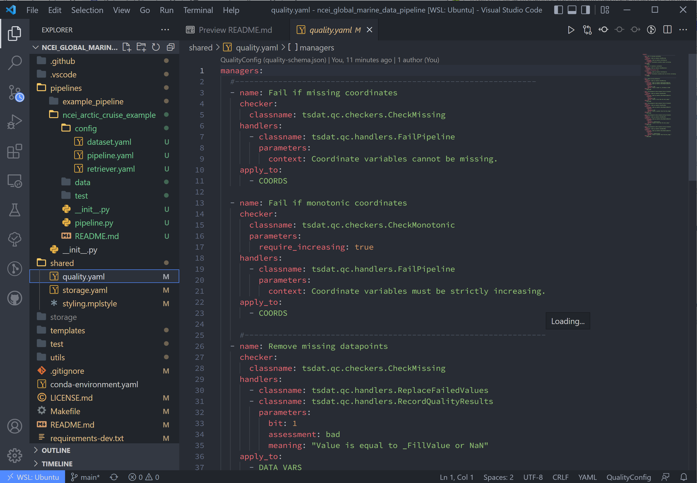

File output is handled by storage.yaml, and built-in output writers are to NETCDF4 file format or CSV.

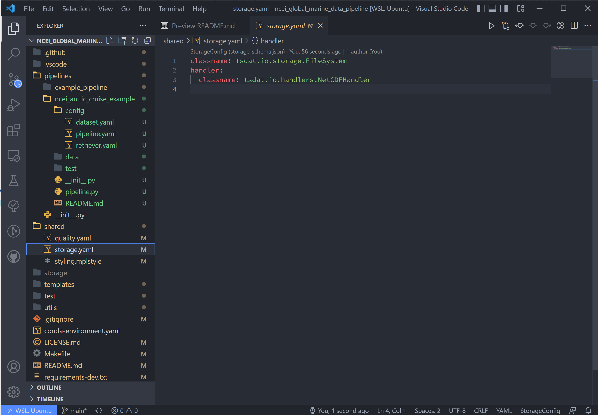

I won't do this here, but CSV output can be added by replacing the `handler` block in `storage.yaml` with:

```yaml
handler:
  classname: tsdat.io.handlers.CSVHandler
```

Finally `pipeline.py` is the last get-pipeline-to-working mode "TODO" we should finish setting up here. As mentioned
previously, it contains a series of hook functions that can be used along the pipeline for further data organization.

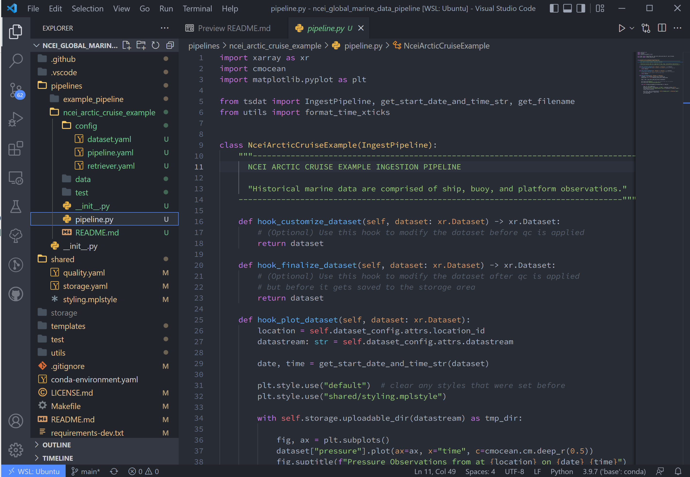

We shall set up `hook_plot_dataset`, which plots the processed data and save the figures in the `storage/ancillary`
folder. To keep things simple, only the pressure data is plotted here, but feel free to edit this code as desired:

```python title="pipelines/ncei_arctic_cruise_example/pipeline.py"
import xarray as xr
import cmocean
import matplotlib.pyplot as plt

from tsdat import IngestPipeline, get_start_date_and_time_str


class NceiArcticCruiseExample(IngestPipeline):
    """NCEI ARCTIC CRUISE EXAMPLE INGESTION PIPELINE

      Historical marine data that are comprised of ship, buoy, and platform 
      observations.
    """

    def hook_customize_dataset(self, dataset: xr.Dataset) -> xr.Dataset:
        # (Optional) Use this hook to modify the dataset before qc is applied
        return dataset

    def hook_finalize_dataset(self, dataset: xr.Dataset) -> xr.Dataset:
        # (Optional) Use this hook to modify the dataset after qc is applied
        # but before it gets saved to the storage area
        return dataset

    def hook_plot_dataset(self, dataset: xr.Dataset):
        location = self.dataset_config.attrs.location_id

        date, time = get_start_date_and_time_str(dataset)

        with plt.style.context("shared/styling.mplstyle")

          fig, ax = plt.subplots()
          dataset["temperature"].plot(ax=ax, x="time", c=cmocean.cm.deep_r(0.5))
          fig.suptitle(f"Temperature measured at {location} on {date} {time}")

          plot_file = self.get_ancillary_filepath(title="temperature")
          fig.savefig(plot_file)
          plt.close(fig)

          # Create plot display using act
          display = act.plotting.TimeSeriesDisplay(
              dataset, figsize=(15, 10), subplot_shape=(2,)
          )
          display.plot("wave_height", subplot_index=(0,), label="Wave Height")  # data in top plot
          display.qc_flag_block_plot("wave_height", subplot_index=(1,)) # qc in bottom plot

          plot_file = self.get_ancillary_filepath(title="wave_height")
          display.fig.savefig(plot_file)
          plt.close(display.fig)
```

## Running the Pipeline

We can now re-run the pipeline using the `runner.py` file as before with:

```bash
python runner.py pipelines/ncei_arctic_cruise_example/data/arctic_ocean.sample_data.csv
```

Which will run with the same output as before:

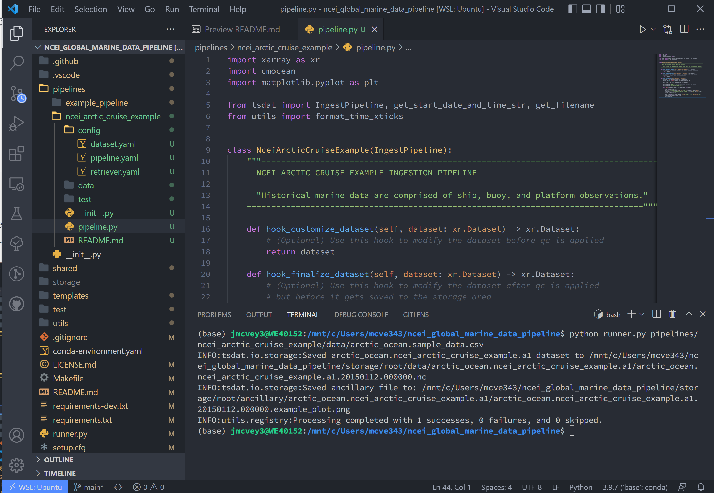

Once the pipeline runs, if you look in the `storage` folder, you'll see the plot as well as the netCDF file output (or
csv if you changed the output writer earlier):

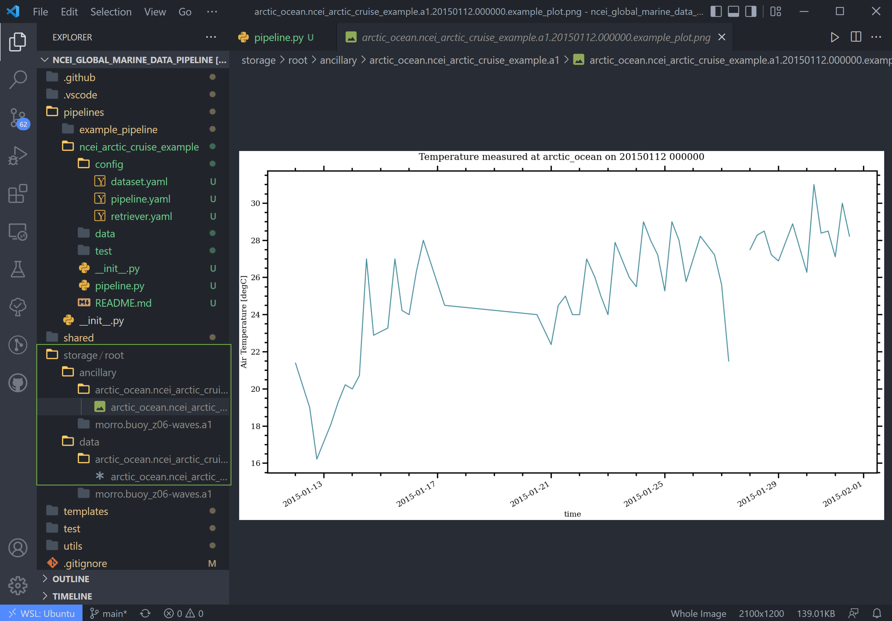

## Viewing the Data

NetCDF files can be opened using the provided `file_viewer.ipynb` jupyter notebook. This file can be opened in VSCode or
through [Jupyter's website](https://jupyter.org/try).

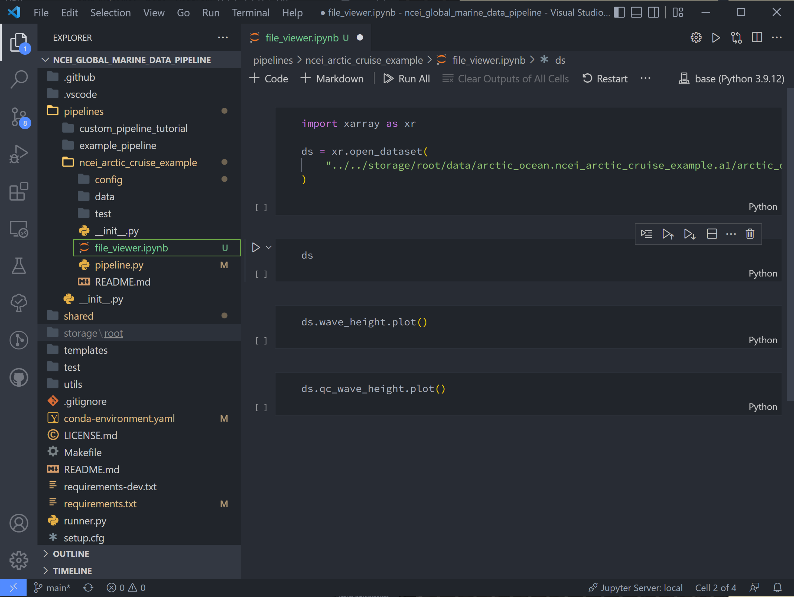

Change the first code block to point to our netcdf data:

```python
import xarray as xr

ds = xr.open_dataset(
    "../../storage/root/data/arctic_ocean.ncei_arctic_cruise_example.a1/arctic_ocean.ncei_arctic_cruise_example.a1.20150112.000000.nc"
)
```

And hit ++shift+enter++ to run this code block. Run the next code block to see an interactive data block.

```python
ds
```

Use the drop-down arrows on the left and the text file and database icons on the right to explore the data.

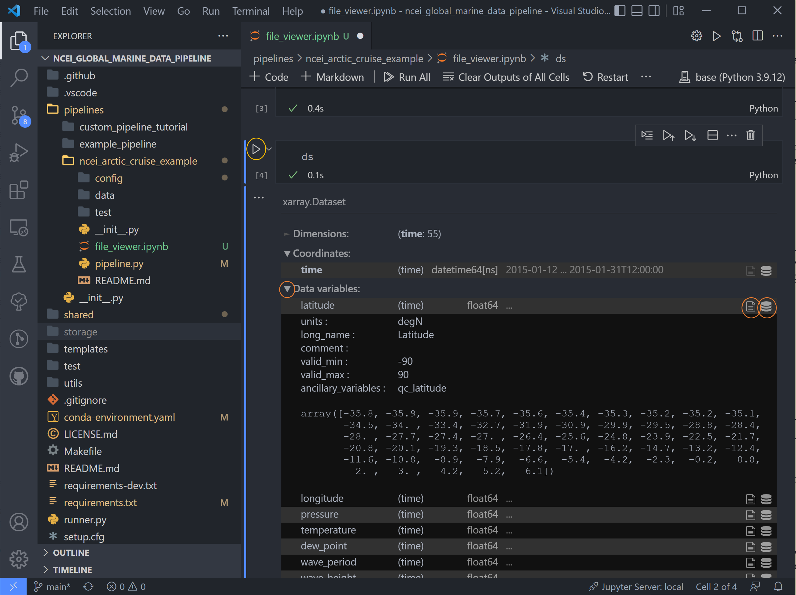

There are two sets of variables here. The first are the original variables saved with their data (adjusted by data
converters and/or QC function if applicable) and associated metadata.

The second set are the QC variables. Tsdat adds these variables if the `RecordQualityResults` handler is called in the
quality configuration file. A few attributes, specified for this handler in the quality config file, are shared across
all QC variables: `flag_masks`, `flag_meanings`, and `flag_assessments`.

In this case, there are three `flag masks`: 1, 2, and 4. We can see in the data, flags 1 and 4 were tripped on this
variable. Every point listed as 1 corresponds to the first entry in `flag_meanings`:
`Value is equal to _FillValue or NaN`, a.k.a. it is a missing data point. Likewise for flag 4: a few data points are
above the valid maximum specified.

Note: if multiple QC flags are tripped, these flags will be added together. For instance, if a QC variable has a value
of 5, this means that the QC tests corresponding to flag 1 and flag 4 were both tripped.

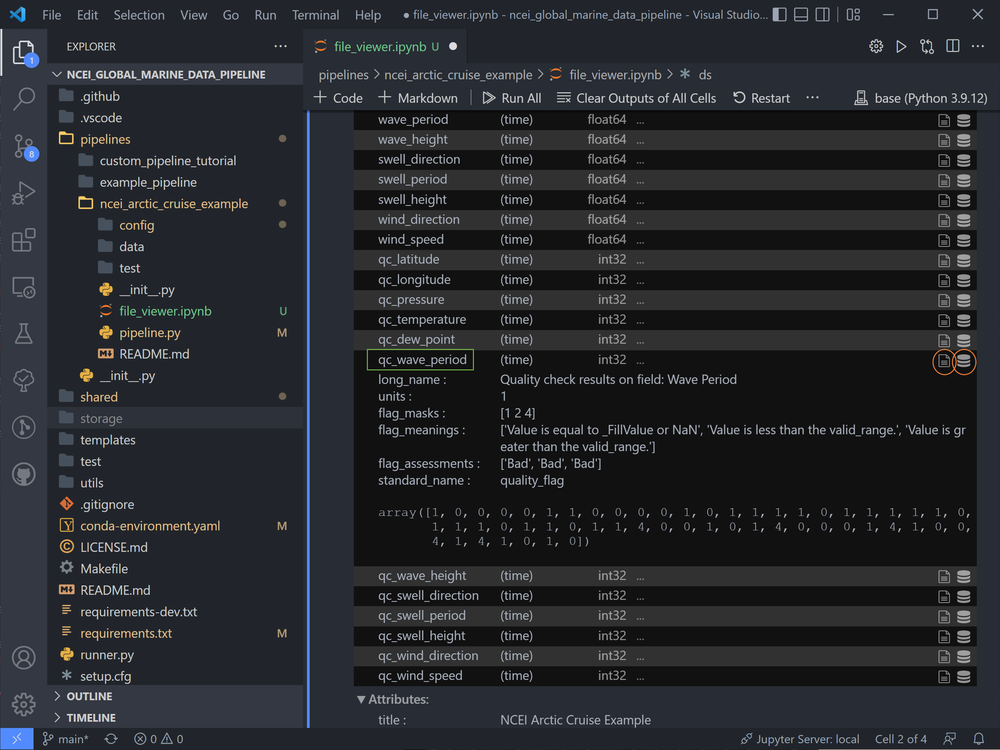

The final two code blocks are shorthand for plotting variables in the dataset.

```python
ds.temperature.plot()
ds.qc_temperature.plot()
```

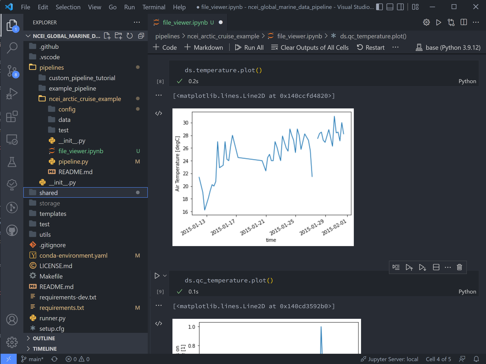

## Pipeline Tests

Testing is best completed as a last step, after everything is set up and the pipeline outputs as expected. If running a
large number of data files, a good idea is to input one of those data files here, along with its expected output, and
have a separate data folder to collect input files.

Move the input and output files to the `test/data/input/` and `test/data/expected/` folders, respectively, and update
the file paths.

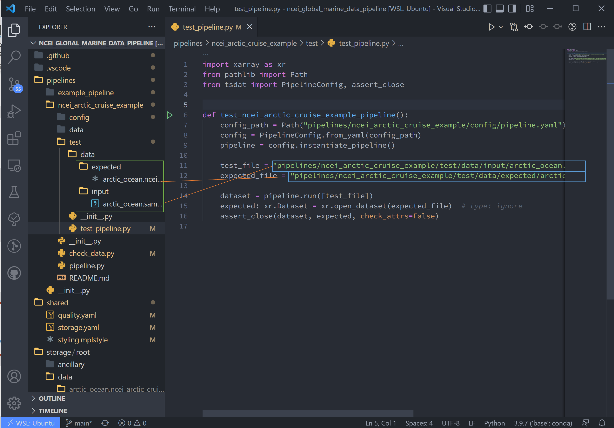

## Next Steps

Tsdat is highly configurable because of the range and variability of input data and output requirements. The following
tutorial, the [pipeline customization tutorial](./pipeline_customization.md), goes over the steps needed to create
custom file readers, data converters, and custom quality control. In the developer's experience, many types of input
data (aka file extensions) require a custom file reader, which also offers the freedom for easy pre-processing and
organization of raw data.
