# Pipeline Customization

This tutorial goes over how to add custom file readers, quality control, and data converter code to tsdat for the
[pipeline-template](https://github.com/tsdat/pipeline-template). This tutorial builds off of the
[previous tutorial](./data_ingest.md) and utilizes the same example data.

We'll dive straight into it by creating a new pipeline:

```bash
make cookies
```

or

```bash
cookiecutter templates/ingest -o ingest/
```

And select `y` (yes) to the `Do you want to use a custom X?` prompts.

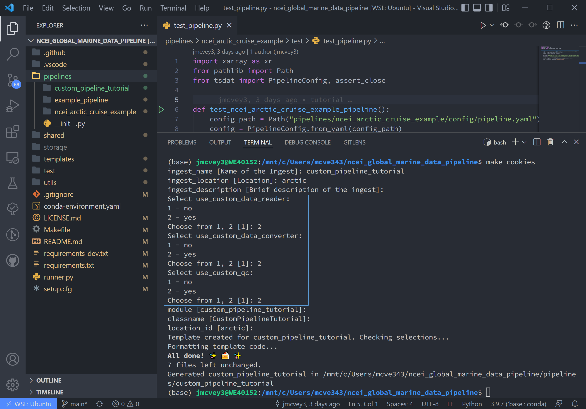

Notice this adds a readers.py, qc.py, and converters.py to the new pipeline directory, as well as a qc.yaml file to the
config folder.

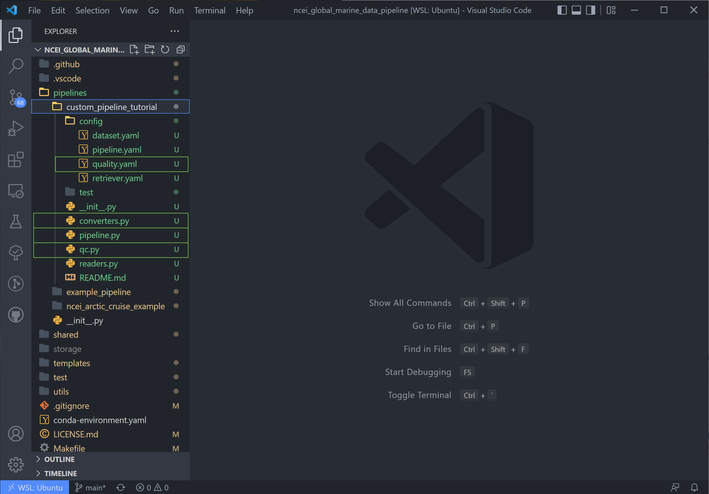

## Fill out the Configuration Files

Go ahead and copy the `retriever.yaml`, `dataset.yaml`, and `pipeline.py` files from the NOAA NCEI example data tutorial
if you are using that data. If you are building a custom pipeline, go ahead and fill out these files now.

## Adding a Custom File Reader

Tsdat has a few native file readers: `CSVReader`, `NetCDFReader`, `ParquetReader` and `ZipReader`, as well as a couple 
tar file readers (`ZipReader` and `TarReader`). While useful for a number of input files, it is not uncommon for raw data 
files to be saved in some custom format or structure. Tsdat has the flexibility to incorporate user-built code to read 
and pre-process raw data.

It is recommended to test your code before inputting to tsdat's framework by first writing and testing a reader on your
input data in your preferred IDE. This read function should return an xarray Dataset.

Since we're using the same NOAA NCEI data as before, we will copy tsdat's built-in CSV reader here for this example. All
readers in tsdat have this structure:

```python title="pipelines/custom_pipeline_tutorial/readers.py"
from typing import Any, Dict, Union
from pydantic import BaseModel, Extra
import pandas as pd
import xarray as xr
from tsdat import DataReader


class NCEIReader(DataReader):
    """Custom DataReader that can be used to read data from a specific format.

    Built-in implementations of data readers can be found in the tsdat.io.readers
    module.
    """

    class Parameters(BaseModel, extra=Extra.forbid):
        """If your CustomDataReader should take any additional arguments from the
        retriever configuration file, then those should be specified here."""

        read_csv_kwargs: Dict[str, Any] = {}
        from_dataframe_kwargs: Dict[str, Any] = {}

    parameters: Parameters = Parameters()
    """Extra parameters that can be set via the retrieval configuration file. If you opt
    to not use any configuration parameters then please remove the code above."""

    def read(self, input_key: str) -> Union[xr.Dataset, Dict[str, xr.Dataset]]:
        # Read csv file with pandas
        df = pd.read_csv(input_key, **self.parameters.read_csv_kwargs)

        # Return an xarray dataset
        return xr.Dataset.from_dataframe(df, **self.parameters.from_dataframe_kwargs)
```

As you can see in the above code, our reader is contained by the class `NCEIReader`. The `Parameters` class initiates
the parameters expected from the `retriever.yaml` file, which are then fed to the "read" function, which contains the
reader's source code.

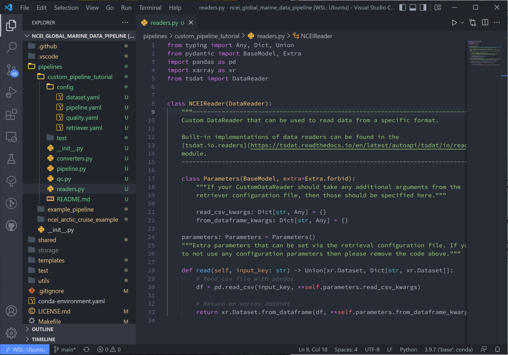

Note that `reader.py` is the first bit of code that the pipeline runs after finding the datafile(s). After running 
`reader.py`, the pipeline configures the dataset using `retriever.yaml`. If variable names are changed in
the reader source code, this change should be reflected in the variable's input names in `retriever.yaml`.

After setting up the reader, we next need to tell tsdat now to use our csv file reader. Open the `retriever.yaml` file 
and replace the `readers` block with:

```yaml title="pipelines/custom_pipeline_tutorial/config/retriever.yaml"
readers:
  .*:
    classname: pipelines.custom_pipeline_tutorial.readers.NCEIReader
    parameters:
      read_csv_kwargs:
        sep: ", *"
        engine: "python"
        index_col: False
```

Notice we are not using the `from_dataframe_kwargs` parameter in the reader, but if we were, `from_dataframe_kwargs` 
would be listed at the same indent level as `read_csv_kwargs`.

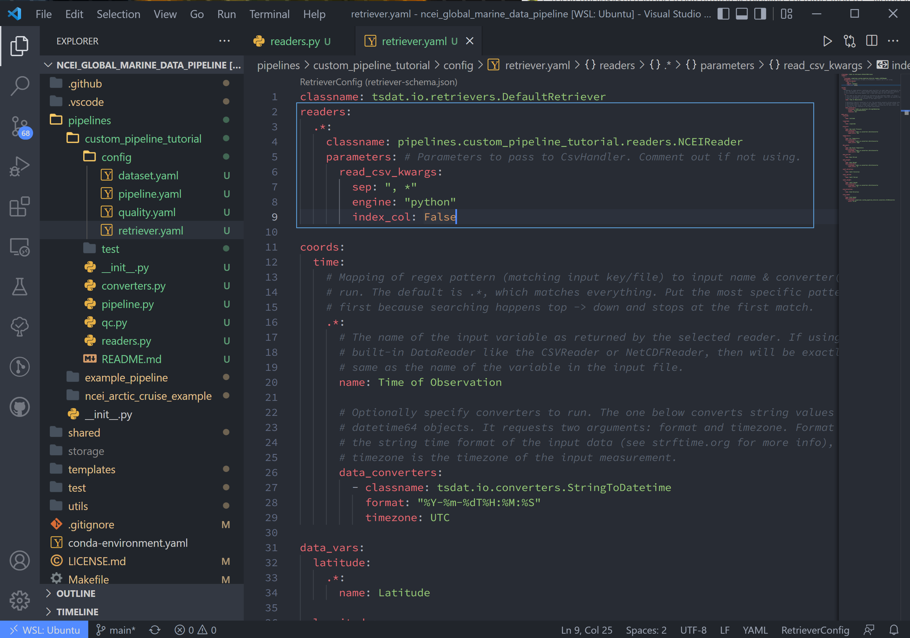

## Adding Custom Data Converter Functions

Tsdat has a couple native data converters, including the `UnitsConverter` and `StringToDatetime` converters. These
provide the useful functions of converting units and utilizing the datetime package's ability to read time formats,
given the correct time string.

The custom data converter is an option to add pre-processing to specific variables in the input dataset, while a custom
file reader gives more flexibility to cover all at once. Converters operate on a variable-by-variable basis, so keep
this in mind when adding one. The converters are run after the pipeline runs the configuration specified in 
`retriever.yaml`.

For this example, we'll use a custom units conversion. As stated in the NCEI NOAA documentation, the units for wind 
speed are recorded as either 1/10th of a knot or m/s, depending on the configuration. Because the rest of the file is 
saved in imperial units, I'm assuming the data is actually saved as kt/10. This isn't a standard unit, so we 
shall add a data converter to tackle this input in the codeblock below.

```python title="pipelines/custom_pipeline_tutorial/converters.py"
import xarray as xr
from typing import Any, Optional
from pydantic import BaseModel, Extra
from tsdat.io.base import DataConverter
from tsdat.utils import assign_data
from tsdat.config.dataset import DatasetConfig


class Kt10Converter(DataConverter):
    """Converts NCEI windspeed data format from kt/10 to m/s. 
    E.g. 500 kt/10 = 50 kt = 25.7 m/s

    Expects "kt/10" as input and "m/s" as output units.
    """

    class Parameters(BaseModel, extra=Extra.forbid):
        """If your CustomConverter should take any additional arguments from the
        retriever configuration file, then those should be specified here.
        """

        units: Optional[str] = None

    parameters: Parameters = Parameters()
    """Extra parameters that can be set via the retrieval configuration file. If you opt
    to not use any configuration parameters then please remove the code above."""

    def convert(
        self,
        dataset: xr.Dataset,
        dataset_config: DatasetConfig,
        variable_name: str,
        **kwargs: Any,
    ) -> xr.Dataset:

        input_units = self.parameters.units
        output_units = dataset_config[variable_name].attrs.units

        if ("kt/10" not in input_units) and ("m/s" not in output_units):
            return dataset

        data = dataset[variable_name].data / 10 * 0.514444

        dataset = assign_data(dataset, data, variable_name)
        dataset[variable_name].attrs["units"] = output_units

        return dataset
```

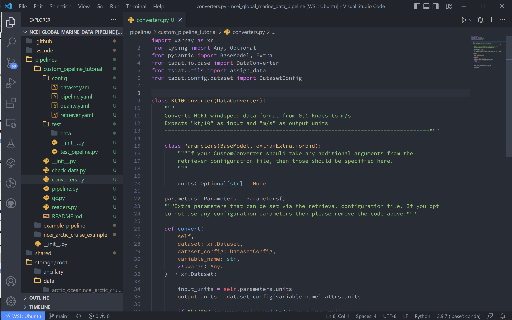

Now we configure the "wind_speed" variable to use this converter in the `retriever.yaml` file:

```yaml title="pipelines/custom_pipeline_tutorial/config/retriever.yaml"
wind_speed:
  .*:
    name: Wind Speed
    data_converters:
      - classname: pipelines.custom_pipeline_tutorial.converters.Kt10Converter
        parameters:
          units: kt/10
```

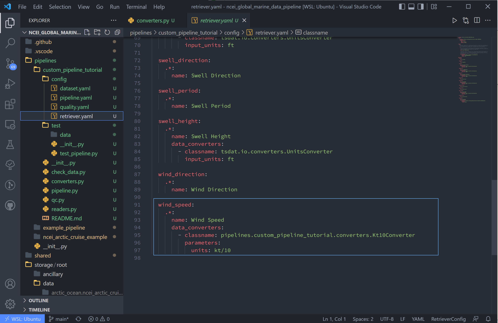

## Adding Custom Quality Control Functions

First, a quick overview of how tsdat handles quality control (QC):

Tsdat has a number of native quality control functions that users could find useful. (See
[quality control](../config/quality_control.md) for more info). These built-in functions can then be input into the
pipeline config or shared folder quality.yaml, and many are already incorporated in the pipeline template.

It is important to note that QC functions are applied one variable at a time.

For example:

```yaml title="pipelines/custom_pipeline_tutorial/config/quality.yaml"
quality_management:

  - name: Remove data points below minimum valid threshold
    checker:
      classname: tsdat.CheckValidMin
    handlers:
      - classname: tsdat.RemoveFailedValues
      - classname: tsdat.RecordQualityResults
        parameters:
          assessment: Bad
          meaning: Value is less than expected range
    apply_to: [DATA_VARS]
    exclude:
      - foo
      - bar
```

In the above block of code, a `CheckValidMin` check is run all variables except variables named "foo" and "bar". This
QC check only runs on variables that have the "valid_min" attribute defined in their metadata in the `dataset.yaml`
config file.

The first handler specified here (`RemoveFailedValues`) removes values that failed the QC check by replacing them with
the attribute `_FillValue`.

The second handler used is `RecordQualityResults`, which requires parameters in the `quality.yaml` block itself:
*assessment* and *meaning*. This adds `qc_variable_name` variables to the output data for each data variable that the
handler is applied to. The values of these qc variables are 0 if all tests pass, and a non-zero value if any of the
checks applied to that specific variable fail. Here we just have the 1 QC manager (`name=Remove data points ...`), so a
value of 0 represents the data passed and a value of 1 means the test failed.

A variable is set to run through a quality management block by adding the required attributes. To run a variable
"distance" through the QC block shown above, add the required "valid_range" and "_FillValue" attributes like the
following:

```yaml title="pipelines/custom_pipeline_tutorial/config/dataset.yaml"
distance:
  dims: [time]
  dtype: float
  attrs:
    units: "m"
    valid_min: -3 # attribute for the "CheckValidMin" function
    _FillValue: -999      # the "bad data" value
```

Now back to the tutorial steps:

Custom QC code in tsdat allows a user to create both *checkers* and *handlers*. Like readers, you can add as many of
each as one would like. *Checkers* should return a boolean numpy array (`True`/`False`) for each variable in the raw
dataset where `True` refers to flagged data. *Handlers* take this boolean array and apply some function to the data
variable it was created from.

For this tutorial, we'll add a QC handler that interpolates missing data with a cubic polynomial using one of xarray's
functions:

```python title="pipelines/custom_pipeline_tutorial/qc.py"
import numpy as np
from pydantic import BaseModel, Extra
import xarray as xr
from numpy.typing import NDArray
from tsdat import QualityChecker, QualityHandler


class PolyInterpHandler(QualityHandler):
    """Fills in missing data with a cubic polynomial spline"""

    def run(
        self, dataset: xr.Dataset, variable_name: str, failures: NDArray[np.bool_]
    ) -> xr.Dataset:

        if failures.any():
            # Make sure failed data points are NaN'd out
            dataset[variable_name] = dataset[variable_name].where(~failures)

            # Interpolate with cubic polynomial
            dataset[variable_name] = dataset[variable_name].interpolate_na(
                dim="time", method="cubic", keep_attrs=True
            )

        return dataset
```

You'll see that the "run" function here is given three inputs:

1. `dataset` - currently processed dataset
2. `variable_name` - current variable undergoing QC
3. `failures` - the true/false array, where true refers to values that failed the QC check

In this case, the checker is `CheckMissing`, which flags data points already missing from the dataset. If the checker
returned a "failures" array had data points flagged that weren't missing, I would want to make sure to remove those
data points before passing to `dataset[variable_name].interpolate_na()`.

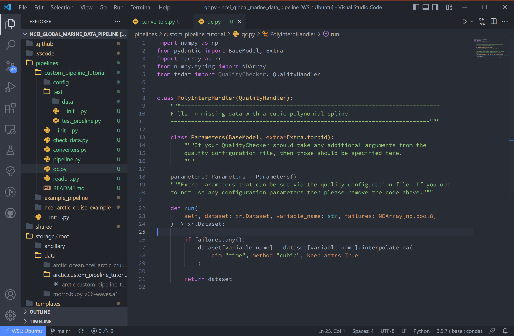

We then update the `quality.yaml` file and replace the custom input with our most recent code. We'll continue to use
`CheckMissing` and `RecordQualityResults` here.

!!! note

    You will need to remove the *Remove missing data points* QC block (the first block with `RemoveFailedValues`) for
    interpolation to work properly. If running multiple QC tests, you will want to make sure they aren't overwriting 
    each other.

```yaml title="pipelines/custom_pipeline_tutorial/config/quality.yaml"

  - name: Cubic spline interpolation
    checker:
      classname: tsdat.qc.checkers.CheckMissing
    handlers:
      - classname: pipelines.custom_pipeline_tutorial.qc.PolyInterpHandler
      - classname: tsdat.qc.handlers.RecordQualityResults
        parameters:
          bit: 10
          assessment: bad
          meaning: "Data replaced with cubic polynomial"
    apply_to:
      - DATA_VARS
```

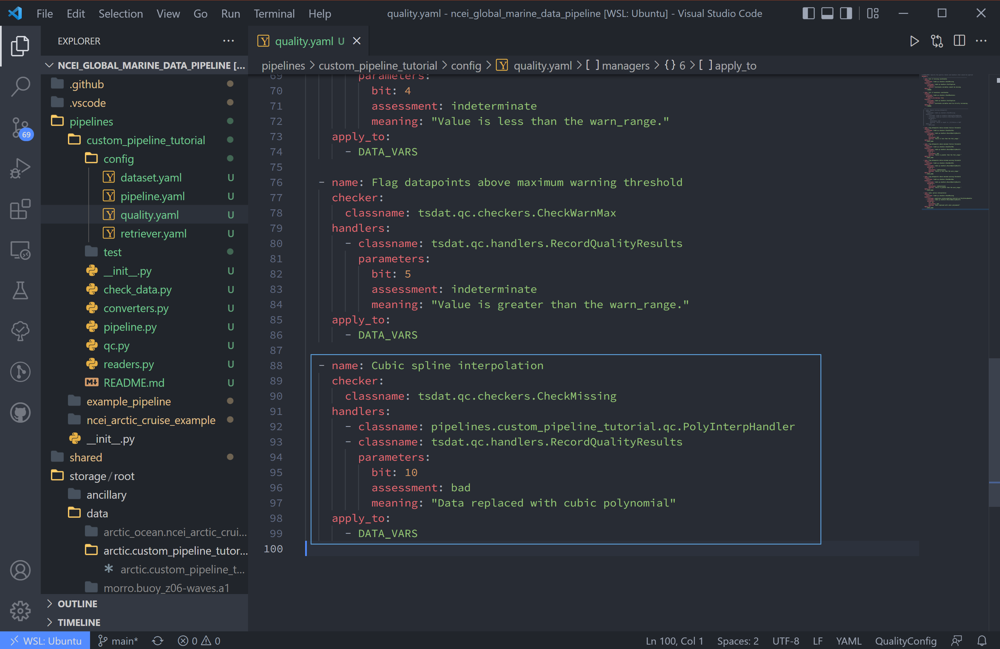

## Run the Pipeline

There are a couple more things. First we need to update the pipeline regex pattern in the `pipeline.yaml` file to run
files in this particular pipeline, and we'll do this by changing the triggers block:

```yaml title="pipelines/custom_pipeline_tutorial/config/pipeline.yaml"
triggers:
- .*custom.*\.csv
```

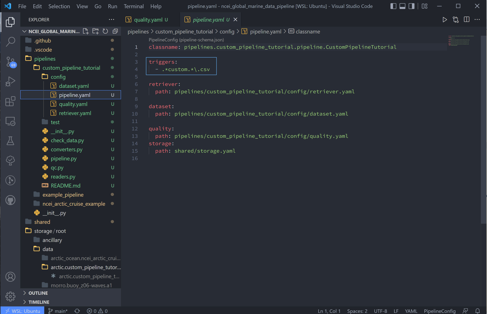

Next, we want to copy the data to this pipeline and rename it to match the regex pattern. The data here is stored in the
`test/data/input/` folder, but can be anywhere, and I have named this data `custom.sample_data.csv`.

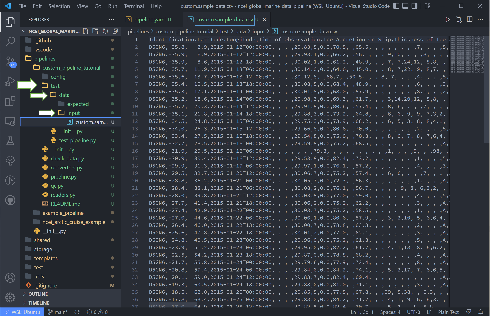

Finally we can run this pipeline. Open a terminal (++ctrl+backslash++) and run

```bash
python runner.py ingest pipelines/custom_pipeline_tutorial/test/data/input/custom.sample_data.csv
```

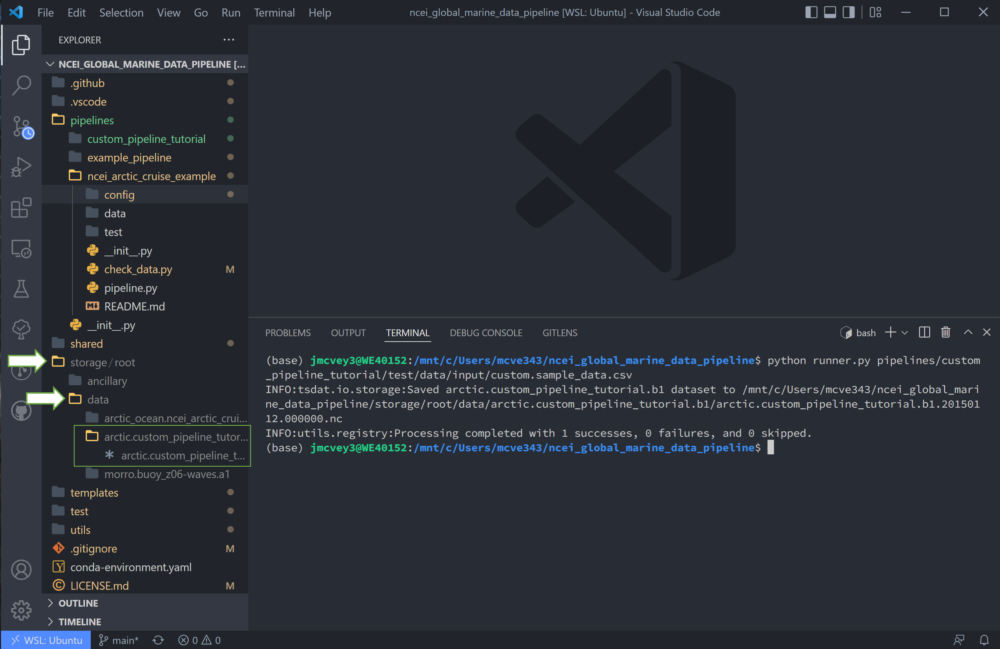

## Notes on Errors

Errors commonly ensue from data file located in incorrect directories, incorrect classname paths, and syntax errors.
If you get an error, most of the time there is an error, missing or incorrect input in the .yaml files.

### Common Errors

`KeyError ['time']`

:   Time is typically the first variable tsdat looks for, so if it can't load your dataset or if the time coordinate is
    not input correctly, this error will pop up. The failure load a dataset typically results from incorrect file
    extensions, regex patterns, or file path location.

`Can't find module "pipeline"`

:   There are many modules and classes named "pipeline" in tsdat. This error typically refers to a classname specified
    in the config file, i.e. `pipelines.custom_pipeline_tutorial.qc.<custom_qc>` or
    `pipelines.custom_pipeline_tutorial.readers.<custom_reader>`. Make sure this classname path is correct.

`Check_<function> fails`

:   Ensure all the variables listed under a quality management group can be run through the function. For example, if I
    try to run the test `CheckMonotonic` on all "COORDS", and one of my coordinate variables is a string array (e.g.,
    'direction': ['x','y','z'], this function will fail). Fix this by replacing "COORDS" with only numeric coordinates
    (e.g. 'time') or add the failing coordinate to the exclude section.

`"CheckMonotonic" fails for "X" values in variable "time"`

:   If a timestamp isn't sequentially increasing, this check will fail the entire pipeline and tell you in the error 
    message which timestamps have failed (which timestamps are earlier in time than the previous timestamp). This is 
    typically due to a datalogger writing error. The only built-in fix for this in the pipeline is to change the handler 
    from `FailPipeline` to `RemoveFailedValues`, which will drop the suspect timestamps and leave a gap. Otherwise the 
    timestamps will need to be fixed manually, assuming the missing timestamps are recoverable.

`If a QC handler doesn't appear to be running on a variable`

:   *make sure it's not being overridden by another in the same pipeline
    * make sure your custom QC tests are running on a single variable at a time and not affecting the entire dataset.

`Pipeline is "skipped"`

:   Make sure your regex pattern in `pipeline.yaml` matches your filename. There are regex file match checkers online
    for a sanity check.
