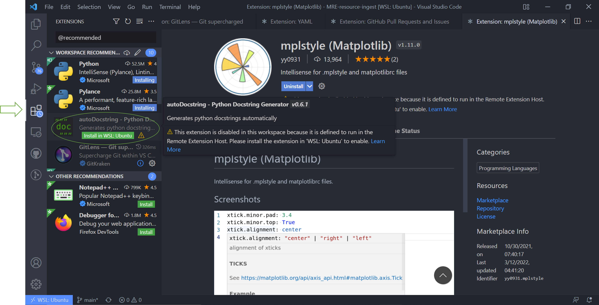
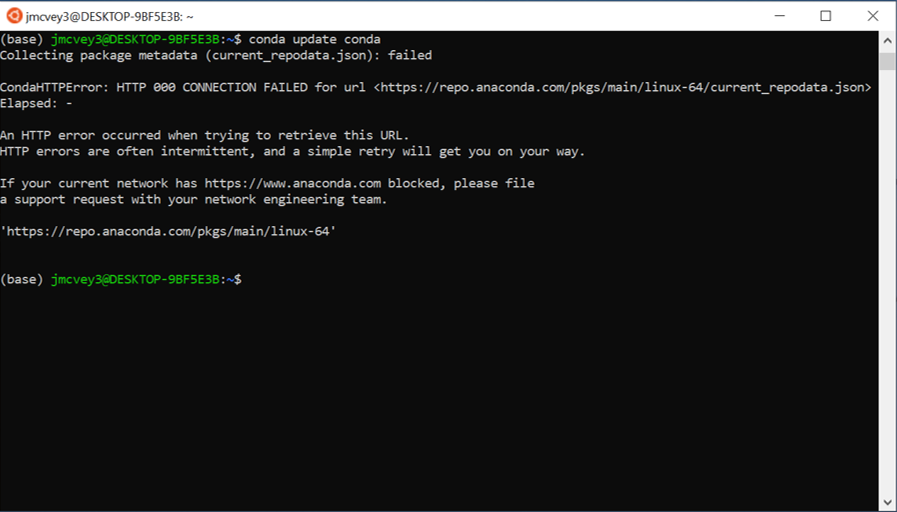
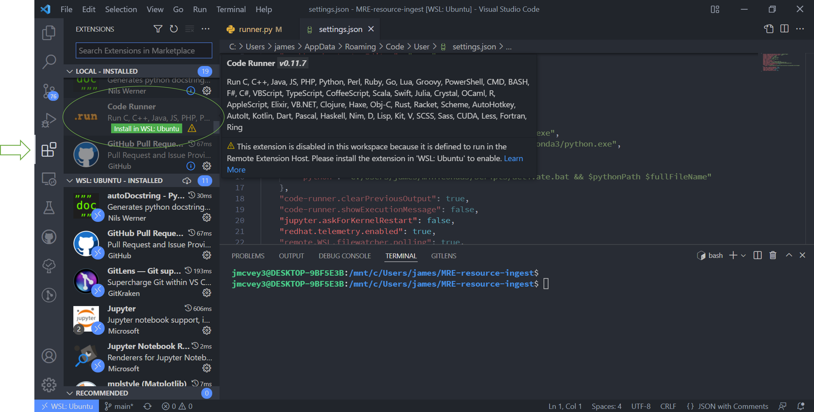

# Setting up WSL and VSCode for Windows Users

This tutorial goes over installing WSL Version 1 (and in our case, we'll be installing Ubuntu) and setting up a WSL
environment in VSCode.

Start by installing [VSCode](https://code.visualstudio.com/). It's a good idea to familiarize yourself with the VScode
interface. Installing Ubuntu in WSL is a more involved process:

1. In the windows search bar, type "Turn Windows features on or off" (located in the control panel).

    

2. A new window will pop up with a list of checkboxes. Scroll down to "Windows Subsystem for Linux" and make sure that
    box is checked. Then click "OK".

    

3. Once Windows has applied changes, click "Restart now" to reboot and enable WSL.
4. After reboot, open the Microsoft Store app from the search bar, and search for "Ubuntu".

    

5. A new bash terminal will pop up. Wait for the install to run, and create a username and password when prompted. Note,
    if you forget your password, can manually reset it from Windows Powershell.

6. Windows does not allow WSL to automatically connect to wifi, so we'll need to add this manually. Open a WSL bash and 
enter the following. This unsets the automatic creation of the `/etc/resolv.conf` file and sets a generic nameserver to 
find the wifi address in Windows.

```bash
  echo -e "[network]\ngenerateResolvConf = false" | sudo tee -a /etc/wsl.conf
  sudo unlink /etc/resolv.conf
  echo nameserver 8.8.8.8 | sudo tee /etc/resolv.conf
```

You may need to restart WSL by opening Windows Powershell and running `wsl --shutdown`.

7. Another issue that may pop up is WSL's ability to access the Windows screen to display plots. If you get such an 
error, "Ubuntu can't acess the display...", open ".bashrc" from a WSL terminal:
```bash
  sudo nano .bashrc
```
Then scroll down through the file searching for the line similar to `export DISPLAY=local_host:0.0` (or the name 
specified in the error), and replace this with `export DISPLAY=:0`.

## Setting up VSCode to run with Ubuntu WSL

Now that we have both installed, we need to tell VSCode to look for the WSL container.

1. Open VSCode, and if you do not have an Ubuntu bash (the term for a linux terminal) window open, do so by searching
    for "Ubuntu for Windows".

2. In the bash window, type `code .` and hit ++enter++. This command sets up the communication between VSCode and WSL

    

3. A new VSCode window will should pop up, and if it asks if you "trust the authors" (that's you), hit yes.

    

4. You can exit out of the window that just popped up, and in your original VSCode window, hit ++ctrl+shift+p++ to open
    the command bar and type and run "Reload Window". (If you notice I have a different tsdat pipeline from the original
    tutorial, don't worry, the steps are the same.)

    

5. Once the VSCode window reloads, you'll be able to search and find WSL commands. Open the command window
    ++ctrl+shift+p++ and search for "Reopen Folder in WSL".

    

    

6. Wait for the window to reload and VSCode will start installing the necessary things. When it prompts you to install
    the recommended extensions, hit yes. You can close all the windows that pop up.

    

7. Occasionally VSCode will fail to import and extension for whatever reason. If it does, navigate to the extensions in
    the side bar and click the green "Install in WSL" button.

    The full list of extensions you want installed are:

    - Python (Intellisense)
    - Pylance
    - Jupyter
    - Jupyter notebook renderer
    - Github pull requests
    - Code Runner
    - mplstyle
    - Todo Tree
    - YAML

    

8. When the "Pylance" extension installs, VSCode will prompt you to reload the window. Do so.

    

9. The next prompts from VSCode will likely be `<package> is not installed`. This is because we need to install python
    in the WSL environment, so ignore these for now.

    

## Setting up Python in Ubuntu WSL

In these steps I'll show you how to set up Miniconda in WSL. Miniconda is a barebones version of Anaconda that has all
the same hardware, but doesn't download Anaconda's full suite of python packages, which saves disk space.

1. Start by opening an Ubuntu bash and downloading Miniconda from the command line:

    ```bash
    curl -sL "https://repo.anaconda.com/miniconda/Miniconda3-latest-Linux-x86_64.sh" > "miniconda3.sh"
    ```

2. This command renames and saves the downloaded file with a simpler filename. Run the `.sh` file with:

    ```bash
    bash miniconda3.sh
    ```

    

3. This will start the install process. Scroll through the install process with the ++enter++ key, and type "yes" to the
    prompts as they pop up.

    

    

    

    

4. Once Miniconda3 finishes installing, it'll ask you to "close and open your shell". To do this, close the Ubuntu
    window, open up a Windows Powershell window, and type:

    ```bash
    wsl --shutdown
    ```

    

    If you don't do this, you'll get an http error anytime you try to run conda:

    

5. Reopen an Ubuntu bash, and update conda:

    ```bash
    conda update conda
    ```

6. Remove the Miniconda download file:

    ```bash
    rm miniconda3.sh
    ```

7. And install "wget" if it wasn't downloaded with conda:

    ```bash
    conda install wget
    ```

## Using a WSL Environment in VSCode

Now that Ubuntu has a python environment set up, we need to open it in VSCode

1. Open up the vscode window and click the python version in the bottom right hand corner. This is our active python
    environment

    

2. In the command bar list that drops down, select the 'base' environment from miniconda. You'll see the environment
    name change in the bottom toolbar.

    Whenever you open WSL in VSCode, you'll want to make sure the miniconda environment is running.

    

3. Everything should now be set up to run tsdat, so at this point we just need to install it. Type ++ctrl+backslash++ to
    open the VSCode terminal. This should automatically open a new terminal window and a few lines of code should
    automatically run to activate the conda environment. The name of your environment should show up in parenthesis in
    the terminal command line (i.e. `(<env_name>) <username>@<machine>:<path>$`).

    

    If the conda environment doesn't activate, make sure the "CodeRunner" extension is installed.

    

Congrats! You know have a working WSL environment in Windows VSCode.

!!! note

    If you are running a pipeline and get a "permissions denied" error, delete the original `storage/` folder and let
    tsdat recreate the data through WSL. Windows does not allow WSL to alter folder permissions
    ([WSL#81](https://github.com/microsoft/WSL/issues/81)), so it can't write to or rename folders that it doesn't
    originally create.
