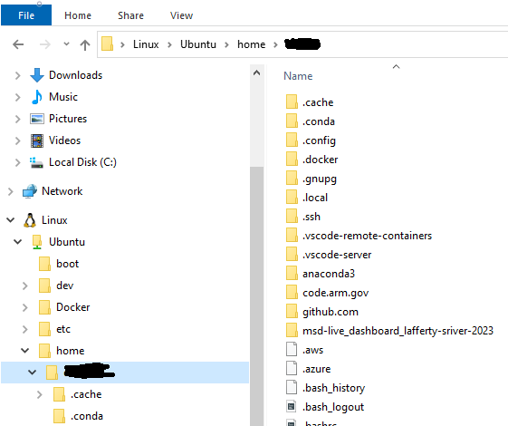

# Installing Docker on Windows Using WSL2 (NOT Docker Desktop)
These instructions help Windows users install Docker inside Windows Subsystem for Linux,
Version 2 (WSL2), without using Docker Desktop, which is difficult to update and has 
licensing fees.

## Prerequisite:  Uninstall Docker Desktop
If you have Docker Desktop currently installed, you will need to uninstall it first
before following the rest of the steps. Follow the proper steps from Docker's website to properly shut down all engines and completely remove from your system.

## Step 1.  Install WSL2
Follow the [Installing WSL Tutorial](setup_wsl.md) to install WSL on Windows and get it
set up in VSCode.

## Step 2.  Fix your DNS settings in your WSL2 VM
By default, the VM will not have the correct name server configured, so you won't be 
able to access any URLs until you fix this (i.e., you can't install anything in your VM
yet).

Open a WSL2 terminal, and run this:

```
  echo -e "[network]\ngenerateResolvConf = false" | sudo tee -a /etc/wsl.conf
  sudo unlink /etc/resolv.conf
  echo nameserver 8.8.8.8 | sudo tee /etc/resolv.conf
```

This creates a file called /etc/wsl.conf and writes the echoed lines to it. It also removes the special settings
 on /etc/resolv.conf and sets a specific DNS for the network.

Restart WSL to make sure the DNS changes took effect:
* From a PowerShell terminal, run `wsl --shutdown`
* Open a new WSL terminal (from a PowerShell terminal, run `wsl`)
* From your WSL terminal, run `ping www.google.com`.  If you get a response, all is well.


## Step 3.  Install Docker in WSL2 VM
From a WSL terminal, run these commands.

1. Install Docker (ignore the warning from Docker about using WSL):
    ```
    curl -fsSL https://get.docker.com -o get-docker.sh
    sudo sh get-docker.sh
    ```

2. Add your user to the Docker group
    ```
    sudo usermod -aG docker $USER
    ```

3. Sanity check that both tools were installed successfully
    ```
    docker --version
    docker compose version
    ```

4. Fix your IP Tables

    To check your Ubuntu version, look at
    ```
    cat /etc/os-release
    ```

    If your WSL is using Ubuntu 22.04 or Debian 10+, you need to do 1 extra step for 
    iptables compatibility. Run the following command and choose option (1) to use
    iptables-legacy:

    ```
    sudo update-alternatives --config iptables
    ```

6. Set your Docker daemon to run on starup

    From a WSL terminal, edit `/etc/wsl.conf`
    ```
    sudo nano /etc/wsl.conf
    ```

    Add the following to the top of the file:
    ```
    [boot]
    systemd=true
    ```

7. Restart WSL

    From PowerShell terminal:
    ```
    wsl --shutdown
    ```

8. Make sure systemd is running

    Open up a new WSL terminal and run
    ```
    systemctl list-unit-files --type=service
    ```

    If you see a bunch of services, all is well.  Hit `q` to exit.

9. Make sure Docker is running
    From your new WSL terminal, run
    ```
    ps aux | grep docker
    ```

    You should see that the docker daemon is running.  Something like:
    ``` 
    root         263  0.6  0.1 5284636 139760 ?      Ssl  Sep20 144:46 /usr/bin/dockerd -H fd:// --containerd=/run/containerd/containerd.sock
    ```

10. Finally, install the javascript backend runtime environment in WSL:
    ```
    sudo apt install nodejs npm
    ```

## Step 4. If you followed the [WSL-VSCode Tutorial](setup_wsl.md),
You are done installing Docker in WSL. To use any repository with a docker image
in VSCode, you must first reopen any reposity in WSL. 

To do this, open the repository folder in VSCode.

Then hit ++ctrl+shift+p++ to open the command line, and run 
`WSL: Reopen Folder in WSL`.

You should now be able to run Docker and attach to running containers using
"Dev-Containers: Attach to Running Container".

You may need to go into Settings and search for "Execute in WSL" to find the Dev-Containers option that says "Always Execute in WSL". Check that box and reload the window.

## Step 4a. If you are not using VSCode:
All of your code has to be migrated under the WSL in order for you to use it.  
In Explorer, you can see it at the bottom under Linux/Ubuntu



Note that your WSL username is the one you set up when you installed WSL.  I picked my 
same windows username and password so I would remember.

You should symlink any config files or folders that currently exist in your Windows home folder
to your WLS home folder (e.g., ~/.ssh, ~/.aws, etc.) 

For example, to link your .ssh folder (known hosts and keys), from your WSL terminal, run:
```
ln -s /mnt/c/Users/$USER/.ssh ~/.ssh
```

## Step 4b. Clone code from WSL
VS code will make your life easier when it comes to git commands and credentials so from wsl terminal do:
```
mkdir test
cd test
code .
```
Follow prompts to have WSL extension added to VS Code, you may have to restart Code. Then open bash terminal in vs code to execute the git clone commands, follow prompts and click 'ok' in browser window that will eventually open to allow VS Code permissions to git.

## Step 5. Install tools in WSL
From WSL terminal:

For node and npm use nvm:
https://github.com/nvm-sh/nvm#installing-and-updating

For python and to use virtual envs:
```
sudo apt install python-is-python3
sudo apt install python3.10-venv
```

For aws-cli:
(if using aws cli from within a venv be sure to activate the venv AFTER installing node)

Install or update the latest version of the AWS CLI - AWS Command Line Interface (amazon.com)
https://docs.aws.amazon.com/cli/latest/userguide/getting-started-install.html

