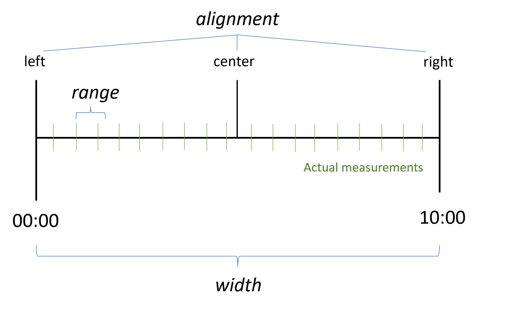
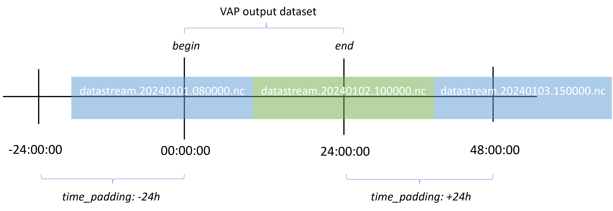

# Value Added Product (VAP) Pipeline Tutorial

The purpose of a VAP pipeline is to conduct additional processing and/or analysis on top of data that has been through
ingest pipelines. This can range from something as simple as combining datasets produced in the ingest pipelines;
improved quality control that requires variables from multiple datasets; bin-averaging or custom analysis algorithms; to
calculating new qualities from raw inputs (e.g. calculating salinity from independent measurements of temperature and
conductivity).

In this tutorial, we'll run through a Value Added Product (VAP) pipeline workflow that takes in raw CSV files measured
by a Sofar Spotter wave buoy and combines them into a final product that includes quality-controlled and standardized
wave statistics, buoy location, and sea surface temperature.

!!! warning "Prerequisite steps"

    === "Download the Data"

        Raw Spotter data to follow along in this VAP can be downloaded from the
        [Marine Hydrokinetic Data Repository (MHKDR)](https://mhkdr.openei.org/submissions/545). Find the entry called
        `Raw Data from Spotter Buoy.zip` and download it. Unzip the folder and run the *`spotter`* ingest pipeline.

    === "Windows Users: Setup WSL and VSCode"
        
        Before we start, Windows users should note that they need to use Windows Subsystem for Linux (WSL) to run VAP pipelines,
        and have conda install on their chosen Linux distribution. Instructions for installing WSL are located
        [**here**](./setup_wsl.md).

## Installing the Pipeline Repository

We'll begin by cloning or downloading the
[**sofar_spotter_pipelines**](https://github.com/ME-Data-Pipeline-Software/sofar_spotter_pipelines) repository. There
are 4 pipelines in this repository:

1. **`pipelines/spotter`**: The pipeline that ingests the raw Spotter CSV files (those ending in `_FLT`, `_LOC`, `_SST`)
and runs quality control.
2. **`pipelines/vap_gps`**: A VAP pipeline takes the raw GPS data and bin-averages it into 10 minute intervals. It is
included for the purposes of this tutorial.
3. **`pipelines/vap_wave_raw`**: A VAP pipeline that runs spectral analysis on the ingested buoy motion data to
calculate wave statistics and runs quality control. Meant to be run on a daily interval.
4. **`pipelines/vap_wave_stats`**: The final VAP pipeline that takes the wave statistics from `pipelines/vap_wave_raw`
and interpolates GPS positions and sea surface temperature (SST) measurements onto the wave timestamps. Also does some
additional calculations and summary plots. Meant to be run on a monthly interval.

Instructions for running pipelines in this repository are in the top-level `README` and are the same as the
[ingest pipeline tutorial](./data_ingest.md).

If you haven't already, create a new environment for running pipelines by opening a new terminal in VSCode and running
`conda env create`. If you are not on a Unix machine or are not on Windows WSL, this will error out, as one of the
dependencies is built in C for Unix.

## Creating a New VAP

We can create a new VAP pipeline by running `make cookies` from the terminal, and entering "`vap`" in the first prompt.

You will then run through the same set of prompts as you do in the ingest pipeline. You may want to use the same
parameters as the ingest pipeline you want to read from.

The following will generate a new pipeline called **`vap_gps`**, which has already been done for this repository. If you
open up this pipeline, you can see that the pipeline structure for the VAP is very much the same as the ingest pipeline,
with a few key differences in the configuration files.

```txt
Please choose a type of pipeline to create [ingest/vap] (ingest): vap
What title do you want to give this ingest?: GPS Location
What label should be used for the location of the ingest? (E.g., PNNL, San Francisco, etc.): cpr
Briefly describe the ingest: 
GPS location measured by a Sofar Spotter wave buoy deployed near Culebra, Puerto Rico
Data standards to use with the ingest dataset ['basic','ACDD','IOOS']: basic
Do you want to use a custom DataReader? [y/N]: n
Do you want to use a custom DataConverter? [y/N]: n
Do you want to use a custom QualityChecker or QualityHandler? [y/N]: n
'vap_gps_location' will be the module name (the folder created under 'pipelines/') Is this OK?  [Y/n]: n
What would you like to rename the module to?: vap_gps
'VapGpsLocation' will be the name of your TransformationPipeline class (the python class containing your custom python code hooks). Is this OK? [Y/n]: n
What would you like to rename the pipeline class to?: VapGPS
'cpr' will be the short label used to represent the location where the data are collected. Is this OK?  [Y/n]: y
```

## Ingest Pipeline (`spotter`)

We'll briefly go over the ingest pipeline so we know what we're working with for the VAP pipelines to follow.

This ingest is built so that all raw Spotter files can be run from a single command:

```shell
python runner.py ingest path/to/raw_spotter_files/*.CSV
```

This command will automatically go through all of the downloaded CSV files and pick out the relevant ones for the
ingest: buoy motion (`_FLT.CSV`), buoy location (`_LOC.CSV`), and sea surface temperature (`_SST.CSV`). This pipeline is
compatible with Spotter2 and Spotter3 raw files.

!!! note "Supported spotter ingests"

    === "Buoy Motion (`_FLT.CSV`)"

        1. Reads in data using tsdat's built-in CSV reader.
        2. Conducts quality control using custom qc checks (:material-file: *`qc.py`*):
            - Checks for "spikes" using windows of 1500 points
                ([Goring and Nikora 2002](http://dx.doi.org/10.1061/(ASCE)0733-9429(2002)128:1(117))).
            - Replaces spikes via a cubic polynomial with the 12 surrounding data points.
            - Checks values against valid min/max. Values beyond +/- 3m are removed. This range should be updated for
            expected sea states.
        3. Creates plots of these XYZ measurements (:material-file: *`pipeline.py`*).

        Relevant config files: :material-file: *`config/dataset_flt.yaml`*, :material-file:
        *`config/pipeline_flt.yaml`*, :material-file: *`config/retriever.yaml`*, :material-file: *`config/quality.yaml`*

    === "Buoy Location (`_LOC.CSV`)"

        1. Reads in data using custom CSV reader (:material-file: *`readers.py`*).
        2. Conducts quality control:
            - Checks values against valid min/max.
            - Removes values which failed quality checks.
        3. Creates plots of the GPS positions (:material-file: *`pipeline.py`*).
        
        Relevant config files: :material-file: *`config/dataset_loc.yaml`*, :material-file:
        *`config/pipeline_loc.yaml`*, :material-file: *`config/retriever.yaml`*, :material-file: *`config/quality.yaml`*

    === "Sea Surface Temperature (`_SST.CSV`)"

        1. Reads in data using custom CSV reader with a caveat (:material-file: *`readers.py`*):
            - A timestamp is not saved to this file; rather the system logs a value in milliseconds. This millisecond
            value is also recorded in the corresponding (same-numbered) `_FLT.CSV` file, which is read in to back down
            the appropriate timestamp.
        2. Conducts quality control:
            - Checks valid min/max.
            - Removes values beyond 0 and 40 degrees C.
        3. Creates a timeseries plot of temperature (:material-file: *`pipeline.py`*).
        
        Relevant config files: :material-file: *`config/dataset_sst.yaml`*, :material-file:
        *`config/pipeline_sst.yaml`*, :material-file: *`config/retriever.yaml`*, :material-file: *`config/quality.yaml`*

Each of these pipelines saves "`a1`" level data in netCDF format, one for each raw file.

## Metadata

For all of the pipelines in this repository to run properly, we'll need to replace the metadata with that for this
Puerto Rico deployment. This primarily means setting the attributes sections of the dataset configuration files
(`dataset.yaml`). For example, the `dataset_xxx.yaml` file for all of the **`spotter`** pipelines means changing the
"`title`", "`description`" and "`location_id`" attributes:

```yaml
attrs:
  title: Culebra Wave Data
  description:
    Raw XYZ data taken by a Sofar Spotter buoy deployed NW of Culebra Is., Puerto Rico
  location_id: cpr
  dataset_name: spotter
  data_level: a1
  qualifier: pos
  temporal: 400ms
  fs: 2.5 # Hz
  n_bin: 1500 # 2.5 Hz * 600 s
```

## Timeseries Bin-Averaging Pipeline (*vap_gps*)

The *vap_gps* pipeline is a VAP that fetches ingest timeseries data, bins the data and averages it at 10 minute
intervals (bin-averaging). GPS data is used here, but this example will pertain to any timeseries.

We'll go over the key differences between the ingest and VAP pipelines setups, starting with how to run a VAP on the
command line, then running through the configuration files, and finally looking at the pipeline class in pipeline.py.
While DataReaders are no longer necessary for VAPs, DataConverters, quality control Checkers/Handlers, and file storage
have not changed.

The VAP run command is set up differently from the ingest. Instead of a filename, we specify the path to the VAP
pipeline configuration file we want to run, as well as a "begin" time and an "end" time to span the time region of data
we want to collate.

```bash
python runner.py vap <path/to/vap/pipeline.yaml> --begin <yyyymmdd.HHMMSS> --end <yyyymmdd.HHMMSS>
```

For the purposes of this tutorial, we'll run a single day at the start of Aug, 2023.

```bash
python runner.py vap pipelines/vap_gps/pipeline.yaml --begin 20230801.000000 --end 20230802.000000
```

Assuming you downloaded the raw data, updated the `dataset_xxx.yaml` files, and ran the ingest pipeline given the ingest
run command, running this line will add the file `storage/root/data/cpr/cpr.gps.b1/cpr.gps.b1.20230801.000000`. Note
that our "begin" timestamp is similar to the filename timestamp.

### Dataset Configuration

The *vap_gps* `dataset.yaml` file looks very much the same as the ingest pipeline. The configuration is copy-pasted from
pipelines/spotter/dataset_loc.yaml, but with a few geospatial attributes added that define the maximum and minimum
latitude and longitude values that a user can expect to see. In this case, these were found by manually looking at each
variable and define the limits of the Spotter buoy's watch circle. They are also used later to set the limits in the
plot hook.

```yaml
attrs:
  title: GPS Location
  description:
    GPS location measured by a Sofar Spotter buoy deployed NW of Culebra Is., Puerto Rico
  location_id: cpr
  dataset_name: gps
  data_level: b1
  geospatial_lat_min: 48.2735
  geospatial_lat_max: 48.2742
  geospatial_lat_units: degrees_north
  geospatial_lon_min: -124.2870
  geospatial_lon_max: -124.2852
  geospatial_lon_units: degrees_east

coords:
  time:
    dims: [time]
    dtype: datetime64[ms]
    attrs:
      units: Seconds since 1970-01-01 00:00:00 UTC
      long_name: Time
      standard_name: time
      timezone: UTC

data_vars:
  lat:
    dims: [time]
    dtype: float32
    attrs:
      units: degrees_north
      long_name: Latitude
      standard_name: latitude
      valid_min: -90
      valid_max: 90
  lon:
    dims: [time]
    dtype: float32
    attrs:
      units: degrees_east
      long_name: Longitude
      standard_name: longitude
      valid_min: -180
      valid_max: 180
```

### Pipeline Configuration

The pipeline configuration file, `pipeline.yaml`, has changed slightly, i.e. there is an additional "datastreams"
parameter and "triggers" is now empty. The datastreams parameter covers all of the pipeline outputs that generate
variables one wants to retrieve for the VAP pipeline. In this case, we just want the "cpr.spotter-gps-1min.a1" data.

```yaml
classname: pipelines.vap_gps.pipeline.VapGPS
parameters:
  datastreams:
    - cpr.spotter-gps-1min.a1

triggers: []

retriever:
  path: pipelines/vap_gps/config/retriever.yaml

dataset:
  path: pipelines/vap_gps/config/dataset.yaml

quality:
  path: shared/quality.yaml
storage:
  path: shared/storage.yaml
```

### Retriever Configuration

The retriever configuration file, `retriever.yaml`, has a number of additions from the ingest version. The `DataReader`
class is replaced for tsdat's built-in `StorageRetriever`, which accesses the storage file location to collect files
containing the datastreams that we specify in `pipeline.yaml`. In order for a VAP to work with the appropriate ingest
pipelines, they all must use the same `storage.yaml` file located in the "shared" folder.

The coordinates and data variables also have additional parameters, "time" in particular. Sometimes it's desirable
(real-time measurements) to have measurements that are aligned on a gridded time variable, rather than a random,
instrument-dependent offset.

For this VAP, a new timegrid is created that is spaced on a 10-minute interval. We do this by ignoring the file input
regex, setting the name to "N/A", and setting the `CreateTimeGrid` DataConverter. This TimeGrid will start at the top of
the hour and continue at 10-minute intervals to the "end" time specified in the VAP run command.

If we create a new timegrid, Tsdat assumes that one of the DataTransforms will be used. If a DataTransform is not used,
Tsdat will assume the input timestamps are already on a TimeGrid.

```yaml
coords:
  time:
    name: N/A
    data_converters:
      - classname: tsdat.transform.CreateTimeGrid
        interval: 10min
```

The two variables we're pulling from the ingest pipeline are "lat" and "lon". It's good practice to specify the file
regex (gps) with starting and ending breaks `(.*)` on the first indent. On the next indent, we'll specify the variable
ingest "name" and "data_converters" key.

Note that all VAP functional is incorporated into the Tsdat workflow via DataConverters.

The DataConverter (DataTransform) classname we want to use is `tsdat.transform.BinAverage`. The other built-in options
are `tsdat.transform.NearestNeighbor` and `tsdat.transform.Interpolate`.

```yaml
data_vars:
  lat:
    .*gps.*:
      name: lat
      data_converters:
        - classname: tsdat.transform.BinAverage
  lon:
    .*gps.*:
      name: lon
      data_converters:
        - classname: tsdat.transform.BinAverage
```

Next we need to specify parameters to run the transformer properly on these variables. There are two sets of parameters
that we can set for the DataTransforms, called `fetch_parameters` and `transformation_parameters`:

```yaml
classname: tsdat.io.retrievers.StorageRetriever
parameters:
  fetch_parameters:
    # How far in time to look after the "end" timestamp (+), before the "begin"
    # timestamp (-), or both (none) to find filenames that contain needed data
    time_padding: -24h

  transformation_parameters:
    # Where the point lies in the coordinate bounds (CENTER, LEFT, RIGHT)
    alignment:
      time: CENTER

    # How far to look for the next available data point
    range:
      time: 60s

    # Width of the transformation
    width:
      time: 600s
```

### Transformation Parameters

Both of these sets of parameters are best explained by pictures. For the `BinAverage` transform, "width" defines the
size of the averaging window (600s = 10 min) and "alignment" defines the location of the window in respect to each
timestamp.

In the window shown below, the alignment is technically set to "LEFT". No matter what "alignment" is set to, the
TimeGrid will always start at 00:00. For instance, if "alignment" is set to "CENTER" and the width is 600 s, the
01:00:00 timestamp represents bin-averaged data between 00:55:00 and 01:05:00. Tsdat will attempt to fetch the file
that contains data for the previous 5 minutes here. If a filename with a timestamp 10 minutes prior cannot be found,
the 01:00:00 timestamp will be set to nan.

The "range" keyword is relevant for the `NearestNeighbor` and `Interpolate` transforms, and defines how far from the
last timestamp to search for the next measurement. The "range" and "width" parameters should be set in seconds.



### Fetch Parameters

The "time_padding" fetch parameter can be critical to set correctly. To show what this parameter does, open up a new
terminal and run if you haven't already:

```bash
python runner.py vap pipelines/vap_gps/pipeline.yaml --begin 20210801.000000 --end 20210802.000000
```

When the pipeline completes successfully, navigate to
`storage/root/ancillary/cpr/cpr.gps.b1/cpr.gps.b1.20210903.000000.timeseries.nc` and look at the X-axis ticks. Notice
that data is found for the entire day.

Now, set `timepadding: 0`, open a terminal and run the vap again:

```bash
python runner.py vap pipelines/vap_gps/pipeline.yaml --begin 20210801.000000 --end 20210802.000000
```

Check out the same .png file again. See that half the data is missing for the day.

The image below depicts the idea of what this parameter does. Data files, particularly these from the Spotter buoy, are
not saved on any particular time schedule. When this is the case, we want to set `time_padding` far enough so that Tsdat
is able to retrieve all of the files that contain the data we want, but not so far as to significantly slow down the
pipeline.



Setting `timepadding: -24h` tells Tsdat to fetch files up to 24 hours earlier than the start date we specified. If we
set `timepadding: +24h`, it will fetch datafiles 24 hours after the "end" time. Setting `timepadding: 24h` will fetch
both before and after. Units of hours ('h'), minutes ('m'), seconds ('s'), and milliseconds ('ms') can be used here. If
no units are specified, tsdat will default to using seconds.

### Pipeline Class Configuration

The final file that's important to review is the change to the pipeline class located in `pipeline.py`. The first is the
inherited class change from `IngestPipeline` to `TransformationPipeline`. The second is the addition of the
`hook_customize_input_datasets` hook, which allows the user to alter datasets retrieved from the ingest pipeline. The
input/return here is a dictionary of datasets that are labeled based on their individual datastreams and "begin"/"end"
timestamps. The other three hooks have not changed.

```python
class VapGPS(TransformationPipeline):
    """---------------------------------------------------------------------------------
    This is an example pipeline meant to demonstrate how one might set up a
    pipeline using this template repository.

    ---------------------------------------------------------------------------------"""

    def hook_customize_input_datasets(self, input_datasets) -> Dict[str, xr.Dataset]:
        # Code hook to customize any input datasets prior to datastreams being combined
        # and data converters being run.
        return input_datasets

    def hook_customize_dataset(self, dataset: xr.Dataset) -> xr.Dataset:
        # (Optional) Use this hook to modify the dataset before qc is applied
        return dataset

    def hook_finalize_dataset(self, dataset: xr.Dataset) -> xr.Dataset:
        # (Optional) Use this hook to modify the dataset after qc is applied
        # but before it gets saved to the storage area
        return dataset

    def hook_plot_dataset(self, dataset: xr.Dataset):
        # (Optional, recommended) Create plots.
        pass
```

### Closing thoughts on the GPS VAP

With the information contained in the above sections, you can create most VAP pipelines. The rest of this tutorial
reviews the other two VAPs in this repository, as well as a number of features/idiosyncrasies you might need to know for
your own particular use case. This are listed as the following:

1. Creating a VAP dataset using the time coordinate from an ingest dataset
2. Adding new coordinates to a VAP dataset
3. Conducting analyses beyond that of bin-averaging, nearest neighbor, and interpolation
4. A VAP example that fetches multiple datastreams

## VAP Pipeline using "Non-typical" Analysis (*vap_wave_raw*)

The *vap_wave_raw* pipeline takes the buoy surge, sway, and heave measurements, conducts spectral analysis, and
estimates wave statistics. Spectral analysis is common in the field of fluid mechanics, but this pipeline will be
instructive for any analysis that results in new timestamps. The following pipeline, *vap_wave_stats*, will be more
helpful for users who don't need more complex analysis.

### Configuration Files

We'll begin by setting up the pipeline's retriever configuration file. We'll use the same "time_padding" as before, and
include variables we want to pull from the ingest "pos" datastream output ("time", "x", "y", and "z"). Instead of
creating a new TimeGrid, we can simply retrieve "time" like any other variable.

Notice we add a 2nd coordinate here that we will use later that does not exist in the ingest pipeline: "frequency". This
coordinate will be generated in our pipeline hook, but Tsdat requires that new coordinates are pulled through the
retriever, unlike data variables that can be introduced in the dataset configuration.

```yaml
classname: tsdat.io.retrievers.StorageRetriever
parameters:
  fetch_parameters:
    # How far in time to look after the "end" timestamp (+), before the "begin"
    # timestamp (-), or both (none) to find filenames that contain needed data
    time_padding: -24h

coords:
  time:
    .*pos.*:
      name: time
  frequency:
    .*pos.*: 
      name: frequency

data_vars:
  x:
    .*pos.*:
      name: x
  y:
    .*pos.*:
      name: y
  z:
    .*pos.*:
      name: z
```

In our dataset configuration file, we add all of the variables that are required for our analysis, as well as all the
variables that will be added in our analysis. Only the first few variables are shown to keep this blip short. This
includes our new "frequency" coordinate as well.

```yaml
attrs:
  title: Wave Statistics
  description:
    Wave statistics measured by a Sofar Spotter wave buoy deployed in Culebra, Puerto Rico
  location_id: cpr
  dataset_name: wave
  data_level: c0

coords:
  time:
    dims: [time]
    dtype: datetime64[ms]
    attrs:
      units: Seconds since 1970-01-01 00:00:00 UTC
      long_name: Time
      standard_name: time
      timezone: UTC
  frequency:
    dims: [frequency]
    dtype: float32
    attrs:
      long_name: Band Center Frequency
      units: Hz
      standard_name: wave_frequency

data_vars:
  x:
    dims: [time]
    dtype: float32
    attrs:
      long_name: Buoy Surge
      standard_name: platform_surge
      units: m
      valid_min: -8
      valid_max: 8
  y:
    dims: [time]
    dtype: float32
    attrs:
      long_name: Buoy Sway
      standard_name: platform_sway
      units: m
      valid_min: -8
      valid_max: 8
  z:
    dims: [time]
    dtype: float32
    attrs:
      long_name: Buoy Heave
      standard_name: platform_heave
      units: m
      valid_min: -8
      valid_max: 8
  wave_hs:
    dims: [time]
    dtype: float32
    attrs:
      long_name: Significant Wave Height
      units: m
      standard_name: sea_surface_wave_significant_height
      valid_min: 0
      valid_max: 20
  wave_energy_density:
    dims: [time, frequency]
    dtype: float32
    attrs:
      long_name: Wave Energy Density
      units: m^2 s
      standard_name: sea_surface_wave_variance_spectral_density
      valid_min: 0.0
  ...
```

The pipeline configuration file remains simple, and in this case we've added a new quality configuration file. Our
datastream this time is `cpr.spotter-pos-400ms.a1`.

```yaml
classname: pipelines.vap_wave_raw.pipeline.VapWaves
parameters:
  datastreams:
    - cpr.spotter-pos-400ms.a1

triggers: []

retriever:
  path: pipelines/vap_wave_raw/config/retriever.yaml

dataset:
  path: pipelines/vap_wave_raw/config/dataset.yaml

quality:
  path: pipelines/vap_wave_raw/config/quality.yaml

storage:
  path: shared/storage.yaml
```

### Pipeline Class

The TransformationPipeline class is where we do the bulk of the work, as we need to add in all of our analysis code
here.

The first section we add are the global variables we want to use for the rest of analysis, and these are parameter that
will never vary with the data streaming through the pipeline ("fs", "wat", and "freq_slc").

Next we edit the first hook. Tsdat does not allow for new coordinates to be added through `dataset.yaml` like it does
for new data variables. So this first hook, which operates directly after fetching the input datasets, is where we add
the new coordinate, "frequency". We'll do this by finding the key we specified in `retriever.yaml` ("pos"), adding the
coordinate to that dataset, and returning the "input_datasets" dictionary.

```python
fs = 2.5  # Hz, Spotter sampling frequency
wat = 1800  # s, window averaging time
freq_slc = [0.0455, 1]  # 22 to 1 s periods


class VapWaves(TransformationPipeline):
    """---------------------------------------------------------------------------------
    This is an example pipeline meant to demonstrate how one might set up a
    pipeline using this template repository.

    ---------------------------------------------------------------------------------"""

    def hook_customize_input_datasets(self, input_datasets) -> Dict[str, xr.Dataset]:
        # Code hook to customize any input datasets prior to datastreams being combined
        # and data converters being run.

        # Need to write in frequency coordinate that will be used later
        for key in input_datasets:
            if "pos" in key:
                # Create FFT frequency vector
                nfft = fs * wat // 6
                f = np.fft.fftfreq(int(nfft), 1 / fs)
                # Use only positive frequencies
                freq = np.abs(f[1 : int(nfft / 2.0 + 1)])
                # Trim frequency vector to > 0.0455 Hz (wave periods between 1 and 22 s)
                freq = freq[np.where((freq > freq_slc[0]) & (freq <= freq_slc[1]))]
                # Set the frequency coordinate
                input_datasets[key] = input_datasets[key].assign_coords(
                    {"frequency": freq.astype("float32")}
                )

                return input_datasets
```

The next hook, `hook_customize_dataset`, is where we add all of our analysis code. This hook is run after the
DataTransform classes have been run and the dataset standardized based on `dataset.yaml`. The first part of this hook
runs the spectral analysis and wave algorithms, and is shown below.

```python
def hook_customize_dataset(self, dataset: xr.Dataset) -> xr.Dataset:
    # (Optional) Use this hook to modify the dataset before qc is applied

    ds = dataset.copy()

    # Fill small gps so we can calculate a wave spectrum
    for key in ["x", "y", "z"]:
        ds[key] = ds[key].interpolate_na(
            dim="time", method="linear", max_gap=np.timedelta64(5, "s")
        )

    # Create 2D tensor for spectral analysis
    disp = xr.DataArray(
        data=np.array(
            [
                ds["x"],
                ds["y"],
                ds["z"],
            ]
        ),
        coords={"dir": ["x", "y", "z"], "time": ds.time},
    )

    ## Using dolfyn to create spectra
    nbin = fs * wat
    fft_tool = dolfyn.adv.api.ADVBinner(
        n_bin=nbin, fs=fs, n_fft=nbin // 6, n_fft_coh=nbin // 6
    )
    # Trim frequency vector to > 0.0455 Hz (wave periods smaller than 22 s)
    slc_freq = slice(freq_slc[0], freq_slc[1])

    # Auto-spectra
    psd = fft_tool.power_spectral_density(disp, freq_units="Hz")
    psd = psd.sel(freq=slc_freq)
    Sxx = psd.sel(S="Sxx")
    Syy = psd.sel(S="Syy")
    Szz = psd.sel(S="Szz")

    # Cross-spectra
    csd = fft_tool.cross_spectral_density(disp, freq_units="Hz")
    csd = csd.sel(coh_freq=slc_freq)
    Cxz = csd.sel(C="Cxz").real
    Cxy = csd.sel(C="Cxy").real
    Cyz = csd.sel(C="Cyz").real

    ## Wave height and period
    pd_Szz = Szz.T.to_pandas()
    Hs = wave.resource.significant_wave_height(pd_Szz)
    Te = wave.resource.energy_period(pd_Szz)
    Ta = wave.resource.average_wave_period(pd_Szz)
    Tp = wave.resource.peak_period(pd_Szz)
    Tz = wave.resource.average_zero_crossing_period(pd_Szz)

    # Check factor: generally should be greater than or equal to 1
    k = np.sqrt((Sxx + Syy) / Szz)

    # Calculate peak wave direction and spread
    a1 = Cxz.values / np.sqrt((Sxx + Syy) * Szz)
    b1 = Cyz.values / np.sqrt((Sxx + Syy) * Szz)
    a2 = (Sxx - Syy) / (Sxx + Syy)
    b2 = 2 * Cxy.values / (Sxx + Syy)
    theta = np.rad2deg(np.arctan2(b1, a1))  # degrees CCW from East, "to" convention
    phi = np.rad2deg(np.sqrt(2 * (1 - np.sqrt(a1**2 + b1**2))))

    # Get peak frequency - fill nan slices with 0
    peak_idx = psd[2].fillna(0).argmax("freq")
    # degrees CW from North ("from" convention)
    direction = (270 - theta[:, peak_idx]) % 360
    # Set direction from -180 to 180
    direction[direction > 180] -= 360
    spread = phi[:, peak_idx]
```

The second part of this hook manually shortens the dataset based on the number of new timestamps (sized based on the
number of calculated spectra) and resets the time coordinate. We also assign the data variable values, and drop the
input variables we don't want to keep.

```python
    # Trim dataset length
    ds = ds.isel(time=slice(None, len(psd["time"])))
    # Set time coordinates
    time = xr.DataArray(
        psd["time"], coords={"time": psd["time"]}, attrs=ds["time"].attrs
    )
    ds = ds.assign_coords({"time": time})
    # Make sure mhkit vars are set to float32
    ds["wave_energy_density"].values = Szz
    ds["wave_hs"].values = Hs.to_xarray()["Hm0"].astype("float32")
    ds["wave_te"].values = Te.to_xarray()["Te"].astype("float32")
    ds["wave_tp"].values = Tp.to_xarray()["Tp"].astype("float32")
    ds["wave_ta"].values = Ta.to_xarray()["Tm"].astype("float32")
    ds["wave_tz"].values = Tz.to_xarray()["Tz"].astype("float32")
    ds["wave_check_factor"].values = k
    ds["wave_a1_value"].values = a1
    ds["wave_b1_value"].values = b1
    ds["wave_a2_value"].values = a2
    ds["wave_b2_value"].values = b2
    ds["wave_dp"].values = direction
    ds["wave_spread"].values = spread

    return ds.drop(("x", "y", "z"))
```

We don't utilize `hook_finalize_dataset` in this pipeline, and plots are created in `hook_plot_dataset`, which won't be
copied here.

### Quality Control

We do incorporate one custom QualityChecker in this pipeline, and it checks that our wave estimations are valid. The
`quality.yaml` entry is shown first, followed by the class in `qc.py`. These are implemented in the same manner as the
ingest pipeline.

```yaml
  - name: Check wave factor
    checker:
      classname: pipelines.vap_wave_raw.qc.WaveCheckFactor
    handlers:
      - classname: tsdat.qc.handlers.RemoveFailedValues
      - classname: tsdat.qc.handlers.RecordQualityResults
        parameters:
          assessment: bad
          meaning: "Check factor either null or <= 0.5"
    apply_to:
      - DATA_VARS
    exclude: [wave_energy_density, wave_check_factor]
```

```python
import numpy as np
import xarray as xr
from numpy.typing import NDArray
from tsdat import QualityChecker, QualityHandler


class WaveCheckFactor(QualityChecker):
    """----------------------------------------------------------------------------
    Checks for where the wave factor is nan or negative and returns a
    mask where bad values are labeled as True.
    (This function runs on a variable by variable basis.)
    ----------------------------------------------------------------------------"""

    def run(self, dataset: xr.Dataset, variable_name: str) -> NDArray[np.bool8]:

        if "frequency" in dataset[variable_name].dims:
            check_factor = dataset["wave_check_factor"]
        else:
            check_factor = dataset["wave_check_factor"].median("frequency")

        mask = check_factor.isnull() + (check_factor < 0.5)

        return mask
```

Finally, this pipeline can be run by:

```bash
python runner.py vap pipelines/vap_waves_raw/pipeline.yaml --begin 20230801.000000 --end 20230802.000000
```

## VAP Pipeline fetching Multiple Datastreams (*vap_wave_stats*)

The *vap_wave_stats* pipeline takes the wave estimations from *vap_wave_raw* and interpolates the GPS and SST
measurements onto the wave timestamps. This pipeline also adds a new coordinate for a new data variable that is
calculated in the code hooks.

### Configuration Files

In our dataset configuration files, we want to copy-paste in all of the variables from the respective dataset
configurations. In this pipeline, we also include a slew of metadata variables in accordance with Integrated Ocean
Observing System (IOOS) standards.

In our pipeline configuration file, we make sure to add the datastreams that we want this VAP to pull from. In this
case, we're fetching data from the "vap_waves_raw" pipeline and the GPS and SST pipelines from the *spotter* ingest
pipeline.

```yaml
classname: pipelines.vap_wave_stats.pipeline.VapWaveStats
parameters:
  datastreams:
    - cpr.wave.c0
    - cpr.spotter-gps-1min.a1
    - cpr.spotter-sst-1min.a1

triggers: []

retriever:
  path: pipelines/vap_wave_stats/config/retriever.yaml

dataset:
  path: pipelines/vap_wave_stats/config/dataset.yaml

quality:
  path: shared/quality.yaml
storage:
  path: shared/storage.yaml
```

In our retriever configuration, we include the same "time_padding" parameter, and include a "range" of 120s for the
`Interpolate` DataTransform. 2 min was chosen with the reasoning that it is twice the sampling frequency of the buoy's
GPS unit and thermistor, so we're less likely to miss a data point.

Next, the 3 coordinates are fetched from the "wave" datastream ("vap_waves_raw"), and the assortment of variables from
all 3 input streams. For the non-"wave" datastream variables ("lat", "lon", "sst"), the `tsdat.transform.Interpolate`
DataConverter is set. `Interpolate` does a simple 1D linear interpolation from the ingest timestamp to the VAP
timestamp. `NearestNeighbor` could also be used here in the same manner if desired.

For the variables pulled from the "wave" datastream (i.e. "wave_hs"), these are already mapped onto the "wave" time
coordinate, so we don't need to include a DataTransform here.

```yaml
classname: tsdat.io.retrievers.StorageRetriever
parameters:
  fetch_parameters:
    # How far in time to look after the "end" timestamp (+), before the "begin"
    # timestamp (-), or both (none) to find filenames that contain needed data
    time_padding: -24h

  transformation_parameters:
    # Where the point lies in the coordinate bounds (CENTER, LEFT, RIGHT)
    alignment:
      time: CENTER

    # How far to look for the next available data point
    range:
      time: 120s

    # Width of the transformation
    width:
      time: 60s

coords:
  time:
    .*wave.*:
      name: time
  frequency:
    .*wave.*: 
      name: frequency
  direction:
    .*wave.*: 
      name: direction

data_vars:
  lat:
    .*gps.*:
      name: lat
      data_converters:
        - classname: tsdat.transform.Interpolate
  lon:
    .*gps.*:
      name: lon
      data_converters:
        - classname: tsdat.transform.Interpolate
  sst:
    .*sst.*:
      name: sst
      data_converters:
        - classname: tsdat.transform.Interpolate
  wave_hs:
    .*wave.*: 
      name: wave_hs
  ...
```

### Pipeline Class

This pipeline adds a new additional variable to the dataset and creates a series of plots in pipeline.py as well. It's
common to need to calculate another variable in a VAP hook, and to do so, we add the variable's metadata to
dataset.yaml. In this case, that is "wave_dir_energy_density":

```yaml
  wave_dir_energy_density:
    dims: [time, frequency, direction]
    dtype: float32
    attrs:
      long_name: Directional Energy Density
      units: m^2 s / deg
      standard_name: sea_surface_wave_directional_variance_spectral_density
      valid_min: 0.0
```

In `pipeline.py`, we can set the variables "values" after calculating said variable.

```python
    # Wave energy density is units of Hz and degrees
    dataset["wave_dir_energy_density"].values = dataset[
        "wave_energy_density"
    ] * np.rad2deg(D)
```

### Running the pipeline

As the last pipeline in this series, it is designed to output data to be stored on a database. To keep files small, this
pipeline is built to collate data in larger segments. The following run command saves and plots data for the month of
August.

```bash
python runner.py vap pipelines/vap_wave_stats/pipeline.yaml --begin 20230801.000000 --end 20230901.000000
```

### Running a slew of time periods locally on a VAP

Though the VAP is primarily built for running real-time data on the cloud, you can set up an shell script (.sh) to run
multiple pipelines on a time period

```sh
#!/bin/bash

# Set the proper path to your conda shell script
source ~/miniconda3/etc/profile.d/conda.sh
# Set the conda environment name
conda activate tsdat-pipelines

# Uncomment the following if your system needs these settings
#export LD_LIBRARY_PATH=$HOME/miniconda3/envs/tsdat-pipelines/lib:$LD_LIBRARY_PATH
#export DISPLAY=:0

# Run pipelines
python runner.py vap pipelines/<pipeline_name>/config/pipeline.yaml --begin 20230727.000000 --end 20230801.000000
python runner.py vap pipelines/<pipeline_name>/config/pipeline.yaml --begin 20230801.000000 --end 20230901.000000
python runner.py vap pipelines/<pipeline_name>/config/pipeline.yaml --begin 20230901.000000 --end 20231001.000000
python runner.py vap pipelines/<pipeline_name>/config/pipeline.yaml --begin 20231001.000000 --end 20231101.000000
python runner.py vap pipelines/<pipeline_name>/config/pipeline.yaml --begin 20231101.000000 --end 20231105.000000

```

Run this shell script using `bash script_name.sh`

## Setup Errors

### Incorrect environment in VSCode

If VSCode didn't properly initiate the repository conda environment (default: "tsdat-pipelines"), you'll get this error:

```txt
ERROR: Could not initialize udunits unit system
 -> Can't open installed, default, unit database
ERROR: Could not initialize udunits unit system
 -> Can't open installed, default, unit database
ERROR: Could not create var-to-array converter for: /retrieved_data/input_ds/obs1/_vars_/time
```

### ADI-Py installation errors

The following is the error that pops up if the ADI-Py libraries are not installed, not installed correctly, or have been
installed and aren't found:

```txt
WARNING:tsdat.transform.adi:Warning: ADI libraries are not installed. Some time series transformation functions may not work.
C:\Users\mcve343\tsdat-dev\tsdat\tsdat\transform\converters.py:29: UserWarning:

Encountered an error running transformer. Please ensure necessary dependencies are installed.
warnings.warn(
ERROR:tsdat.transform.converters:'NoneType' object has no attribute 'Group'
Traceback (most recent call last):
File "C:\Users\anaconda3\lib\site-packages\tsdat\tsdat\transform\converters.py", line 291, in convert
    transformer.transform(
File "C:\Users\anaconda3\lib\site-packages\tsdat\tsdat\transform\adi.py", line 424, in transform
    retrieved_dataset: cds3.Group = self._create_adi_retrieved_dataset(
File "C:\Users\mcve343\tsdat-dev\tsdat\tsdat\transform\adi.py", line 525, in _create_adi_retrieved_dataset
    dataset_group = cds3.Group.define(None, "retrieved_data")
AttributeError: 'NoneType' object has no attribute 'Group'
```

1. You'll get this error if trying to run a VAP on Windows. VAPs cannot be run in Windows. You must install WSL and run
a pipeline from WSL.
2. If you are running a VAP in WSL or a Unix machine (Linux or Mac) and get above series of errors

    - Make sure you're running in the correct conda environment ("tsdat-pipelines" is the default)

    - Ensure the ADI-Py libraries were installed properly by recreating the conda environment by running `conda env
    create` from the pipeline-template repository.

    - Older versions of ADI-Py have had an environmental path not set. If rebuilding the repository environment does not
    work, you'll need to set this path manually in your terminal:

        ```shell
        export LD_LIBRARY_PATH=$HOME/miniconda3/envs/tsdat-pipelines/lib:$LD_LIBRARY_PATH
        ```

        Replace "miniconda3" and "tsdat-pipelines" to your correct conda distribution and environment names,
        respectively.

3. If using WSL, you may get a second, display related error. To set WSL to use your machine's LCD, set
`export DISPLAY=:0`. This line can be added to the `.bashrc` file to permanently fix this.

### NaN input to ADI-Py libraries

If a variable is set to use one of the DataTransforms and the retrieved variable is either missing or all nan, then the
ADI-Py libraries will fail abruptly with a short error message:

```bash
pipelines/<pipeline_name>/test/test_pipeline.py Fatal Python error: Floating point exception
```

The key to solving this error is to specify a particular value for that variable, if it's missing in the
`hook_customize_input_datasets` function hook in `pipeline.py`.

### Setting up the VSCode debugger

It's helpful to create a debugger configuration for building and testing a VAP. Do this by navigating to
`.vscode/launch.json` in the repository main folder, and copy-paste and edit the following configuration for the VAP and
time period you want to run (you'll also need to add a comma to the end of the previous configuration):

```json
        {
            "name": "Debug VAP",
            "type": "python",
            "request": "launch",
            "program": "${workspaceFolder}//runner.py",
            "console": "integratedTerminal",
            "args": [
                "vap",
                "pipelines/<pipeline_name>/config/pipeline.yaml",
                "--begin",
                "yyyyddmm.000000",
                "--end",
                "yyyyddmm.000000"
            ]
        },
```
